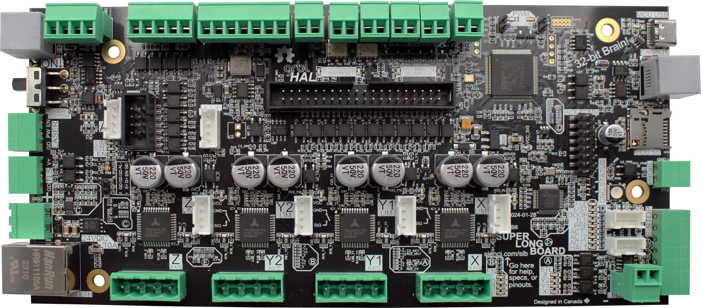

# Header One Test Document

1. This is the place for Bold text
    1. Testing more
1. Write all as one
1. This will mess up

- This is the place for Bold text
  - Testing more

1. Write all as one
1. This will mess upThis is the second 2nd place for a line.
Indented line still work?
2nd Indented line
    

## Subheader

This is the place for **Bold** and *Italics*

Link to me [HERE](https://resources.sienci.com/view/slb-manual/#wiring)

<https://resources.sienci.com/view/slb-manual/#wiring>

[Click Me to go to Header Three t](#header-three-tester)

check out [this page](/mill-one/index.md)

<a href="https://resources.sienci.com/view/am-cnc-terminology/" target="_blank" rel="noopener">Check out CNC Terms HERE</a>

<a href="https://resources.sienci.com/view/am-cnc-terminology/" target="_blank" rel="noopener">Click Me</a>

{.aligncenter .size-medium .nar}

{.aligncenter .size-medium}

### Header Three tester