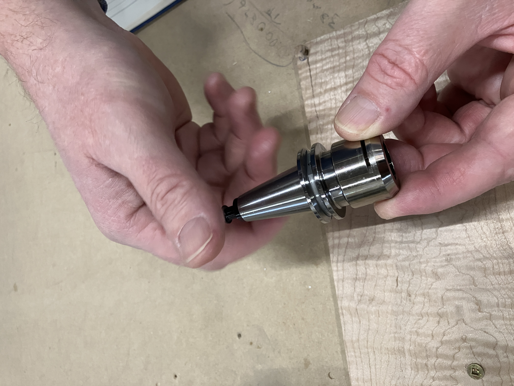
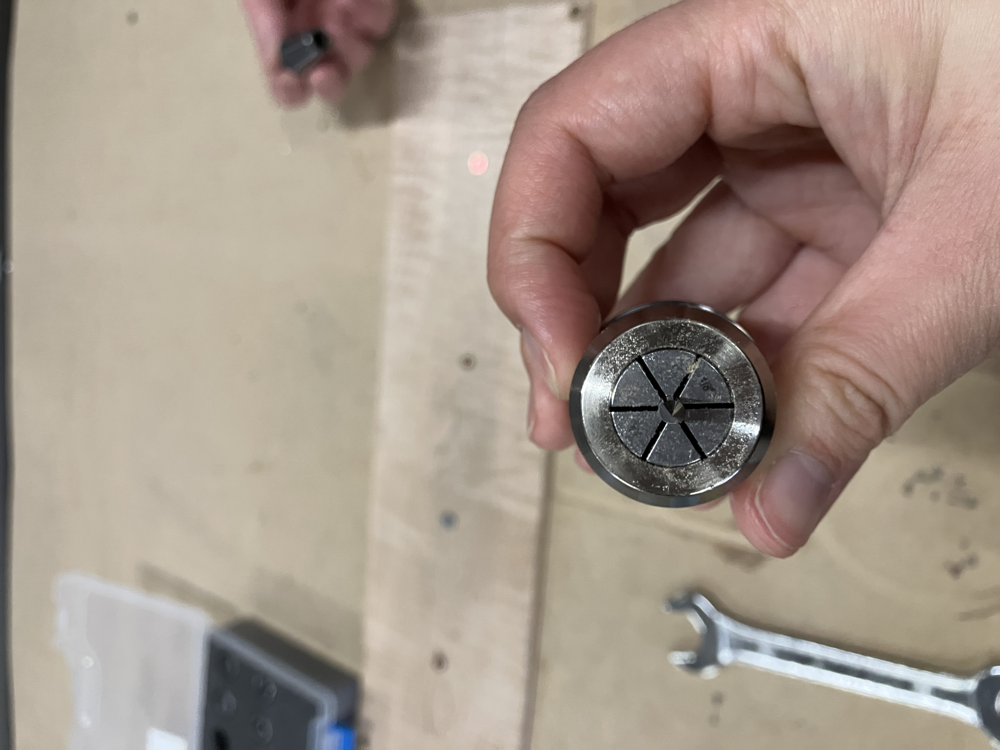
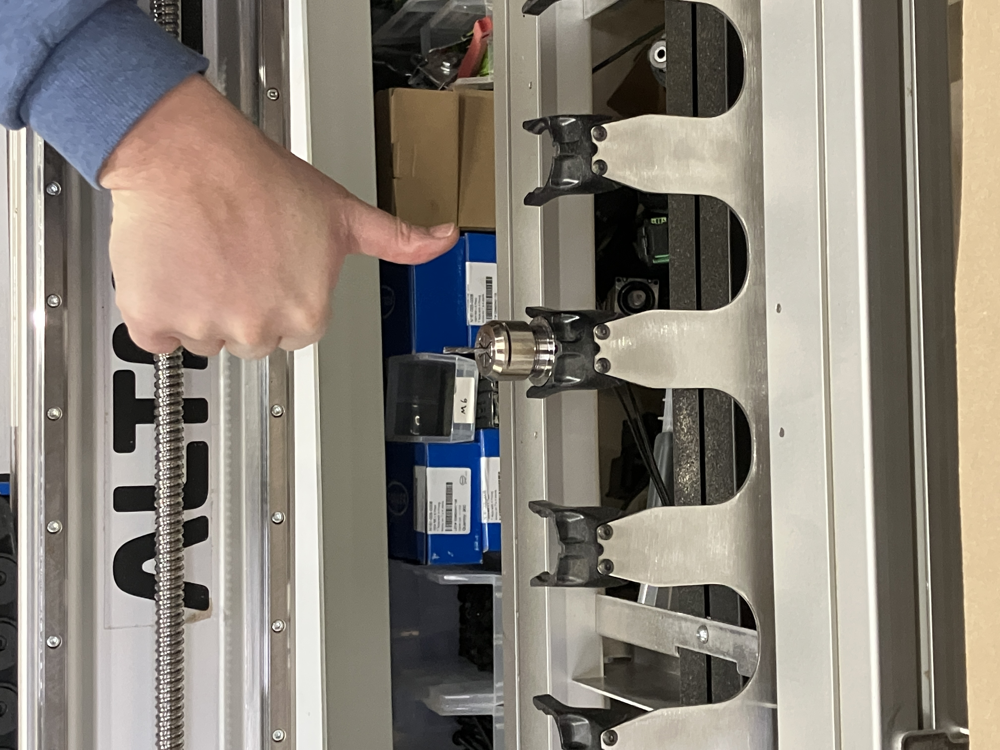

## Preparing your g-code file

To do tool changes with the ATC using gSender, your g-code needs to be formatted to be readable by gSender (i.e. compatible with grblHAL firmware).

The format requirements are...

* Unique tool numbers must be  assigned to each type of tool you use (e.g. if you assign 1/4" flat upcut as T1, no other tool can be T1 in the g-code file)

* Tool numbers must be whole numbers (e.g. T1, T12)

* For each tool change within your g-code, it should start like this:

    **M5** stop spindle

    **M6 T1** tool change, tool number (1, in this example)

    **M3 S10000** start spindle, spindle speed (10000 RPM in this example)

*** Looking for suggestions on how to make this more clear, probably a chart so the g-code and explanation are separated?

Meeting these requirements should be easy enough, but the process may slightly vary depending on what CAM software you are using.  

### Vectric VCarve

1. Once you made your design and toolpaths, you will need to assign tool numbers on VCarve that match how you will be setting up the tools on your machine. For each toolpath, find the option to edit your tool. It will pop up a window called [Tool Database](https://docs.vectric.com/docs/V12.0/Cut2DDesktop/ENU/Help/form/Tool%20Database/index.html) with all the parameters like diameter, feeds and speeds, for your tool. Edit the Tool Number to match the position that tool will be on, on your rack.

1. Download our post-processor for Vectric VCarve ***(link to post processor here)
Load it into the program as described in [this article](https://docs.vectric.com/docs/V12.0/VCarvePro/ENU/Help/form/post-processor-management/index.html). When you are ready to export your g-code, select the one you just loaded, called "_____________".

### Fusion 360

1. You will need the paid version of Fusion 360 to have the g-code automatically formatted for automatic tool changing. Otherwise you will need to manually export each toolpath, add the tool changing g-code and combine them into one file.

2. When exporting g-code, use the **grbl (mm)** post processor from their list of default post processors, then select the checkbox to export multi-tool files.  

## Installing Tools

Unfasten the collet nut from each tool holder you are using.

Grab your end mill and insert it into an ER20 collet. Seat the collet and end mill into a collet nut, then fasten them to a tool holder. Ensure the face of the collet is flush with the tool holder. Repeat for all the end mills you need for the job.

Slide the assembled tools onto the rack, with the end mills facing down.

 ***what NOT to do

Make sure they are placed in the correct order, matching the tool numbers you chose in the CAM software. Remember, Tool 1 is at LEFTMOST position on the rack

***need a graphic to show rack positions for 6 and 12

## ATC Workflow on gSender

If you haven't yet, go through the Software Setup page to initialize your ATC system. ***Link to software setup. You cannot use your ATC until this process is complete.

We have the g-code, and we installed the tools. Now we can move on to running the job!

1. Set up any workholding to secure your material on the wasteboard.

1. Connect to gSender

1. Home the machine

* Jog the machine away from the tool rack

* Press Home

1. Load your job onto gSender

* Use the Load File button to select your g-code file

* You should see a "Tool Timeline" with the different toolpaths highlighted in various colours, corresponding to the toolpath colours on the visualizer

1. Load a tool onto the spindle to zero your machine with

* Choose a tool from your rack that has a symmetric, flat end, like a standard flat end mill

* Press Load and select the correct tool number

***insert picture of Load with dropdown

* Remove the bottom of the dust shoe so you can see the end mill

* Jog the machine to where you want the job to start on your material, then use the Z0, X0 and Y0 buttons to zero each axis

* Jog upwards then reattach your dust shoe bottom (you do NOT need to re-zero the Z-axis after jogging)

We are about ready to start cutting. Here are some final precautions you may want to take:

1. Check the Tool Timeline to see if the order of toolpaths and their tool number are correct.

* At any point before running the job, if you need to re-assign tool numbers, use the Remapping button beside each toolpath.

***insert screenshot of remapping button

1. At the Spindle/Laser tab, spin up the spindle to ensure automatic spindle control is working

1. In Config, under Tool Changing, check that the gSender Strategy is set to Ignore

***insert screenshot of this setting

1. Press Start!
