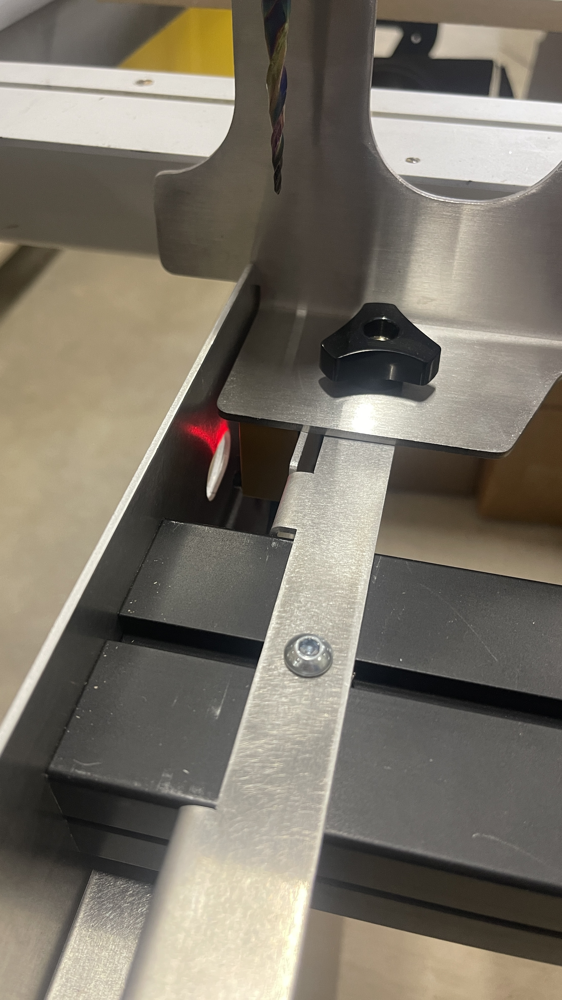
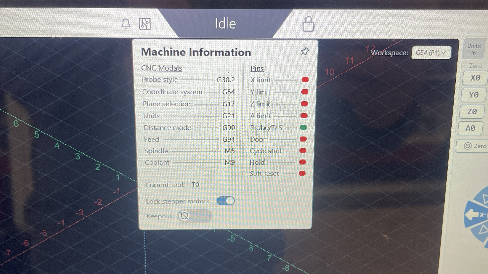
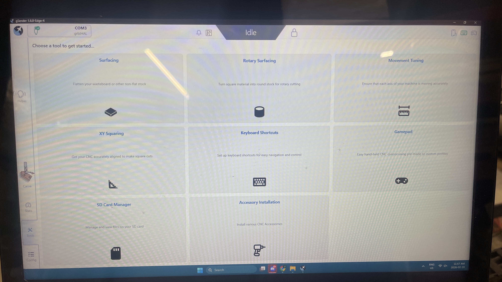
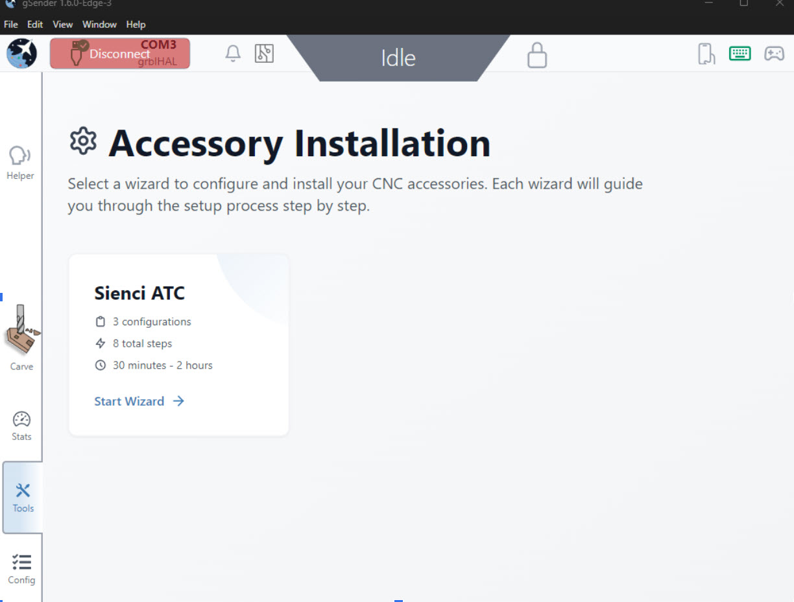
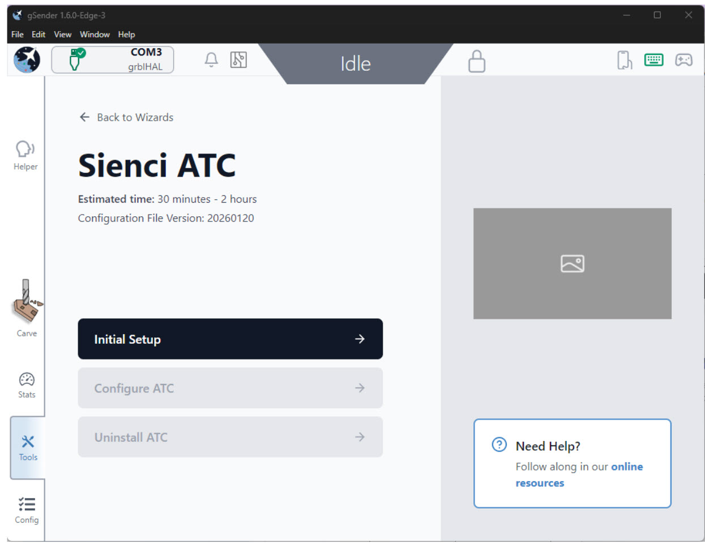
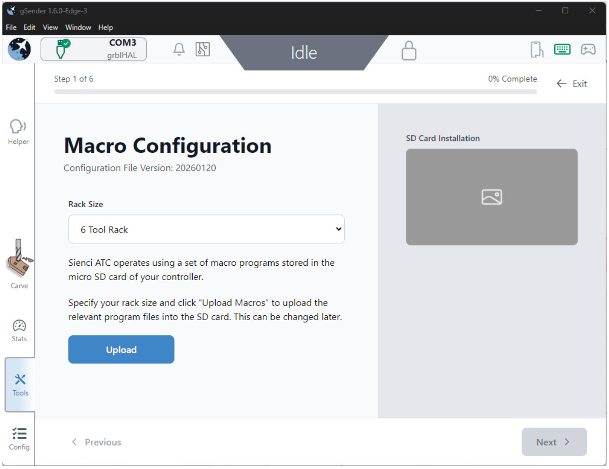
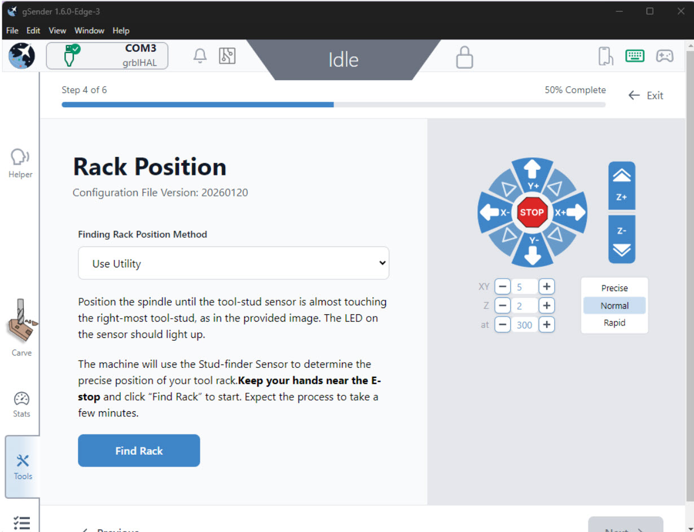
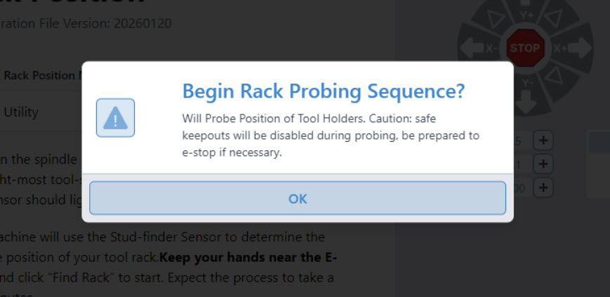
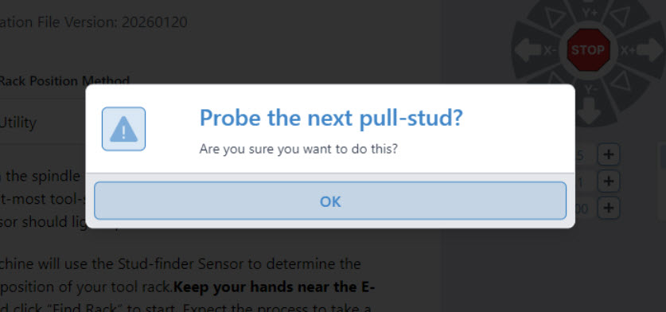
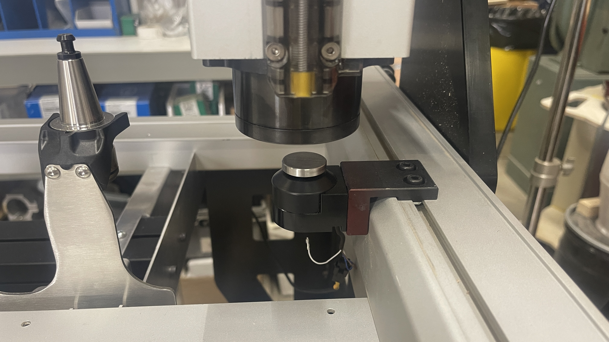

## gControl Panel

At this time you can reinstall your gControl panel and mount, see instructions [here ] https://resources.sienci.com/view/gc-gcontrol-assembly/

## Software Setup

1. Plug the **VFD power cable** into an outlet and turn on the power switch at the bottom of the VFD.
1. Turn on the **SLB-EXT** using its toggle switch, cycling the E-stop as usual.

## Initial Hardware Checks

1. Verify the **rack sensor** is on. It should be on if the rack has been installed correctly. There should be a red light coming from the rack sensor.

{.aligncenter .size-medium}

1. Check that the **tool length sensor (TLS)** is functioning.

    * Press down on the TLS (either manually or by jogging the spindle down slowly), and confirm the **orange TLS LED** on the SLB-EXT turns on.

**Insert screen shot or gif of light going on/off w button press. Maybe combine button press gif w light going on/off.**

{.aligncenter .size-medium}

1. Check the **white Pressure LED** on the spindle is on.

{.aligncenter .size-medium}

* If the light is **red**:

  * Check the air compressor gauge
  * Check the filter regulator gauge
  * Ensure the ball valve is open

⚠️ **Note:**
The first time you connect to **gSender** with the spindle connected, air will leak because the system has not yet been configured.

## gSender Setup

1. Open **gSender** and connect to your machine.
1. Go to **Tools**.
1. Go to **SD Card Manager**.
1. Insert your **microSD card** into the slot.

{.aligncenter .size-medium}

* We strongly recommend using the microSD card provided with your kit.
* Other SD cards may need to be reformatted to FAT32 and must not exceed a capacity of 32 GB.

We will be using gSender to write the latest ATC macros to your SD Card in the Initial Setup stage below.

### Accessory Installation

1. Stay on the Tools tab, and click on **Accessory Installation**.

{.aligncenter .size-medium}

1. Select **Sienci ATC** and click on that box. This process should take approx 30 min.
1. Select **Initial Setup**.

{.aligncenter .size-medium}

1. Select your Rack Size. For this example, we are selecting a 6 Tool Rack. Hit Upload.

{.aligncenter .size-medium}

1. Once the button turns green, click Next in the bottom right corner.

### Controller Configuration

1. This step will configure your controller. Hit the blue button Apply.
1. Once the wizard runs, hit Next.
1. This step will update your homing position. Hit the blue **Re-home button** to begin this wizard.
1. Once the button turns green and shows Complete, continue with the Next button.

* You should hear the air leak **stop** once configuration is applied.

### Rack Position

This next wizard will prompt us to manually jog the ATC, in order to locate the rack. To do this, we will line up the sensor on the front of the ATC over the tool holder stud, triggering an LED to light up.

{.aligncenter .size-medium}

1. Ensure **Use Utility** is selected in the drop down menu.

    ⚠️ **Caution:** Move slowly. Avoid crashing the **stud finder** or **spindle nose**.

1. Assuming you start from the back left corner of the machine, you will be moving the spindle above the left-most tool holder, about:  

* 1140mm to the right on the X axis

* 20mm forward on your Y axis

* 100mm down on your Z axis
  
    **Note: These values are approximate, you will need to adjust especially if using a MK1 or early MK2**

Let's begin:

1. You can set your speed to rapid and enter 1140 into your XY travel distance box, then hit X+, or simply hold the X+ button down to move to the right.

    **Insert Picture or gif of machine moving**

1. Set your speed to normal, enter 20mm into your XY travel distance box, then hit the Y- arrow.

    **Insert Picture or gif of machine moving**

1. Keeping your speed at normal, enter 100 mm into your Z distance travel box, then hit the Z- button on the right side.

    **Insert Picture or gif of machine moving**

1. Use **precise jog** (small taps only) to get approximately:

   * **1 mm** or **1/16 in** above the stud finder, to see the light turn on

{.aligncenter .size-medium}

Once the light is on, hit the **Blue Find Rack** button.

{.aligncenter .size-medium}

This will bring up a **Probing Sequence** confirmation box, hit OK to continue.

* The machine will move in a small grid pattern to re-locate the stud. The process will repeat for the **left-most tool holder**.

Once complete, you will see another confirmation box pop up. We will be moving to the next tool (tool #6), so ensure the tool stud is mounted there before continuing. Hit OK.

{.aligncenter .size-medium}

**Add a indication of where tool 1 and tool 6 are in this image below.**

{.aligncenter .size-medium}

1. You should now have the spindle sitting over your tool-stud (position 1) with the red light on. Hit continue. Your spindle will return to home.

**Verify this step is correct, isn't it simply sitting over position 6?**

1. Click Next

### Tool Length Sensor Position

Now we will be setting the location of the TLS.

1. We are going to move the spindle all the way to the right side again, to set the location of the TLS. You can jog all the way, or enter 1250mm into the XY travel distance box to get close.
1. Now you can adjust forward (Y-) approx 80mm, and down (Z-) by approx 130mm.
1. Now do manual adjustments until the spindle nose is directly above the tls.

{.aligncenter .size-medium}

1. Now you can hit the blue **Set Position** button!
1. Once the button turns green and indicates the position has been set, hit the Next button.

### Spindle Configuration

In this section we will be power cycling and reconnecting to the SLB EXT, ignoring an Alarm and hitting the next button.

1. Hit the setup and reboot blue button.
1. You must now reconnect to the controller.

{.aligncenter .size-medium}

1. Ignore the Alarm 11, and click the Next button
1. This will bring up the Modbus Config wizard.

### Modbus Config

1. Hit the button

{.aligncenter .size-medium}

Setup Complete!! Exit the wizard now.

The last step is to run homing again.

Bob is your uncle now.

1. Go to Config -> Tool Changing.
1. Toggle the Enable ATCi switch and hit the apply changes button.

### Probed Rack Offsets

* Offset values are calculated using:

* Home position → center of the **last tool holder** *(confirm left-most vs right-most)*

1. Press **Continue** to return the machine to the home position automatically.

## Tool Length Sensor Probing

* You may probe using the **spindle nose** directly on the TLS.
* If probing with a tool:

  1. Manually install a **tool holder and bit**.
  2. Press the **drawbar button** to insert the holder.

### Recommended Tooling

* Use a **flat end mill** for best accuracy.
* Do **not** use:

  * Surfacing bits
  * Asymmetric tools

## Modbus Configuration

1. Reconnect to the machine in gSender.
2. Complete the **Modbus configuration**.
3. After the wizard completes:

   * **Home the machine**

Once complete, the following tabs should appear in gSender:

* **Spindle / Laser**
* **ATC**

## Functional Checks

Try the following to confirm everything is working correctly:

* **Pick Up Tool**
* Slowly jog toward the rack

  * Confirm the machine prevents entry into the lock-out zone
* **Probe Tool**
* Turn the **spindle ON**
* Run **spindle burn-in G-code**
