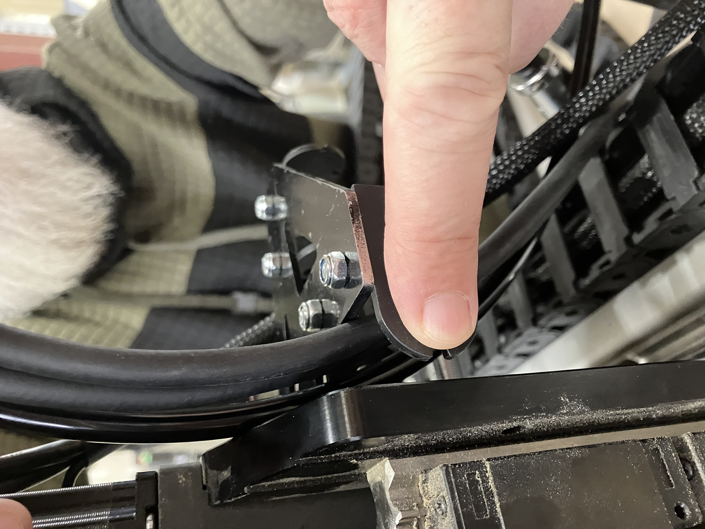

## Spindle Mounting

1. From the **Accessories box** in the main ATC box, take out the fasteners.
2. Using the **top foam as a cushion**, remove the spindle from the bottom foam. Place the spindle on the top foam with the **threaded holes facing up**. 

   > **Important:** Never stand the spindle on its nose (the end where tools are inserted). This can damage the bearings.
1. Grab the **drag chain** from the main ATC box and the accessories box. Undo all clips using a flathead screwdriver.
2. Remove the **male drag chain end link** (the one with studs on the sides, not holes) with flathead screwdriver.
3. Place the male link onto the **Z-axis drag chain pickup**, then fasten using **two (2) M4-8 mm screws**.

4. Align the assembled Z-axis drag chain pickup onto the back of the spindle at the threaded holes, then use **four (4) M4-8 mm screws** to securely attach it. Make sure the end link faces the front of the ATC (where the buttons are).

3. Take out the **ATC mounting plate** and place it on the spindle.

4. Use this chart provided (based on your setup) to determine where you want to mount the spindle and plate. (We need renders for the extreme positions so 5 pictures total)

{.aligncenter .size-medium}

5. Place **4-6 M6-14 mm screws** into the holes and fasten them using the provided Allen key. The screw heads should sit in the bore holes.

6. Place **two (2) M6 shoulder screws** onto the ATC mounting plate, then align them with the holes on the **X gantry** of the AltMill. Secure using the Allen key. This is easier with 2 people. 

The photo above is incomplete, the pickup should be fully assembled we want to just show the position and orientation of the pickup from the back of the spindle

7. Use **two (2) M6-25 mm screws** on the bottom holes of the plate to fully secure the assembly onto the X gantry.

> **Note for 4×8 machines:** Remove the cover of the backpack on the ATC spindle to access more mounting holes on the X gantry. Undo the three screws on the cover, then use **two (2) M6-25 mm screws** to secure the ATC mounting plate to the gantry.

## Drag Chain Routing

This can be tricky, make sure to mind the orientation of the ends and female/male. You may need to redo if you put it wrong dont worry

From the other side of the drag chain, remove the **female end link** and place it on the **X-axis drag chain pickup**. Secure it with **two M4-8mm bolts and nuts**.

Make sure the clips on your existing AltMill X drag chain are undone and that the **drag chain mount at the back of the XZ axis is removed** before proceeding.

From the existing X drag chain, remove the male drag chain end link and attach it to the X-axis drag chain pickup with **M4-8 mm screws**.

Attach the assembled X-axis drag chain to the back of the Z-axis assembly using the screws from the previously removed drag chain mount.

Reattach the X-axis drag chain onto the new pickup.

## Cable and Tubing Routing

1. Grab the following from the main box:

   * ATC spindle cable (blue)
   * Signal cable
   * Air line tubing (10m) 

2. On the **Z-axis**, rest one end of the air line tubing and metal aviation ends of the spindle and signal cable over spindle, making sure they reach the connections at the spindle. 

NO PHOTO HERE, PROBABLY NEED ONE

3. Fit the cables and tubing in the space between the Z-axis assembly and the **female end link** on the X-axis drag chain pickup.

   > **Important:** Do not kink the tubing.

   
   
Start routing in the X, attach 1 clip every 10-20 just to loosely secure.
Detach all the clips on the Z-axis drag chain with a flathead screwdriver. 

4. Attach the Z-axis drag chain from the ATC main box onto the female end link so that the drag chain hangs over the Z-axis, and contain the cables and tubing. Adjust the cables and tubing to ensure they still reach the spindle connections. For the air line tubing leave a palm-sized loop at the back of the Z assembly for strain relief.

   > **Warning:** Cables and tubing must run through drag chains in parallel. **Never cross them over each other.**

Plug in spindle, signal then air tube last, on the spindle.  Use the grooves on the aviation connectors to identify and rotate to seat. 

* ⚠️ *Incorrect alignment can damage the pins.*

Finish routing the 3 in the X-axis by clipping the rest of the links. 

Unclip the Y axis drag chain from the end link. Route the **spindle cable, signal cable and air line tubing** through  Y-axis drag chains. The spindle cable, signal cable and the air tube must exit at the **front of the machine**. Ensure the blue connector can reach the VFD through the table leg cutout (where the AltMill label is). Ensure the end with the **single Molex connector** can reach the SLB-EXT.

> **Important:** Avoid bending the tubing while routing to prevent kinks or blockages.
 