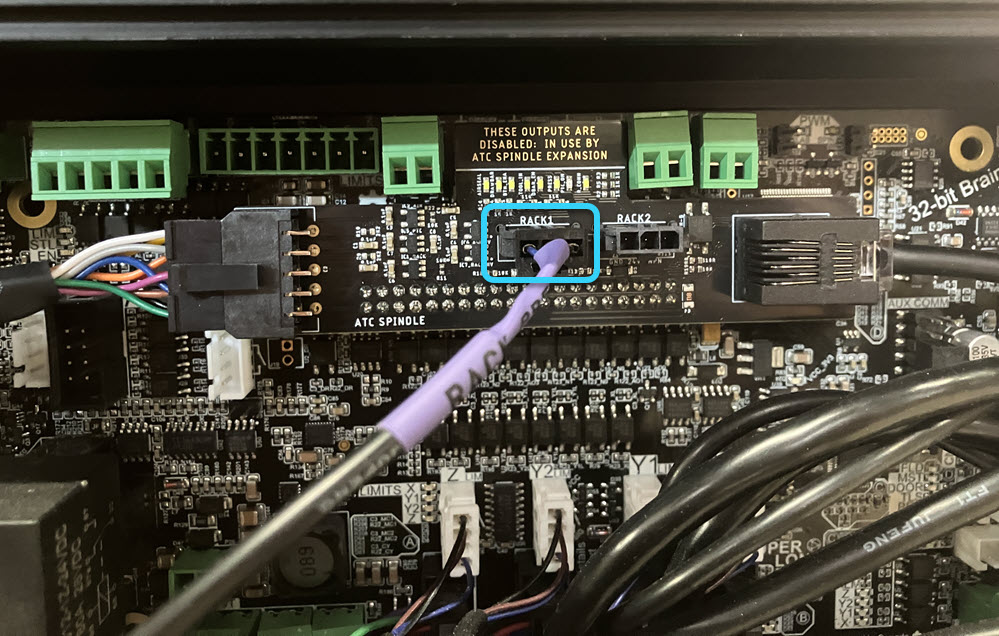

## Rack & TLS Installation

*No rack?** [SKIP AHEAD to the TLS](#tool-length-sensor) section in this article.

{.aligncenter .size-medium}

{.aligncenter .size-full .wid}

## Rack Assembly

1. Grab the **rack sections** and identify:

   * The back right and back left, which are the mirrored pair of sections
   * The front, which are **two identical sections**

   {.aligncenter .size-medium}

1. Grab the **ATC rack sensor.** Put two (2) M3 - 20mm socket head screws into the tool rack sensor. Then mount the sensor onto the **back right rack section**:

   * Fully secure with the pre-installed screws.
   * Position the cable from the sensor into the rectangular cutout.

   {.aligncenter .size-medium}

   {.aligncenter .size-medium}

1. Take the **identical front rack sections** and place them onto the back left and right sections. Based on your machine type, the positioning will be different, so use the small indicator notch on the front sections and the letters labelled on the back sections to align.

   * 2x4 -- align to C
   * 4x4 MK2 & 4x8 -- align to B
   * 4x4 MK1 -- align to A

   Fully secure the connection using **two (2) M6 - 8mm button head screws** per side.

   {.aligncenter .size-full}

   {.aligncenter .size-medium}

1. Place **one assembled rack section** onto one end of the **support extrusion**. Align with the threaded holes. Repeat for the other assembled rack section. Fully secure using **two (2) M5 - 16mm button head screws** at each extrusion end, making sure the extrusion is perpendicular to the support extrusion.

   {.aligncenter .size-medium}

1. Insert a M6 roll-in **T-nut** into the extrusion slot.  
   * Ensure correct orientation of the T-nut in the slot, the flat side should be facing up from the slot.
   * Slide it to align with the rack hole.
   * Place **one M6 - 8mm button head screw**, and fasten securely.
   * Repeat for the other side.

{.aligncenter .size-medium}

---

## Backbone Assembly

{.aligncenter .size-full .wid}

1. Secure one (1) **tool holder clip** onto each end of the backbone, ensuring the clip sits **flush**, using two (2) M4 - 8mm screws. Repeat for each position on the backbone.

   * Hold the clip snug while threading in the screws with an Allen key. Secure fully.
   * Continually check that each clip remains fully seated to the profile.

         ⚠️ **Important:** Improperly seated clips can cause **ATC accuracy issues**.

   {.aligncenter .size-medium}

## Rack Assembly Mounting

{.aligncenter .size-full .wid}

1. Place the backbone onto the assembled rack sections, located using the two studs.

   {.aligncenter .size-medium}

1. Loosely install the two (2) knobs onto the studs, you will adjust the backbone position later.

1. Pre-assemble **four (4) M6 - 8mm button head screws** with the correct **T-nuts** for your machine:

   * **MK1** – Roll-in T-nuts
   * **All other AltMills** – Twist-in T-nuts

   {.aligncenter .size-medium}

1. Bring the **assembled rack sections** and pre-assembled fasteners to the **back-right corner** of the AltMill.

1. Confirm that the ends of the rack are **flush** with the crossbeam faces on both the front and back sections.
   * If not, revisit the [Rack Assembly](#rack-assembly) to adjust hole positions.

1. Slide **two (2) pre-assembled M6 fasteners** per crossbeam T-slot where the rack assembly will mount, for a total of four (4) fasteners.

   {.aligncenter .size-medium}

1. Place the rack assembly **under** the crossbeams and hook it onto the M6 fasteners. Position the assembly so it butts up against the **rear right AltMill leg.**

   {.aligncenter .size-medium}

1. Hold the assembly in place at the support extrusion, clamping the assembly up to the crossbeam, and tighten the fasteners.

   {.aligncenter .size-medium}

1. Finally, secure the backbone knobs. Ensure they sit flush to the rack sections.

   {.aligncenter .size-medium}

1. If installing a **second tool rack**:

   * Repeat the above steps
   * Install it directly next to the first rack, **butted against the backbone**

      ⚠️ This is required for **automated setup in gSender**.

   {.aligncenter .size-medium}

1. Install tool holders into the **first and last slots** of each tool rack assembly.

   * Make sure tool holders are wiped clean with shop towel and isopropyl alcohol
   * Fully seat each tool holder, the clip must engage the flats on the tool holder  

   {.aligncenter .size-medium}

   {.aligncenter .size-medium}

## Rack Sensor Cable Routing

{.aligncenter .size-full .wid}

1. Grab the cable clips from the ATC box and tool rack box, then place them into the crossbeams, three (3) across the rear-most crossbeam, then one (1) for each remaining crossbeam, stopping before the front-most crossbeam.

   Route the **rack sensor cable** through the cable clips in the crossbeams.

         Note: This is different from the TLS cable, making sure you are using the correct cable.

   {.aligncenter .size-medium}

1. From the **rack sensor cable**, connect:

   * **Female end** → rack sensor
   * **Male end** → ATC shield on the SLB-EXT
      * Use **Rack 1** or **Rack 2** port

   {.aligncenter .size-medium}

   {.aligncenter .size-medium}

## Tool Length Sensor

{.aligncenter .size-full .wid}

## TLS Mounting

We will be mounting the TLS on the **back right corner of the AltMill**, next to the tool rack. If you have an MK1 with dust covers, you will need to mount under them.

1. Put the TLS base and body together.

1. Pre-assemble **two (2) M5 - 10mm screws** with the **M5 - T-nuts** on the TLS.

1. Slide the TLS into the **right Y-axis rail T-slot**.

1. Secure the TLS by tightening the M5 fasteners.

1. Then route the **TLS cable** through the cable clips:

   * Leave the **green connector** end at the SLB-EXT, unconnected
   * Leave the **black Molex connector** at the back right of the AltMill, next to the tool rack, unconnected

   {.aligncenter .size-medium}

1. Plug the **green connector** into the **TLS port** on the SLB-EXT.

1. Plug the **black Molex connector** from the TLS cable into the TLS.

   {.aligncenter .size-medium}

   {.aligncenter .size-medium}

Your tool rack and TLS are now completely assembled!
