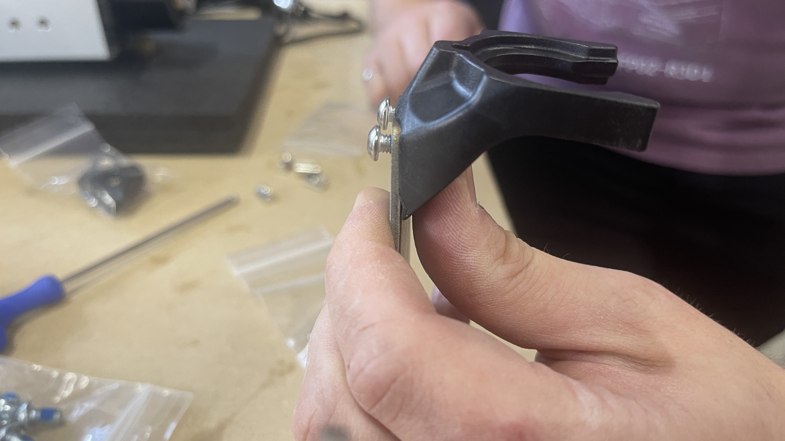
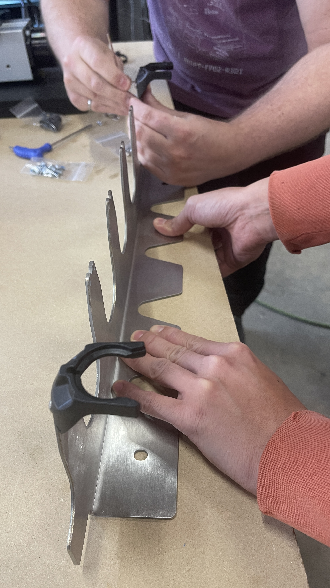
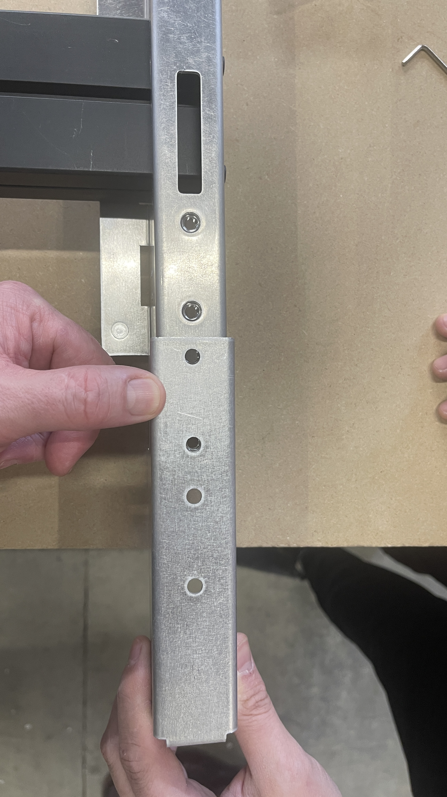
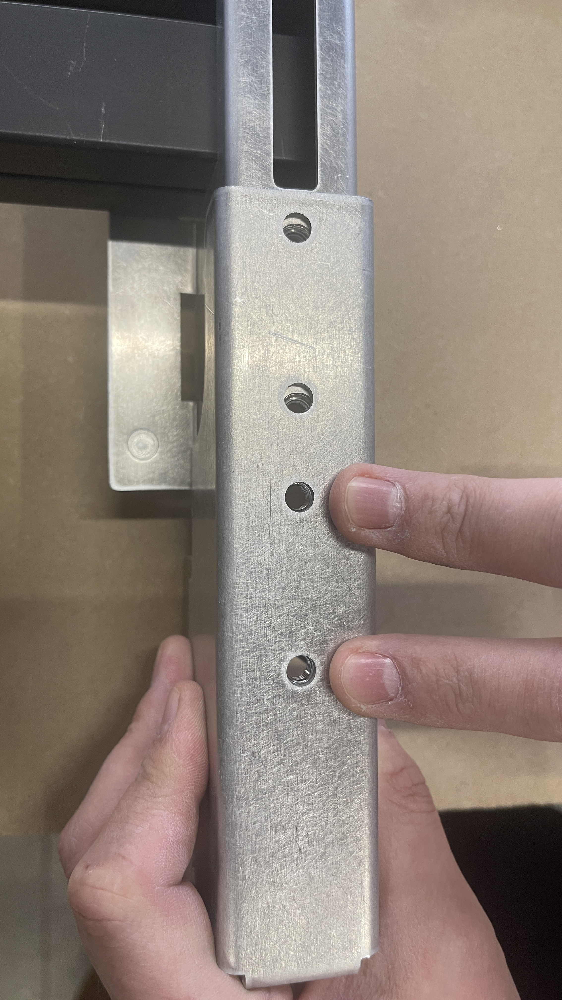
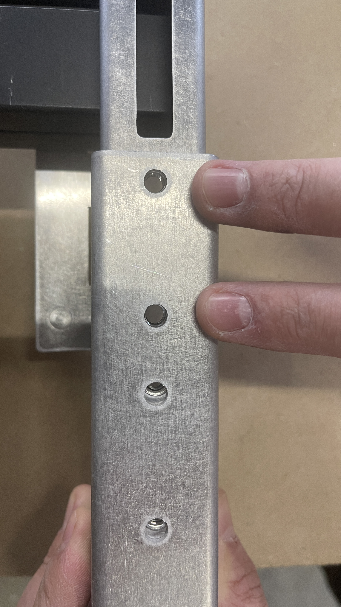
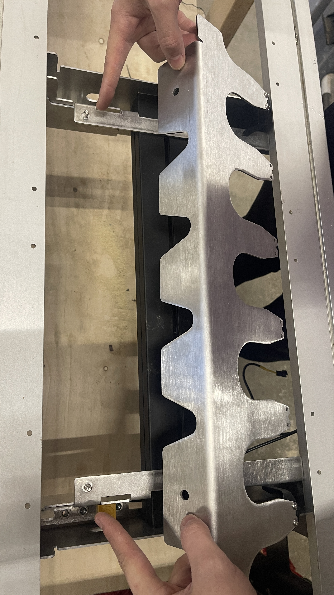
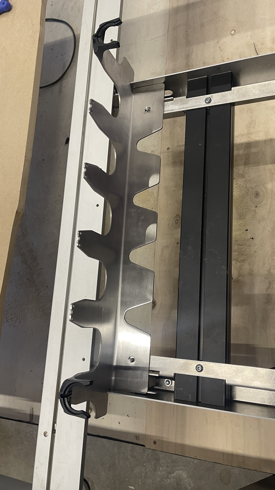
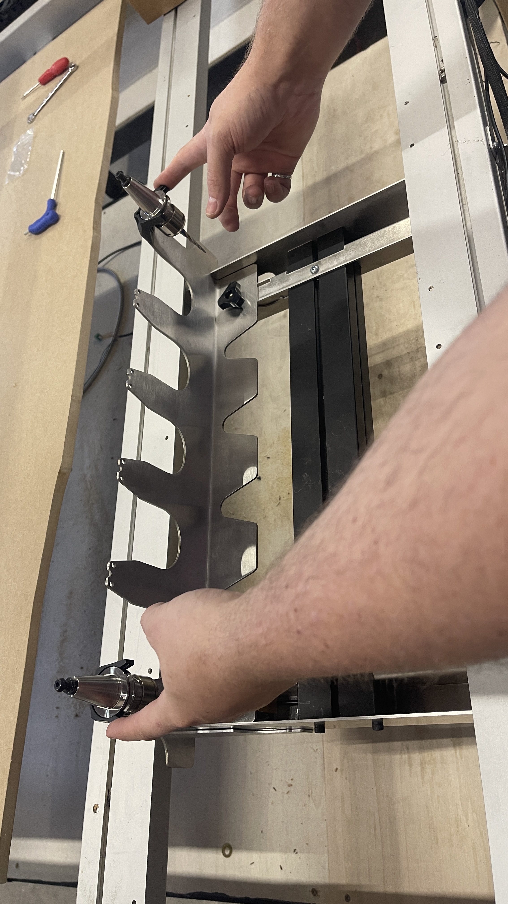
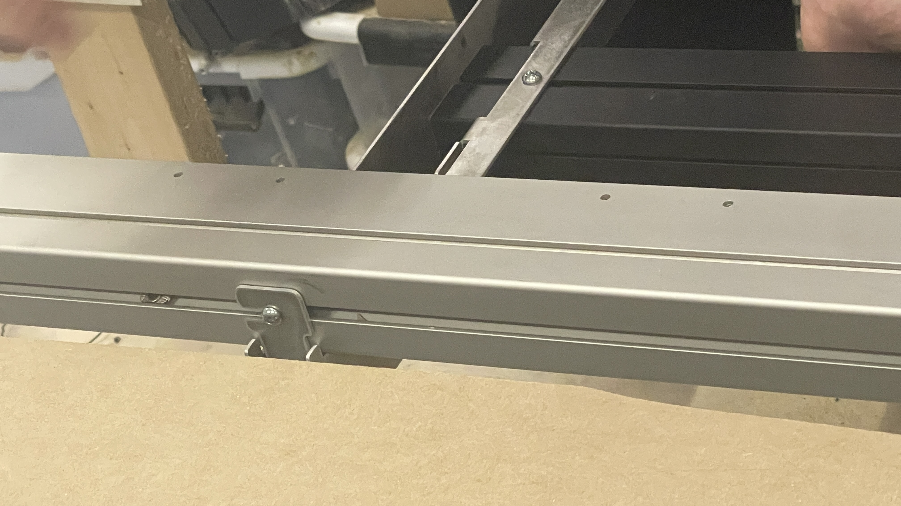
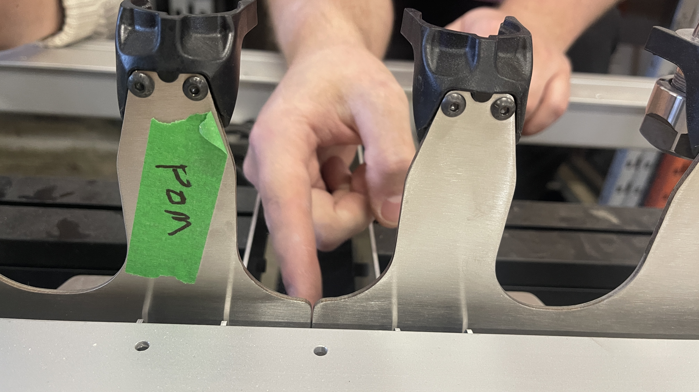

## Rack & TLS Installation

> **No rack?** Skip ahead to the **TLS Cable** section in this article. ***Insert link to heading

Header photo (fasteners are unconfirmed yet, better wait for now): 1x support extrusion, 2x front rack section, 1x back right rack section, 1x back left rack section, M6-14mm screws, M6 Roll-in T-nuts, M6 Twist-in T-nuts, M6-8mm screws, M3-20mm screws, M4-8mm screws, 2 or 4 knobs, 1x tool rack sensor cable, 1x TLS cable, 1x TLS body, 1x TLS base, 1 or 2x backbone, 6 or 12x clips

## Rack Assembly

1. Grab the **rack sections** and identify:

   * The back right and back left, which are the mirrored pair of sections
   * The front, which are **two identical sections**

1. Place **one mirrored rack section** onto one end of the **support extrusion**.

   * Align with the threaded holes.
   * Fully secure using **two M6-14mm screws** at the extrusion end.

1. Insert a M6 roll-in **T-nut** into the extrusion slot.  
   * Ensure correct orientation of the T-nut in the slot.

      

   * Slide it to align with the rack hole.
   * Secure using **one M6-8mm button head screw**.

1. Loosely place the **second mirrored rack section** on the opposite end of the extrusion.

1. Put two (2) M3-20mm screws into the tool rack sensor.

1. Mount the **tool rack sensor** onto the **back right rack section**:

   * Position the sensor at the slot.
   * Secure with the pre-installed screws.
   Position the pigtail from the sensor into the rectangular cutout

    

    

   

   

1. For the other mirrored rack section:

   * Fully secure the **two (2) M6-14mm screws** at the extrusion end.
   * Insert the T-nut and fasten using **one (1) M6-8mm button head screw**.

1. Before continuing, make sure the tool rack sensor is secured onto the rack section, in the correct position and orientation, as shown in the picture below:

## Backbone Assembly

1. Grab the **backbone**, **clips**, and **M4-8mm screws**.

1. Position each clip onto the backbone so it sits **flush**.

   * Hold the clip snug while threading in the screws with an Allen key. Secure fully.
   * Continually check that each clip remains fully seated.

   ⚠️ **Important:** Improperly seated clips can cause **ATC accuracy issues**.

1. Repeat for the other end of the backbone. You should have 2 clips installed.

Optionally, you can install all the clips onto the backbone now, or do it at a later time.

## Joining Rack Sections

1. Take the **remaining identical rack sections** and align them based on your machine type:

   * **2×4** – furthest set of holes
   * **4×4 MK2 / 4×8** – closest set of holes
   * **4×4 MK1** – middle set of holes

 ***FURTHEST
***CLOSEST
 ***MIDDLE

1. Secure each connection using **two M6-8 mm screws**.

## Rack Assembly Mounting

1. Place the backbone onto the assembled rack sections, located using the two studs.

***THESE PHOTOs are INCORRECT IT SHOULD NOT BE MOUNTED ON THE MACHINE YET, JUST FOCUS ON THE BACKBONE AND THE RACK

1. Loosely install the two (2) knobs onto the studs, you will adjust the backbone position later.

***CLOSE UP ON THE KNOBS, rack should not be on machine yet

1. If the machine is not already jogged forward:

   * Power on the controller
   * Connect to **gSender**
   * Jog the machine forward to access the rear crossbeams

1. Select the correct **T-nuts** for your machine:

   * **MK1** – Roll-in T-nuts
   * **All other AltMills** – Twist-in T-nuts

*** Roll in is the rectangular one, the twist in is the winged looking one. should label in the render?

1. Pre-assemble these together:

   * **Four (4) M6-8mm button head screws**
   * **Four (4) T-nuts**

1. Bring the entire **rack assembly** to the **back-right corner** of the AltMill.

*** Make a picture to show where on the machine this is, wide shot

* Confirm that the ends of the rack sit relatively flush with the crossbeam faces.
* If not, revisit rack section hole placement.

1. Slide **two (2) pre-assembled M6 fasteners** into the crossbeam T-slot where the rack will mount, for both crossbeams.

1. Lift the rack assembly under the crossbeams and hook the rack flanges onto the M6 fasteners.

** a gif here of this motion would be ideal

1. Position the assembly so:

   * It butts against the AltMill leg
   * The rack flange butts against the **forward crossbeam**

   

   

1. Hold the assembly in place and tighten the M6 fasteners.

1. Adjust the backbone position by loosening the knobs, then pushing the backbone forward, butted up against the crossbeam and corner of rack.

1. Secure the backbone in place using the **knobs** on the studs.

1. If installing a **second tool rack**:

* Repeat the above steps
* Install it directly next to the first rack, **butted against the backbone**

   ⚠️ This is required for **automated setup in gSender**.

1. Install tool holders into the **first and last slots** of each tool rack assembly.

   * Make sure tool holders are wiped clean with shop towel and isopropyl alcohol
   * Fully seat each tool holder, the clip must engage the flats on the tool holder  

## Tool Rack Sensor Cable Routing

1. Route the **tool rack sensor cable** through the cable clips in the crossbeam. For **4×8**, route the cable **underneath** the cable track.

Note: This is different from the TLS cable, making sure you are connecting the correct sensor.

1. From the tool rack sensor, connect:

   * **Female end** → tool rack sensor cable
   * **Male end** → daughter board on the SLB-EXT

     * Use **Rack 1** or **Rack 2** port

## TLS Cable

1. Grab the TLS cable from the kit. Route the **TLS cable** through the cable clips:

   * Leave the **green connector** end at the SLB-EXT
   * Leave the **black Molex connector** at the back-right of the AltMill, next to the tool rack

 ***Photo to show connectors only

1. Plug the **green connector** into the **TLS port** on the SLB-EXT.

## TLS Mounting

* If using the TLS **without an ATC**, you may mount it anywhere convenient.
* With an ATC installed, the **recommended location** is:

  * **Back-right corner of the AltMill**, next to the tool rack

1. Put the TLS base and body together.

*** Ignore background, just need picture of the two pieces together

1. Pre-assemble **two (2) M6-8mm??? screws** with twist-in or roll-in **T-nuts** on the TLS.

1. Slide the TLS into the **right Y-axis rail T-slot**.

1. Secure the TLS by tightening the M6 fasteners.

1. Plug the **black Molex connector** from the TLS cable into the TLS.

Your tool rack and TLS are now completely assembled!
