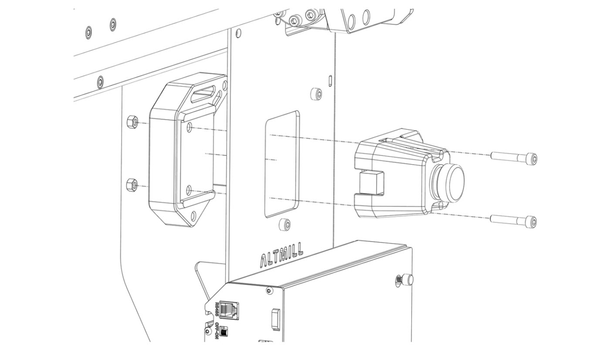
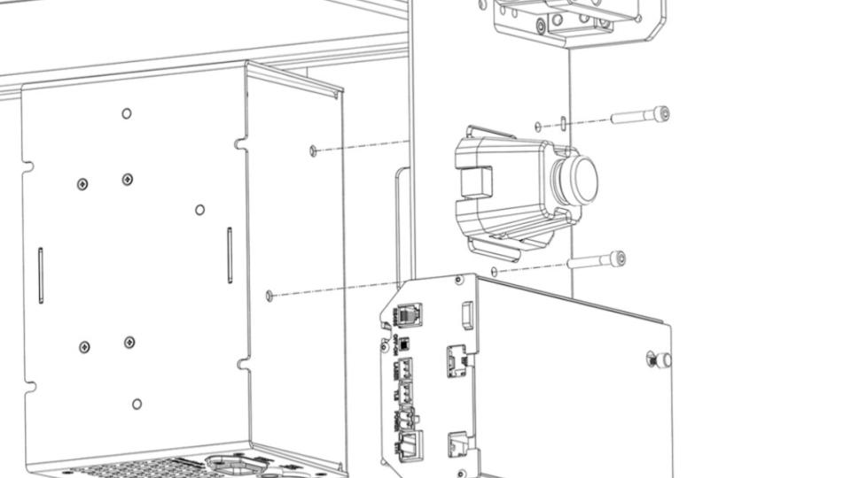
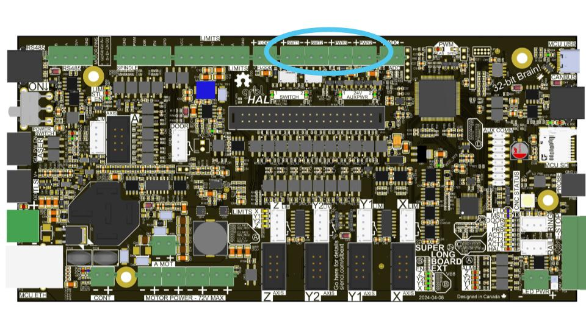
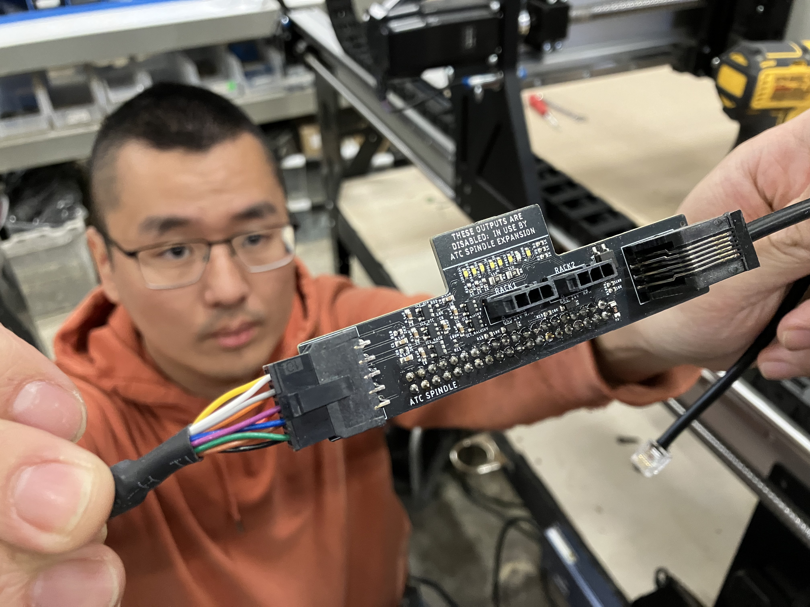
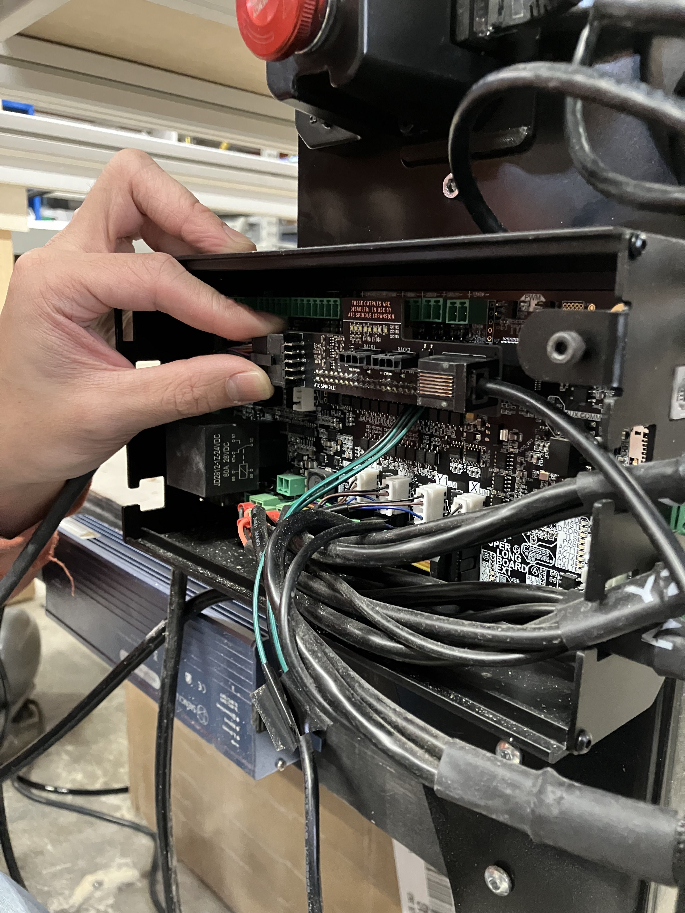
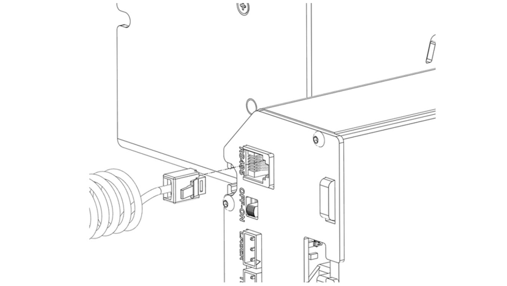

## VFD Installation & Connections

    [Render] Image of full machine with VFD outlined in blue (atc_assembly_vfd-header1.jpg)

    [Render] Parts Needed:
    2x M5 Lock Nuts
    1x VFD Mounting Spacer
    4x M5 - 30mm Socket Head Screws
    1x 2.2kW Enclosed VFD
    1x 220V VFD Power Cord
    1x VFD Controller Cable
    1x ATC Shield (SLB-EXT)
    1x RJ12 Cable
    1x MicroSD card
    (atc_assembly_vfd-parts1.jpg)

---

1. If you already have the **VFD mounting spacer and E-stop assembled**, go to Step 2! Otherwise:
  
    * Fully seat two (2) M5 lock nuts into the VFD mounting spacer. Place the VFD mounting spacer onto the **inner face of the front-left AltMill leg**, then assemble the E-stop on the outer face of the leg using two (2) M5-30mm screws.

{.aligncenter .size-medium}

1. Route the blue connector from the spindle cable through the table leg cutout.

---

    [Render] A single image of the front-left AltMill table leg with the spindle power cable, blue connector end, entering the triangular cutout. The VFD is not installed on. Image below is for reference only.
    (atc_assembly_vfd-table-leg.jpg)

---

1. Plug the spindle cable connector into the bottom of the enclosed VFD.

1. Mount the enclosed VFD inside the table leg using the remaining two (2) M5 - 30mm screws. Ensure that the VFD is positioned so you can see the screen through the table leg cutout.

{.aligncenter .size-medium}

1. Plug the **E-stop cable** back into the SLB-EXT.

1. Plug the **VFD power cord** into the VFD.

1. Plug the coiled **VFD controller cable** into the VFD.

### Finishing Up Connections

1. Turn **off** the **SLB-EXT**.

1. Connect the RJ12 cable into the **ATC shield**

1. On the SLB-EXT, remove the **top row of green connectors**, above the rectangular black header connector. These connectors will interfere with the ATC shield.

1. Connect the other end of the **signal cable** to the ATC shield.

1. Then plug in the **ATC shield** onto the **black header connector** on the SLB-EXT.

---

    [Render] A single image of the ATC shield with the RJ12 cable and signal cable connected. The ATC shield is mounted onto the SLB-EXT. Images below are for reference only.
    
    (atc_assembly_vfd-shield.jpg)

---

1. Connect the other end of the **RJ12 cable** to the **PENDANT port** on the SLB-EXT.

1. Connect the other end of the coiled **VFD controller cable** into the **RS485** port on the SLB-EXT.

{.aligncenter .size-medium}

1. Insert the **SD card** into the **SD card slot** on the SLB-EXT. Make sure it fully sits in the port.

## Wiring Sanity Check

Use this section to double-check all connections:

* **Spindle Cable**
  `Spindle (aviation) → VFD (aviation)`

* **Signal Cable**
  `Spindle (aviation) → ATC shield`

* **VFD Controller Cable**
  `VFD (RJ / Ethernet) → RS485 port on SLB-EXT`

* **VFD Power Cable**
  `VFD (IEC) → Power outlet (NEMA 6-15P)`

* **RJ12 Cable**
  `ATC shield → PENDANT port on SLB-EXT`
  