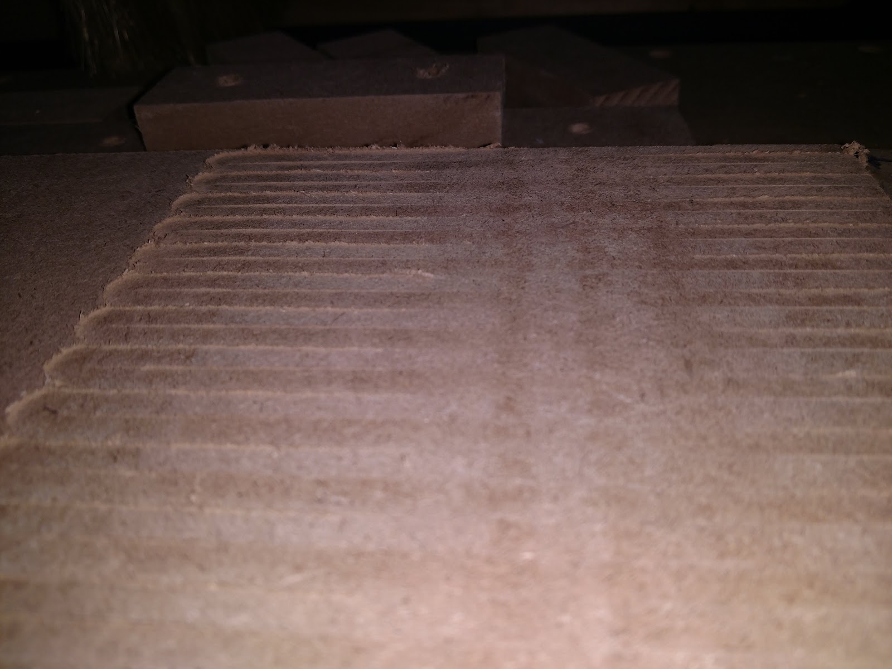

Can go in “Advanced” section
Cover all aspects of tramming but try to keep it general to apply to any CNC

- Nod and Tilt
- https://www.servomagazine.com/magazine/article/how-to-tram-your-cnc-router
- Order of steps to get everything nice with minimal effort
- Find if any other community videos have been made for our machines in particular
- My spoil board has slight stripes as opposed to being perfectly flat… is this normal or do I have a tilt on my router that needs to be fixed? If so, how’s that done?
- https://forum.sienci.com/t/tramming-suggestions/13812/7

---

Tramming is the process of making the flat bottom of a cutting tool parallel to the X and Y Rails. It most often comes up when customers talk about lines appearing when surfacing. It's caused by the flat bottom of bits not being parallel to the rails. The router is slightly angled causing one side of the bit to be higher than the other.

We have found that our machines don't typically require significant tramming for their use-case and as such we don't have documentation on this. If you're interested in tramming your router, I would advise you to look through our LongMill Facebook group and forum and see what process others have used to tram their router.

If the lines appear in the left to right direction, the bit is angled front to back. Depending on how out of tram your router is you may be able to shim the inside surface of where the router mounts. Shim either above or below the mounting bolts to tilt the router towards the front or the back. Another option is to loosen the mounting bolts on the y-gantry plates and rotate the x-rail forward or backward for adjustment. Note: there is very little adjustment to be made.

If the lines appear in the front-to-back direction, the bit is angled left to right. Loosen the four router mount screws and gently tap the router clockwise or counterclockwise until it is trammed.

Some community links:

https://www.facebook.com/groups/mill.one/permalink/1253819475089381/
https://www.facebook.com/groups/mill.one/posts/1184610055343657/
https://www.facebook.com/groups/mill.one/permalink/1151461815325148/
https://forum.sienci.com/t/has-anyone-trammed-their-longmill/521
