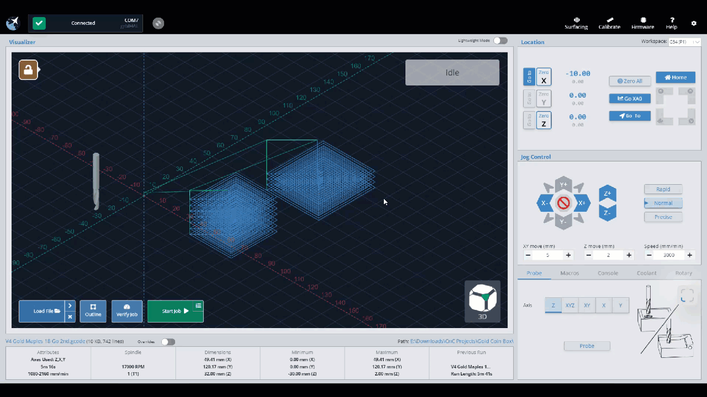

We've recently updated gSender by merging in gSender Edge 1.5.0, bringing you a fresh new look and improved features. This guide will help you get used to the new design and make the switch easier.

Out with the old **Classic version**, and in with the **New U!!**

We've combined similar features, and are excited to share things like our new **Stats Tab** which incorporates stats, maintenance and diagnostics and more, all in one dashboard.

The new **Config Tab** puts all of your settings into one place, so no more flipping between firmware and profile options.

*Rest assured that all of the functionality you are used to is still here, it may simply have a new home.* Hopefully this section helps guide you to the new sections, and that you don't skip a beat. Let's dive into some specifics!

## 🌟 Key UI Enhancements

You will notice right away that as you click through the new UI, there are two section of your screen that are always available to you. The **Top bar** and the **Left bar**.

### Top Bar

The top bar will show you several cool things, and will always be available to see. Feel free to click on some of these icons to see what they do! Moving from left to right, you will see your connection status, notification bell, machine information, machine status, and shortcuts for remote control, keyboard shortcuts & gamepad profiles.

{.align-center .size-medium}

### Left Bar

On the left side of the screen, you will see another bar that stays on the screen at all time, with 5 tabs. From top to bottom, these tabs are:

1. The **Helper Tab** will aid you in understanding and correcting any errors that pop up. It also includes a tool changing wizard.
1. The **Carve Tab**, is where you handle files, watch the visualizer, setup jobs, move the machine, probe for zero, manage macros, check out the console and more.
1. The **Stats Tab** can be used for examining your machine stats, upcoming maintenance, your recent alarms & errors and your machine configuration. A diagnostic file download is available if you run into trouble, and links to our community, resources and Git Hub repository are also found on this tab.
1. On the **Tools Tab**, you will see aids to help you surface a project, square or tune your machine and setup your keyboard and gamepad shortcuts.
1. The **Config Tab** has combined both your machine settings with the firmware settings. You can search these settings or toggle the ones that have been modified.

{.align-center .size-medium}

Let's briefly checkout each tab, to see what goodies are there.

#### **Main Carve Tab**

We've improved the main screen, now called the **Carve Tab**. The right side (Blue) is very similar to Classic gSender -- all the blue buttons move the machine, whether it be jogging, homing or parking. Below, you can access many functions like Probe and Rotary. The middle/left side of the screen (Red) is like a dashboard,  you can load files, control the job and observe your progress in the visualizer.

{.align-center .size-medium}

##### **Updated Jog Controls and DRO**

The jog controls have been redesigned for better ergonomics and touch-screen compatibility.

{.align-center .size-medium}

#### **Stats Tab**

The stats tab offers an overview of your Machine, including your recent jobs run, configuration, upcoming maintenance warnings and your recent alarms & errors. You can also download a diagnostic file for extra support, access our resources, community or github repository! Tap on one of the tabs at the bottom of this page, to see even more details!

{.align-center .size-medium}

#### **Tools Management**

The Tools tab now contains all the widgets for surfacing your project, tuning your machine, as well as creating keyboard shortcuts and gamepad profiles. In this short video, you can see where the Surfacing and Calibrate Tools are on Classic gSender, then we flip over to the Tools tab on the New U.

{.align-center .size-full}

#### **Streamlined Configuration Menu**

The Config menu has been refined to display only relevant sections based on your machine's connection status and selected profile. It's a combination of the   preferences mixed with the  firmware settings, so now all  settings are in one place. In this short video, you can see these moved from the top right (Classic) to the bottom left corner of the screen (New U).

{.align-center .size-full}

One cool thing is that modified settings are highlighted, and a 'Show Modified' toggle allows you to filter and manage settings that have been changed from the machine default. You can reset to default settings at any time if you find a change you have made isn't working.

{.align-center .size-full}

## 🌟 **New Features**

Not only are there several new UI enhancements, there are also a couple of new features that we should mention. Connecting has been streamlined and you have more flexibility on how gSender displays on your screen.

### **Automatic Firmware Detection on Connection**

Connecting is now easier! gSender now automatically detects your firmware type (Grbl/grblHAL) upon connection, selecting the appropriate controller settings. This feature simplifies the process, as you can select your default firmware choice in Config, and connect with a simple button press.

{.align-center .size-medium}

### **Improved Visuals, Touch Support, and New Display Options**

We've made several visual and usability upgrades to gSender. The visualizer now supports pinch-to-zoom on touch screens, **Dark Mode** to reduce eye strain, and includes a redesigned **Lightweight Mode** with easy presets. Turn these on by going to Config -> Customize UI.

If you're using a tablet or vertical screen, **Portrait Mode** is now supported—just rotate your device or change your display orientation.

{.align-center size-medium}

## 🛠️ Additional Noteworthy Features

* **Console Enhancements**: Added console clearing functionality and arrow-scrollable input history for improved usability.
* **Visual Tweaks**: Numerous UI adjustments, including updated icons, responsive sidebar sizing, and improved text legibility.

## 📘 Getting Started with the New UI

To explore these new features:

1. **Download gSender Edge 1.5.0**: Access the latest version from the [Sienci Labs GitHub repository](https://github.com/Sienci-Labs/gsender/releases).
2. **Refer to the Official Documentation**: The [gSender Docs](https://resources.sienci.com/view/gs-using-gsender/) provide comprehensive guidance on utilizing the software's capabilities.
3. **Engage with the Community**: Share your experiences, provide feedback, and seek assistance on the [Sienci Community Forum](https://forum.sienci.com/).

By familiarizing yourself with these updates, you can leverage the enhanced functionality and improved user experience that gSender Edge 1.5.0 offers!
