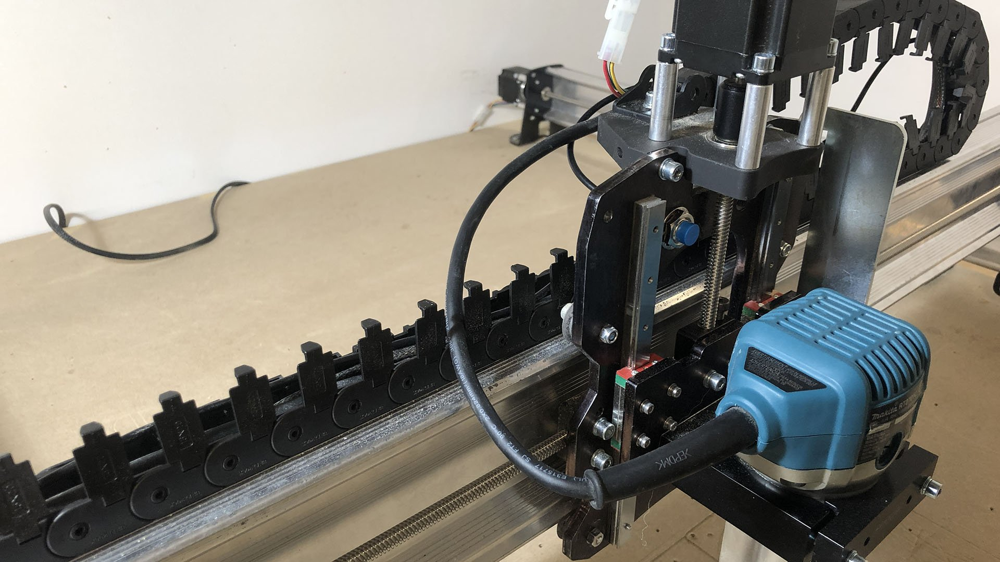

Limit switches (also referred to as end stops or homing switches) are switches that sit at one or both ends of each axis of a CNC to provide a few different functions. There are many different limit switch designs which broadly fall under being either mechanical or non-mechanical.

## **Are they for You?**

Limit switches will usually be used to:

1. Define soft or hard limits in order to prevent a CNC from damaging itself if it travels past its movement limits
1. Repeatably locate the machine (homing) for jogging / work offsets, saving a job that’s gone bad, or to resume existing work done for a long or multi-part job

These added perks are great in the long run as they can fulfill the needs of more advanced CNC users when they’re running longer and more complex jobs. There’s a big catch though, switches require more mindfulness on behalf of the CNCer. That means remembering to home every time you connect to your machine, keeping in mind Alarms you may experience if you’re too close to a hard or soft limit, and lastly understanding that adding switches to your machine can also introduce more complexity when troubleshooting problems with it. This is why we worked to make the LongMill’s design address some benefits of switches so that switches weren’t as necessary. This includes:

1. **Hitting the ends of its travel area causes zero damage to the machine:** In larger, more powerful machines such as VMCs and industrial CNC routers, crashing a machine can very well mean costly damage to your machine so limit switches are cheap insurance to prevent that. However, on hobby machines like the LongMill, the machine is not powerful enough to cause damage to itself, and so are not really necessary. In fact, in some cases, it can be more of a hassle as accidental triggers can ruin a project.
1. **Locating the machine can alternatively be done by using a touch plate:** ‘Homing’ is just the act of calibrating a CNC to a particular spot repeatably so that if, for example, you lose your CNC position due to a power outage or for a tool-change then you can find that position again using the offset distance from the calibrated point. This calibrated point can be set using limit switches but can just as easily be a touch plate or conductive geometry that a tool can touch off

This means the LongMill does NOT need limit switches to operate which is why they’re not included by default. That said, switches may still be worth your consideration if you find yourself running longer and longer jobs, performing more complex cuts, or you want to relocate your position more easily.

## MK2 Limit Switch Kit

https://youtu.be/Z3XCH60SyIY What’s unique about our Inductive Sensor Kit over what’s commonly on the market is the use of inductive sensors over mechanical ones. These solid-state sensors don’t have moving parts and so can last for a long time in dusty industrial environments, making them very reliable. The instructions below will cover how the kit installs on the LongMill MK2 and also include details on how you can put it to use in your daily cutting cycle.

### Unpacking

Each kit comes with:

* Inductive sensors (x3)
* Y-axis sensor bracket
* M5 T-nut for mounting the Y-axis sensor bracket
* M5-10mm socket head cap screws for mounting the Y-axis sensor bracket

{.aligncenter .size-medium}

 Before you begin, you will have to decide where you want your machine to home to since this will decide where you place your sensors. The Z-axis will always home to the top, but X and Y can home to any of the 4 corners of the machine's travel. We recommend homing to the front left or back left corners because:

* **Front left corner (recommended)**: most projects have a zero point on their front left corner so setting up a stop block can allow you to use your home point as the starting point for your cutting job. This also brings everything to the front to be easily accessible for setup, troubleshooting, or tool changes.
* **Back left corner**: another common homing point. Homes out of the way to give you space for setting up your material for a project.

{.aligncenter .size-medium}

### Attaching the Sensors

For the Z-axis, remove the nut and washer on the end of one of the inductive sensors. Pass this sensor through either of the two holes on the X-axis gantry plate (pictured), whichever you prefer. Re-install the washer and nut onto the end of the sensor. Leave it loose and use the nuts on either end to adjust where the sensor sits so that the blue tip doesn’t hit the Z-axis gantry at its upper position, then tighten the nuts. The steel wrench included with your LongMill MK2 serves to tighten the 17mm nuts on each sensor as shown.

{.aligncenter .size-medium}

Mounting the X-axis sensor will also start by removing the nut and washer off the end. Pass this sensor through the large hole at the top of the left Y-gantry plate, then re-install the washer and nut onto the end of the sensor. Adjust the nuts on the sensor so that the inside nut is threaded just barely onto the end of the sensor, then tighten the nuts. If you’ve chosen to home your machine to the right side instead, mount this sensor on the right Y-gantry plate mirrored to what is shown.

{.aligncenter .size-medium}

The Y-axis sensor uses a bracket to mount onto the underside of the Y-axis rail. Install the inductive sensor into the bracket by unscrewing the nut and washer from the sensor. Pass the sensor through the large hole on the mount, then reinstall the washer and nut. You’ll want to adjust where the sensor sits on the bracket so that the face of the blue tip is flush with the edge of the bracket as shown below.

{.aligncenter .size-medium}

To mount this bracket and sensor to the rail, first slide the t-nut into the bottom t-slot of the rail (pictured) until the t-nut is about 1” from the front foot. Start threading the M5-10mm screw into the t-nut but leave a gap so the bracket can be slid between the head of the screw and the bottom of the rail.

{.aligncenter .size-medium}

Where the bracket has a slot, slide it onto the screw with the sensor facing inwards until it bottoms out, then finish tightening the screw while holding the sensor.

{.aligncenter .size-medium}

**Note:** the Y-axis sensor mount is designed so it can be used on any of the four corners of the machine. If you chose to home to a different corner than the front left corner, your Y-axis mounting will be mirrored from the images shown above or you’ll have to flip the sensor inside the mount.

### Wiring

Routing the cables from the inductive sensors happens similarly to the original machine assembly. Un-clipping both drag chains the X and Z-axis sensor wires will follow the stepper motor wire near them and be closed in again once you're confident the sensors are working and correctly placed. The Y-axis sensor cable will run straight to the control box. You can label these as you route them if it helps keep track of each but their length is also an easy way to check where they come from.

{.aligncenter .size-medium}

Make sure there aren't any sharp bends or tears in the cables as a failed limit sensor could cause a false alarm and halt the machine during use.

{.aligncenter .size-medium}

Once routed to the control box, each cable will have a spot to plug in. Look for the three white JST connectors labelled as **XLim**, **YLim**, and **ZLim** on the side of the box and connect each sensor accordingly.

{.aligncenter .size-medium}

### Firmware Changes

Now that your LongMill has switches physically equipped it’ll need to be told on the software level that it’s got some new inputs to pay attention to. This will mean tweaking some firmware settings depending on how you plan to use your switches. Options for homing, soft limits, and/or hard limits are all explained below. https://youtu.be/jmiaWA5tiVw

**Homing Cycle:** if your machine has been unpowered, lost power, or lost its location for any reason then it won't have any reference to where it is. Homing will reliably place your machine by prompting you to 'home' anytime you connect to it, allowing it to move toward the ‘home’ position, detect that location using limit switches, and then say “yep, now I know exactly where I am.” This can be used to resume a previous job, apply work offsets for jigs, apply safe height to your quick travel movements to avoid bit collisions, or even set up a tool changing station.

**Soft limits and Hard limits:** these both exist to prevent your machine from running into itself at its travel limits. Soft limits track your travel limits in software but require homing to first know the CNCs location. Once homed, it’ll know that the machine can’t move further in the homed direction and use the firmware defined maximum travel values to keep track of the limits at the opposite end of each axis. Hard limits can run independently from homing since it looks for when a limit switch gets physically triggered. A trigger will stop the machine to prevent further movement and potential damage.

These can be used separately but are often used together since hard limits’ flaw is requiring sensors on both ends of travel where most machines only sense on one side, while soft limits’ flaw is requiring homing to be effective where sometimes the user can forget to run a homing cycle.

In some g-code senders you’ll need to send these changes manually using their console, for instance typing “$22 = 1” to enable homing. However, the Current version of gSender has a Homing/Limits tab in the Config screen, and Classic gSender has a ‘Firmware’ tool available at the top-right. Here you can scroll around to browse limit switch settings and enable any you feel will be useful to you.

[tabby title="Current" open="yes"]

{.aligncenter .size-medium}

Don't forget to hit the **Apply Settings** button once any changes are made. 

[tabby title="Classic gSender"]

{.aligncenter .size-medium}

[tabbyending]

If you’re interested in making more advanced firmware changes to how your limit switches operate, you can read more in the [Firmware section](#all-firmware-settings) later on this page. For instance, if you placed the sensors in a non-standard location you’ll need to change the $23 homing direction so your machine moves in the correct direction to home.

## Using Limit Switches

Now that you have your limit switches set up, you’ll need to get used to using them on your machine. Expect to see some new behaviours and even errors or alarms you might not have seen before; this is normal and comes with any switch-equipped-machine.

### Homing

If you’ve enabled homing and lost a connection to your machine it will enter an alarm state upon re-connecting. To get out of this alarm state, the machine must be homed so it can rediscover its location. When homing your machine for the first time, be ready to press the E-stop in case any sensor fails to trigger. Once homing is complete, you can check that the machine coordinate values (gray numbers below the blue ones in gSender) are all set to zero or thereabouts.

[tabby title="Current" open="yes"]

{.aligncenter .size-medium}

[tabby title="Classic gSender"]

{.aligncenter .size-medium}

[tabbyending]

There will also be circumstances where you may lose your position and the machine won’t know it so you’ll need to recognize the need for homing and re-home manually. As mentioned earlier, features like soft limits rely on a homed machine to work properly so always check the machine coordinates of the machine and see if their location makes sense. If you’re unsure, we’d recommend re-homing just to be safe.

### Limits

With limits enabled, you’ll see errors or alarms appear which warn you when your machine limits are reached. ‘Alarm 2’ or ‘Error 15’ will result from the machine being told to move to a location that’s outside its soft limits either during a cutting job or during jogging respectively. If you think this is incorrect, double-check that you homed your machine otherwise you can check that your maximum travel settings ($130, $131, $132) aren’t too low. Similarly, an ‘Alarm 1’ will tell you that you’ve triggered a hard limit. You’ll have to unlock, move, unlock, move to get outside of the sensors range to escape the hard limit, or otherwise move the axis by hand as long as you re-home afterwards. If you need to find the maximum travel for your unique setup do the following (optional); home your machine, zero all axes, then jog each axis to where you feel comfortable limiting it. Use the coordinates to set your maximum travel for each axis using $130, $131, and $132.

### Work Offsets

With CNC, work offsets can be thought of as bookmarks. They are saved locations for your machine that allow it to run jobs in different ‘zero’ locations without overwriting the previous zero location. Having one or more known locations you can repeatedly return to is extremely useful for restarting a failed job, recovering from a power outage, repeating the same job in different locations, and running multi-fixture jobs. To change work offsets or workspaces, simply select one of the 6 workspaces from the drop down list in the top right corner of gSender as shown in the photo below. Alternatively, entering the commands G54, G55, G56.. etc. into the console of gSender or UGS will tell the machine to switch into that workspace. You will notice the work coordinates (blue numbers) will change upon switching workspaces to whatever the coordinates are within the new workspace. The machine coordinates (grey numbers) will always remain the same regardless, as these are relative to your machine's home position.

[tabby title="Current" open="yes"]

{.aligncenter .size-medium}

[tabby title="Classic gSender"]

{.aligncenter .size-medium}

[tabbyending]

All 6 of these workspaces are saved by the controller even after powering off the machine. For this reason, using work offsets with the ability to home the machine will give you the confidence to know your job’s relative position no matter what. https://www.youtube.com/watch?v=jmiaWA5tiVw&t=336s

## Troubleshooting

**Homing didn’t complete / ‘Alarm 9’** Homing can fail by either immediately detecting a limit switch when there’s none nearby, moving in the wrong direction, or a limit switch not triggering when reached. For homing direction you can use the ‘Firmware’ tool to flip any axis with the ‘$23’ value. For all other cases, it’s best to first re-check your wiring and that each sensor is connected to the correct port. More detailed troubleshooting is available if you type “$10=19” into the console and when you place a piece of metal in front of any sensor type “?” into the console and look at the response text to confirm that the correct sensor is registering as being triggered.

{.aligncenter .size-medium}

If all sensors are reporting correctly, another check to make is that there’s nothing preventing the machine from reaching the sensor. It shouldn’t be colliding or be too far away that the machine isn’t activating the red light on the sensor. Once troubleshooting is complete be sure to send “$10=3” in the console to exit from the special reporting state. **Limit Switches Not Responding** If you aren't seeing a sensor triggered in the gSender console the issue may be with the connector on the controller or with the sensor itself. While rare, the sensor can fail but most likely the issue will be on the board. Let's test and see if the limit switch is responding correctly. When a piece of metal is placed in front of the limit switch, the red LED on the back of the sensor should light up. You may have to cover the back of the sensor with your hand to see the LED. During this test, make sure your controller is on.

1. With the limit switch plugged into it's corresponding connector, i.e., Z limit switch plugged into the Z port, put a piece of metal in front of the sensor. Does the LED light on the back of the sensor turn on?
2. Now plug the limit switch into one of other limit switch ports, i.e., Z into X port. Does the LED turn on when a piece of metal is placed in the front of it?
    1. If the sensor LED turns on when plugged into the X-connector but not on the Z connector the issue is likely with the board.
    2. If the sensor LED doesn't turn on at all when plugged into either connector, it's likely the issue is the sensor.

To further test the controller please take a small length of wire and install it as the image below. One end will be in either the XLim, YLim, or ZLim pin (depending on the limit switch with the issue) and the other in the GND pin.

{.aligncenter .size-medium}

Open gSender and in the bottom-right corner click Console. In the space that says "Enter G-Code Here..." Type the following text in bold

1. **$10=19,** then press run
2. **"?"**  then press run.

You should one of the following lines depending on which sensor was jumped

{.aligncenter .size-medium}

If you see the following, the issue is on the board and a replacement will be required to use the homing switches. Once troubleshooting is complete be sure to send “$10=3” in the console to exit from the special reporting state.

{.aligncenter .size-medium}

**Jogging or jobs suddenly stop - ‘Alarm 2’ or ‘Error 15’** This is coming from your soft limits:

* Make sure you’ve set the maximum travel settings ($130, $131, $132) to the correct distance that your machine can travel.
* Make sure you’ve homed your machine.

**Jogging or jobs suddenly stop - ‘Alarm 1’** This happens when a hard limit is triggered. You’ll be able to coax the machine away from the limit but next time be mindful of getting close to the machine's limits. If you have soft limits enabled alongside hard limits it’ll prevent your machine from ever triggering hard limits unless it isn’t homed. **Unexpected plunging during jobs - cutting lines into my material** If you’ve noticed this after enabling homing on your machine, it is most likely a result of your g-code using the ‘G28 safe retract’ command. This command is used by some CAM software like Fusion 360 to return the Z-axis to its home position but when the machine hasn't been homed it can cause unexpected movements or tool plunging. If you want to avoid this in the future make sure you home before you run a job or consider disabling homing or modifying the post processor of your CAM software so it doesn’t use G28 commands.

## Custom Limit Switches

### Wiring Considerations

The LongMill controller comes with two different limit switch input spaces: a JST-XH connector for each axis to accommodate a range of pre-wired switches and a screw terminal connector for easy custom wiring. If you’re installing your own limit switches, here are some other important considerations:

* For limit switches on a CNC, what matters most is that the sensing happens precisely and that the accuracy deviates very little with changes in the surrounding environment. Each manufacturer should provide these sorts of details in their documentation.
* It’s very important to shield and filter noise along the limit switch wires since interference can cause the limits to trigger erratically. If you’re running longer cables or sensors that are prone to static buildup consider cable shielding.
* For wiring limit switches to both ends of the axis, you can put them parallel to each other if you’re using NO switches, and series if you’re using NC switches.
* All of the switches share the same ground.

### Installation

In order to attach and wire your own custom set of limit switches to your setup, you’ll likely need the following:

* Soldering iron
* Solder
* Heat shrink or insulating tape
* 4-pin JST connectors (optional)
* 20-24 AWG copper stranded wire
* Any type of 2 or 3-wire limit switch (x3)

The first step is to figure out how to wire your switches. If you have NPN or PNP type switches (common with inductive sensors), you’ll have 3 wires; GND, signal, and 5V. If you have NO or NC type switches (common with mechanical/button switches), you’ll only need to use two wires; COM, and NC or NO. For switches that come with 4-pin JST connectors, you can simply plug the switches into the white connectors on the side of your control board, making sure the wiring is correct based on the type of switch you have (NO, NC, NPN, PNP). If the wiring order is wrong it’s also possible to use a small flathead screwdriver to press into the pin slots on the underside of the connector to remove the crimped pins and reorder them.

{.aligncenter .size-medium}

If you have just the switch and wires, use the green screw terminal connector to securely connect each wire. For mechanical switches (NO, NC type), each switch must be wired to a different signal line, then to GND, as indicated in the "x3" label on the diagram. For inductive sensors (NPN, PNP type), each switch must be wired to a different signal line, then to GND and 5V, as indicated in the "x3" label on the diagram.

[tabby title="Mechanical" open=”yes”]

{.aligncenter .size-medium}

[tabby title="Inductive"]

{.aligncenter .size-medium}

[tabbyending]

If you’re using two switches per axis to act as hard limits on each end, wiring them together will differ whether they’re being set up as NO or NC.You can see how an NO type switch is wired individually and in parallel with another NO switch so if either switch is triggered a signal will be sent to the controller. The two NC switches are shown wired in series so if either switch is triggered it causes the circuit to break and alert the controller. 

[tabby title="NO" open=”yes”]

{.aligncenter .size-medium}

[tabby title="NC"]

{.aligncenter .size-medium}

[tabbyending]

To attach your switches you’ll need to find an appropriate place to mount them on the LongMill. You can start by using the MK2s existing mounting locations or create your own limit switch mounts by designing and cutting them out on the machine or 3D printing them. Check that the wires for all the switches are long enough to reach the control box from their planned positions. Once wiring is complete, the last step is to configure your firmware to suit your limit switch setup. If your setup is quite basic then you can go to the [Firmware Changes](#firmware-changes) header above and read how to complete basic setup before learning how to [use](#using-limit-switches) and [troubleshoot](#troubleshooting) your switches. Otherwise you can read below for more advanced firmware changes.

## All Firmware Settings

You can use the basic settings outlined for our kit or make more advanced changes to suit your own setup. Settings can be changed by sending the command to update the EEPROM settings manually through the console or using the **Firmware** tool in gSender. Below are several of the limit switch related settings you may look to edit as well as their respective commands.

[tabby title="Current" open="yes"]

{.aligncenter .size-medium}

[tabby title="Classic gSender"]

{.aligncenter .size-medium}

[tabbyending]

\[su\_table responsive="yes"\]

|     |     |
| --- | --- |
| **$5 - Limit pins invert** | If you’re using the inductive sensor kit add-on, leave this setting set to ‘Disabled’ (**$5=0**). If you’re configuring custom limit switches, set this as follows. For **NO or NPN**, this setting should be ‘Disabled’ (**$5=0**) and for **NC or PNP**, this setting should be set to ‘Enabled’ (**$5=1**). |
| **$22 - Homing cycle** | By default, your LongMill MK2 firmware is set to ‘Disabled’ (**_$22=0)_**, disabling the ability to use the homing cycle. Activate homing by setting this to ‘Enabled’ (**_$22=1)_**. When homing is activated, every time your machine is connected, your machine will prompt you to home the machine as a safety feature. |
| **$23 - Homing direction invert** | This setting is used to select the direction that the machine moves when homing each axis. When the X and Y axes are set to ‘Inverted’ (**_$23=3)_**, the machine will home in the upwards Z direction, and then to the lower left corner (moving towards the left on the X-axis and moving to the front of the Y-axis). By default all axes will home in the "positive" direction which is typically **Right** (X), **Away** (Y), and **Up** (Z) so toggle these as needed for your setup. In some cases you may want to change the direction that you want to home, either based on the location of your limit switches or the way you want to set up your workflow. The command for setting the homing direction is based on the table seen [here](https://github.com/gnea/grbl/blob/master/doc/markdown/settings.md#2--step-port-invert-mask). For example, if you wanted to home your machine in the back right corner instead, you would send the command ‘$23=0’, so that the X and Y axes homing directions are not inverted. |
| **$24 - Homing locate feed rate** | By default, this speed is set to 25 mm/min (**_$24=25_**_)_. When homing your machine, the machine will first move at a preset speed (see $25 - Homing Seek rate) to more rapidly reach the limit switch, move away from the switch to deactivate it, then move towards the limit switch at a slower speed for a more accurate reading. We recommend keeping this value at 25mm/min as it works for most limit switches. |
| **$25 - Homing seek rate** | By default, this speed is set to 1500 mm/min (**$25=1500**). This is the speed the machine will initially move towards each limit switch to first roughly locate where each limit switch is. This value can be set higher when used with non-interference limit switches that are not damaged if the travel limit is accidentally exceeded. |
| **$26 - Homing switch debounce delay** | By default, this time is set to 250 ms (**_$26=250_**_)_, which controls the delay before the controller measures if the signal is on or off. Some switches can take a few moments before an on or off signal is defined, however this is much less of an issue with a more robust solid state switch such as an inductive sensor. If you’ve installed custom mechanical limit switches, you may want to increase this to deal with greater physical switch debouncing, or you may find that the default delay setting provides adequate debouncing delay. |
| **$27 - Homing pull-off distance** | By default, this distance is set to 1 mm (**_$27=1_**_)_. This is the distance the machine must move away from the switch to un-trigger it. For some switches, such as mechanical switches, this can be a few millimeters, while for inductive proximity sensors may only need a fraction of a millimetre. For inductive sensors, we recommend keeping your default homing pull off distance at 1mm, while if you are using mechanical switches, to use a large number to ensure that your switch is completely untriggered after your homing sequence. |

\[/su\_table\]