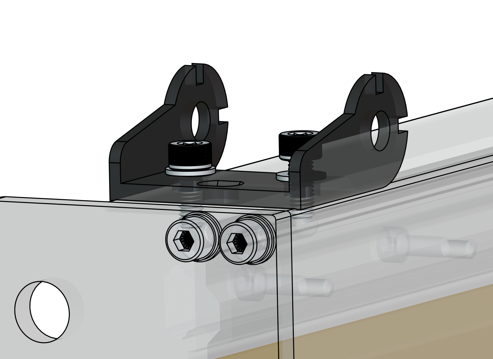

## Drag Chains and Cables

{.aligncenter .size-medium}

{.aligncenter .size-medium}

1. Take off the drag chain **end links** using a flat head screwdriver. There should be 4 total, two (2) with studs and two (2) with holes at the tabs.

1. Before proceeding, join the two halves of the Y-axis drag chain together. For the X-axis drag chain, if you have the 30x30, **remove** 7 links.

    {.aligncenter .size-large}

1. Assemble the drag chain ends with fasteners onto the machine, matching the orientation shown in the images. The fasteners should be hand tight, **do not overtighten** or the end links could break.

    **Left side of X-axis**:

    - Two (2) end links with holes
    - Use M5-8mm screws and M5 T-nuts

    {.aligncenter .size-medium}

    **Left Y-axis, front of machine**:

    - One (1) end link with studs
    - Use M5-8mm screws, and M5 washers under the screwhead

    {.aligncenter .size-medium}

    **Z motor mount, behind Z-axis**:

    - One (1) end link with studs
    - Use M5-8mm screws, and M5 washers under the screwhead

    {.aligncenter .size-medium}

1. **Open** all the clips on both drag chains, using a flathead screwdriver.

1. Place the X-axis drag chain onto the X rail. Route the router cables (e.g. power and signal for AutoSpin) and Z motor cable. Close clips.

1. Secure the X-axis drag chain onto the end links at the **Z motor mount** and X-axis **left-most** end.

    {.aligncenter .size-medium}

        💡 Tip: If you’re having trouble putting the drag chain back on the end link, loosen the end link screws to allow for alignment with the drag chain. Then re-secure the screws.

1. Place the Y-axis drag chain on the MDF, **beside** the left Y-axis.

1. Route the cables coming out from the X as well as the X motor cable, routing out to the front of the machine. Close clips.

1. Place the newly-wired drag chain onto the left Y-axis. Secure the drag chain onto the two (2) end links at the **left side** of the machine.

    {.aligncenter .size-medium}

1. Grab the Y1 and Y2 motor cables. Make note:
    - Y2 cable -> Right motor
    - Y1 cable -> Left motor

1. Route the cables through the left Y-axis extrusion, making sure that the green connectors can reach the respective motor.

    {.aligncenter .size-medium}
  
1. Secure wire connections at each motor - limit switch, motor power, and motor signal. Then check that all motor dip switches are in the correct positions: **1-Down 2-Down 3-Up 4-Up 5-Up**

    {.aligncenter .size-medium}

1. Remove 2 screws from the back of the motor, one to the right of the DIP switch and the other diagonally at the top.

1. Place the motor covers on the motor. For the X and Y, orient them so the **small opening is facing upwards**. Route the wires through the opening, to prevent damage. Then secure them with M3-40mm socket head screws using the provided Allen key.

    {.aligncenter .size-medium}

1. Place the SLB-LITE onto the MDF surface, at the front-left corner. You may need to push the machine closer to the right side to do this.

1. At the SLB-LITE end, connect the motor cables for each axis.

    {.aligncenter .size-medium}

1. Plug the USB cable into the SLB-LITE, at the USB port.

1. Plug the power supply into the SLB-LITE, at the POWER port. Then plug the power supply into wall power (120V). We recommend plugging your router into a separate circuit from the controller and computer, but it’s not always necessary if you have good current in your location.

1. Plug the AutoSpin ethernet connector end into the SLB-LITE, at the SPINDLE port. Then connect the power plug end into wall power.

    {.aligncenter .size-medium}
