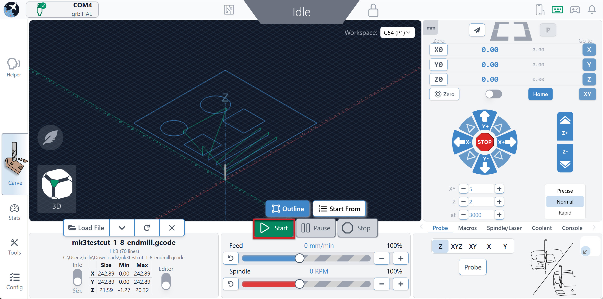

## Surfacing

        Learning Goals

        ☑️ How to home the machine
        ☑️ How to use gSender's surfacing wizard
        ☑️ Know what the settings mean in the surfacing wizard
        ☑️ How to set up the job's origin/zeros and zero the machine accordingly
        ☑️ How to use the AutoSpin in spindle mode
        ☑️ How to locate and change settings in Config

Surfacing is an essential step in setting up your CNC. By removing a thin layer off the top of your wasteboard, it makes the surface parallel to the machine. This allows for an even cutting depth at all points of your wasteboard. So no matter where you mount your stock material, you can rest assured that you're cutting at the correct depth, consistently.

Surfacing can also:

- Minimize the effects of warp on the MDF
- Be used for maintenance purposes to clean off old marks and scars, leaving you with a new, clean surface to glue, clamp, and mount your material to
- Flatten stock material for projects where a flat surface is critical, such as engraving, relief cutting and flip milling

### Step-by-Step Process

You will need to use a surfacing bit - these are designed for light passes and are larger in diameter than other bits, so they can cover a large area quickly while leaving a good surface finish.

1. Grab the 22mm surfacing bit from your Starter End Mill pack, which came with your MK3.

1. Learn how to [install and remove tools](https://resources.sienci.com/view/as-er-collets/) on your AutoSpin. Then install your surfacing bit.

    {.aligncenter .size-medium}

1. Turn ON your AutoSpin router, and make sure it is set to "S" for spindle mode.

1. Turn ON your SLB-LITE controller and connect to gSender.

1. Clear any alarms by pressing and releasing the E-stop on your SLB-LITE, then press Click to Unlock Machine on gSender.

1. **Home** your machine.
    - Make sure the machine is away from the sensors before you press **Home**, otherwise you will get an immediate alarm

    {.aligncenter .size-full}

    {.aligncenter .size-medium}

1. Open the Config tool, and under Homing/Limits, disable the hard and soft limits. You will get an Alarm 2 if soft limits are enabled and you won't be able to surface you spoil board.

    {.aligncenter .size-medium}

    Press Apply Settings, then turn OFF/ON your SLB-LITE controller.

1. Reconnect to gSender.

1. Zero the machine:

    - Jog to the **front left-most** corner of your machine
    - Then, jog down so the bit **touches the wasteboard**
    - Zero all the axes on the machine using the **Zero** button.

1. Determine your XY surfacing dimensions:

    - Jog your machine to the **front right-most** corner.
    - Then jog your machine to the **back right-most** corner.
    - Use the **blue coordinate numbers** as your X and Y surfacing dimensions. Roughly, X should be ~812mm (30x30) OR ~1244mm (48x30), and Y should be ~812mm.
    - If you use a surfacing bit larger than 22mm, X and Y dimensions will be smaller.

1. On the sidebar, navigate to **Tools**, then select Surfacing.

1. You will find the Wasteboard Surfacing settings, adjust as needed.

    Start Position: Where to start surfacing, usually it's where you zeroed your machine.
    - Select the **bottom left corner** of the square, corresponding to the front left of the machine

    X & Y: Surfacing dimensions, how large you want to surface.
    - Use the values determined in Step 9

    Cut Depth & Max: Depth of cut per pass & total depth cut into the wasteboard
    - Set both at **1mm (0.04")**
    - Cut depth larger than 1mm can result in an uneven surface
    - Max can be doubled if your wasteboard is very warped or has deep imperfections

    Bit Diameter: Diameter of cutting tool installed
    - Set to 22mm
    - If you use another surfacing bit, will need to change this value

    Stepover: Percentage of cutting tool area that's overlapping
    - Use **40%**
    - Larger stepover will result in a longer cutting time and a smoother finish, whereas smaller stepover will result in a rougher finish.

    Feed Rate: How fast your machine moves, to bring material through the cutting tool.
    - Use **2500 mm/min**

    Spindle RPM: How fast your spindle/cutting tool rotates.
    - Use **20000 RPM**

    {.aligncenter .size-medium}

1. Once you adjusted the settings, click **Generate G-code** to view the toolpath on the right side of the window.

1. Click **Run on Main Visualizer** to load the file onto gSender.

1. If the dust shoe is on your machine, remove it to prevent damage. However you should still run a vacuum to minimize MDF dust in the air.

1. Put on a mask or respirator. Then on gSender, you can press **Start**

    {.aligncenter .size-medium}

    The router should start spinning up on its own, and the machine should start moving and cutting your wasteboard!

1. Once surfacing is complete, go into Config and **enable the Soft and Hard Limits** again and press Apply Settings. Turn OFF/ON the controller to have the changes take effect.

Congratulations on getting your wasteboard surfaced!

## Project: CNC Test Cut

    Learning Goals

    ☑️ How to do a tool change in between jobs
    ☑️ How to check squareness of your machine and identify cutting issues
    ☑️ How to install different sized bits
    ☑️ Know what workholding to use based on the project
    ☑️ How to run a new job/g-code file on gSender

Our first project will be a short diagnostic test carve.

{.aligncenter .size-medium}

This should highlight any cutting issues happening in X, Y and Z axes. Look out for:

- Roundness and squareness of the shapes
- Consistency in cutting depth at the 3 lines
- Shapes are correctly offset from the 2" long line
  - Inside means the outer contour of the shape is bound within the 2"
  - Outside means that the inner contour of the shape is bound by the 2"

To do this project we will use two different cutting tools. You will one g-code file with the first tool, then switch out to the second tool, then run the other g-code file.

[Download the two g-code files here!](https://drive.google.com/drive/folders/1jcEPXCpg8cQ_NfbjNJJhV7MLB0gvGNeD?usp=sharing)

### Prepare Items

- Find these tools from the Starter End Mill pack and AutoSpin box that came with your MK3.

  - 1/8" flat end mill
  - 60 degree V-bit
  - 1/4" ER11 collet
  - 1/8" ER11 collet

    {.aligncenter .size-medium}

- Source a flat piece of scrap wood that is at least 10"x10"x1/4". This will be your stock material for this job.

- Install and/or use a [workholding method](https://resources.sienci.com/view/cnc-workholding/) that holds the material from the sides or underneath, like double sided tape.

- If you want to measure the accuracy of the cuts, grab digital calipers.

### Set up and Run the Job

1. Secure your material with workholding clamps, tape, or another method. It should be relatively square and flat on your wasteboard.

1. Install the 60 degree V-bit and 1/4" collet onto your AutoSpin. If you need a reminder on how to do this, see [this page](https://resources.sienci.com/view/as-er-collets/).

1. Connect to gSender. Clear any alarms by pressing and releasing the E-stop on your SLB-LITE, then press Click to Unlock Machine on gSender.

1. Home your machine.

1. Jog your machine so the V-bit is at the front left corner of your material, and the V-bit touches the material surface. Then zero your X, Y and Z.

    {.aligncenter .size-medium}

1. Jog your machine upwards, then install the MK3 dust shoe.

1. Check that your AutoSpin router is ON and it is set to Spindle Mode.

1. We are almost ready. Press Load File and select the **mk3testcut-60-vee** file. Then click Open.

    {.aligncenter .size-medium}

1. Run the job by pressing Start! This job should only take a few minutes.

    {.aligncenter .size-medium}

1. Once the job is complete, jog the machine up and towards you, so you can change your tool.

1. Grab the 1/8" flat end mill and 1/8" collet. Change out the tool.

1. Then **zero the Z-axis ONLY,** at the uncut surface of your material.

    - DO NOT zero the X and Y. Both g-code files use the same XY origin/zeros.

1. Press Load File and select the **mk3testcut-1-8-endmill** file. Then click Open.

1. Run the new job by pressing Start! This job is also very short.

    {.aligncenter .size-medium}

1. Once complete, brush off any dust and take out your calipers. See if your machine is in tip-top shape.

    {.aligncenter .size-medium}

    {.aligncenter .size-medium}

    {.aligncenter .size-medium}

Congratulations on completing your first project on the MK3! 🎉
