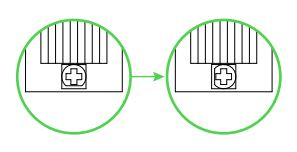
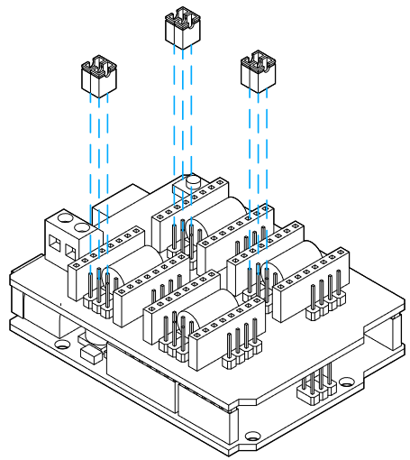

<h2><strong>Hardware</strong></h2>
<h4>How do I install the eccentric nuts? </h4>
You should see that the eccentric nuts have an offset center. When installing the nuts, the only thing you need to be sure of is that the offset is the farthest away from where the rail will be. After this, you'll notice that the gantry is very loose on the rail. Tighten the gantry by rotating the eccentric nut with a wrench until you can't rotate the v-wheels with your fingers anymore.
<h4>The machine is cutting deeper than it's supposed to... </h4>

If you are getting unexpected, deep cuts, it's likely that the cutting tool is coming loose during the cutting operation. There are two causes for this:
<ol>
 	<li>The tool isn't seated properly in the collet adapter.</li>
 	<li>It's slipping since the feed/speed combination is too aggressive.</li>
</ol>
To solve the first, remove the nut at the bottom of the router along with the rest of the assembly and make sure that everything is fitting together like this:

{.aligncenter .size-medium}

Put the above assembly back into the router and fix into place with the collet nut. Cutting should now go as expected. If this isn't fixing the problem then it means you've told the Mill One to cut much faster than it's supposed to. When the machine is pushing the rotating bit really hard into the material, it forced the bit out of the router. Refer to our <strong>Speeds and Feeds</strong> page to adjust as necessary. Otherwise, send us an email and we'll be sure to help you out.
<h4>My machine randomly plunges down on the Z axis, or moves down when I don't want it to. </h4>
If your Z axis doesn't stay still you can use the motors on your Mill One to hold the axis still. Send the command $1= 255 to the console, which will activate all the steppers to hold when the machine comes to a stop. You can deactivate this feature by sending the command $1= 25. Check out this <a href="https://sienci.com/2018/03/30/my-z-axis-keeps-dropping-a-simple-guide-on-using-1-255/">guide</a> to learn more and get more details.
<h4>The machine isn't cutting deep enough...</h4>

Unexpectedly shallow cuts usually originate from one of two issues:
<ol>
 	<li>There is a build-up of dust on the wheels and rail for the z-axis causing the motor to get stuck. Use a dull knife to scrape the gunk off the rails and the insides of the wheels.</li>
 	<li>The z-axis motor doesn't have enough current running through it. Disconnect power from the machine and tune the driver to give the motor more current (rotate counter-clockwise to provide more current).</li>
</ol>
<h2><strong>Software</strong></h2>
<h4>Why isn't UGS connecting to my machine?</h4>

<ol>
 	<li>Your baud rate should be set to 115200.</li>
 	<li>If you're using a Mac, UGS might have trouble detecting your machine. Copy the port address from the Arduino IDE and paste it into UGS and you'll be able to connect just fine. The address should look something like: "/dev/tty.wchusbserial.1420".</li>
 	<li>With a V1 machine and using a Mac, a re-install of the necessary driver should fix your issues.</li>
</ol>

<h2><strong>Electronics</strong></h2>
<h4>My motors aren't turning or getting enough power... </h4>
Make sure that you've tuned the stepper motor drivers by unplugging your machine and turning the stepper driver potentiometers clockwise by 90 degrees. Check out Step 28 from the assembly manual for more details.

{.aligncenter .size-medium}
<h4>The parts that I'm cutting are smaller/larger than they are supposed to be.</h4>
The Mill One defaults to 1/8th step microstepping via two header pins that can be found underneath each axis on the CNC V3 Shield. There should be one header pin in the left most outlet and one in the center. Having the wrong configuration of pins will cause the microstepping to be set incorrectly. Ensure that you have the correct number of header pins in the right plugs. If you still have problems, send us a message.

{.aligncenter .size-medium}

