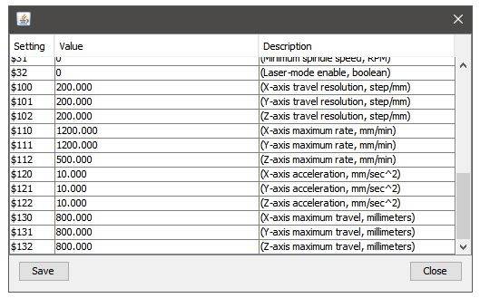

In this guide, you will learn how to adjust your acceleration settings on your Mill One to "overclock" your machine and reduce your milling times.
<h3><strong>Before you begin</strong></h3>
To understand why one would want to adjust these settings, we must first discuss the importance of acceleration settings on the Mill One and CNC machines as a whole. Every time a CNC machine changes direction or makes a movement, it changes its velocity gradually. This is to prevent the machine from damaging itself or losing its position.

If the acceleration settings are too high, the machine is more likely to have problems with losing steps. And on the other side, really low acceleration settings will mean that the overall cutting process will be much slower. We must choose a setting which offers reasonable milling speeds, but also does not damage the machine or cause it to lose steps.

The default speeds of the Mill One have been set to be relatively slow, to ensure the safety of the operator. For more advanced users, we recommend increasing your acceleration settings to allow your machine to go faster.
<h3><strong>How to change your acceleration settings</strong></h3>
Changing acceleration settings on your Mill One is extremely easy to do, especially with Universal G-Code Sender or UGS Platform. First you must access the firmware settings.

For Universal G-Code Sender, from the upper left hand corner, click <strong>Settings -&gt; Firmware Settings</strong>

For UGS Platform, from the upper left hand corner, click <strong>Machine -&gt; Firmware Settings</strong>

This will bring up a window that looks like this:

{.aligncenter .size-medium}

Scroll down to the bottom until you can see the acceleration settings

{.aligncenter .size-medium}

From here, you can change the values for the X-axis, Y-axis, and Z-axis accelerations.

We recommend starting with 50mm/sec^2 on the X and Y-axis, and 20mm/sec^2 on the Z-axis. Once you have made the changes, click 'Save' then close the window. If you get an error message, we recommend closing and opening the connection to the machine and trying again.

If you're interested in making other changes to your firmware settings or want to learn more, check out the Grbl configuration guide <a href="https://github.com/gnea/grbl/wiki/Grbl-v1.1-Configuration" target="_blank" rel="noopener">here</a>.
<h3><strong>Another way to change acceleration settings</strong></h3>
We've created two g-code files <a href="https://resources.sienci.com/wp-content/uploads/2021/05/Acceleration-Setting-Changing-Gcode.zip">that you can download</a> and run on your machine. These files will automatically change your acceleration settings once you select the file in UGS and send it.

The file "New acceleration settings for Sienci Mill One.nc" will change your acceleration settings to 50mm/sec^2 on the X and Y-axis, and 20mm/sec^2 on the Z-axis.

The file "Default acceleration settings for Sienci Mill One.nc" will change it back to default settings.
