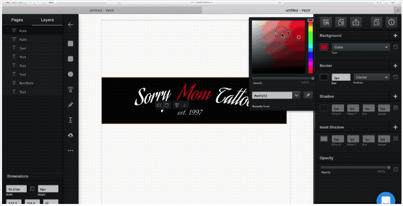
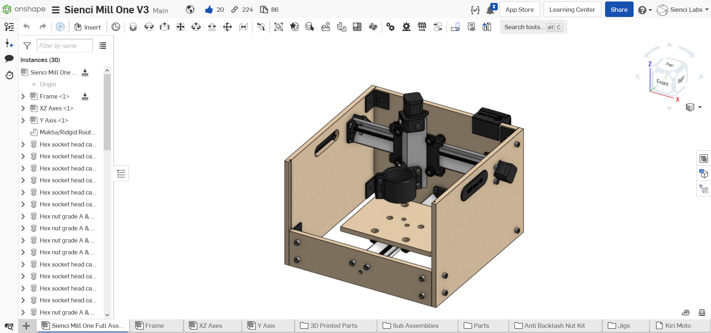
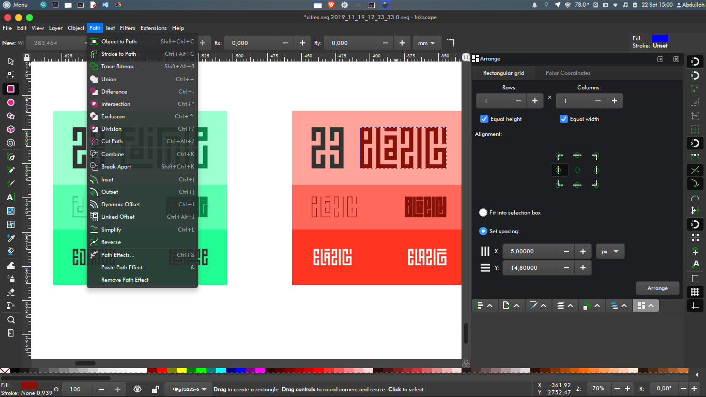

You can work with your favourite <strong>CAD</strong> (Computer Aided Design) and <strong>CAM</strong> (Computer Aided Manufacturing) programs to design and control the Mill One. If you wish to create simple objects with no 3D contours, a simple vector-editing program like Vectr, Inkscape, or Adobe Illustrator can be used. Alternatively, to design your own 3D parts you will need a CAD program like OnShape or Fusion 360.

If you don't feel comfortable with learning these softwares, feel free to move on for now. We've created a selection of <a href="https://resources.sienci.com/view/mo-more-projects/" target="_blank" rel="noopener">Starter Projects</a> and other cool things that you can make on your machine where the 3D models are easy and free to download. There are also websites that offer thousands of 3D models, drawings, and other projects for free.
<h2>The Basics</h2>
For beginners, we have two great suggestions for software that is powerful, simple, free, and cloud-based. You can find links to the software below, along with an introductory video.
<h3><strong><a href="https://vectr.com/" target="_blank" rel="noopener">Vectr</a> (Vector Editing)</strong></h3>
Vectr is a web-based tool that you can use to quickly make simple vector images online. You can also download it to use on your computer to create vector graphics easily and intuitively.

Access it here: <a href="https://vectr.com/new" target="_blank" rel="noopener">https://vectr.com/new</a>
Find useful tutorial videos on their <a href="https://www.youtube.com/channel/UC-cJMcXP4znmrj8_DF-EuvA/featured?disable_polymer=1" target="_blank" rel="noopener">YouTube channel</a>.

{.aligncenter .size-medium}

<h3><strong><a href="https://www.onshape.com" target="_blank" rel="noopener">Onshape</a> (3D Modelling)</strong></h3>
This is a powerful cloud-based 3D modelling software recommended for both beginners and experienced modelers. Since it runs completely on your internet browser, you can run it on almost any modern computing device without having to download anything.

Your CAD projects are automatically saved to the cloud, making sharing and collaboration easy. We use Onshape to allow makers access to our <a href="https://cad.onshape.com/documents/cef8a67838682ca79f64237c/w/22ad8b2c367c8fc81ca0ada0/e/1367d08d70a3f7ccdd669df3" target="_blank" rel="noopener">most current designs</a>. Onshape already offers a very comprehensive list of CAD tutorials which will easily carry you along in getting to know their software. Onshape also integrates <a href="https://grid.space/kiri/" target="_blank" rel="noopener">Kiri:Moto</a>, a easy to use CAM program, so you can create g-code without leaving your browser tab.

Access it here (make a free account): <a href="https://www.onshape.com/" target="_blank" rel="noopener">https://www.onshape.com/</a>
Find useful tutorial videos on their <a href="https://www.youtube.com/channel/UCTvd5lUSLtTH8Qcd7Pl1nQg" target="_blank" rel="noopener">YouTube channel</a>.

{.aligncenter .size-medium}

<h3><strong>Conclusion</strong></h3>
You now have the power to create any 2D or 3D object from scratch with these two programs under your belt. Once you've made a new model, the next step is to bring it into a CAM program. CAM programs define the toolpath that the Mill One uses to cut out your design!
<h2>Advanced Reading (Optional)</h2>
Here are two more recommended programs if the first two weren't your cup of tea. Every software listed on this page is free to use and has been tested by us and other Mill One users.

As far as other softwares are concerned, Wikipedia has a page dedicated to comparing most <a href="https://en.wikipedia.org/wiki/Comparison_of_vector_graphics_editors" target="_blank" rel="noopener">well-known vector graphics editors</a> as well as a list of the majority of <a href="https://en.wikipedia.org/wiki/List_of_3D_modeling_software" target="_blank" rel="noopener">3D modelling programs</a> available for use.
<h3><strong><a href="https://inkscape.org/" target="_blank" rel="noopener">Inkscape</a> (Vector Editing)
</strong></h3>
A desktop-based tool that you can use to either turn existing pixel images into vector images or create your own vector drawings. Also great for importing Solidworks DXFs and turning them into vector images.

Download it here: <a href="https://inkscape.org/en/download/" target="_blank" rel="noopener">https://inkscape.org/en/download/</a>
Find useful tutorial videos by <a class="yt-uix-sessionlink spf-link " href="https://www.youtube.com/channel/UCwRXb5dUK4cvsHbx-rGzSgw" target="_blank" rel="noopener" data-sessionlink="itct=CDQQ4TkiEwjn2LT_6I_YAhVIeAMKHUxkDgIo-B0">Derek Banas</a> on his really great <a href="https://www.youtube.com/watch?v=zUIOEXssTSE&amp;list=PLGLfVvz_LVvTSi9bKrvGR2_DBg0Tv8Dxo" target="_blank" rel="noopener">video playlist</a>.
There's also a great <a href="https://youtu.be/W0V-4O9x9Uk" target="_blank" rel="noopener">video guide</a> for converting pixel images into vector images courtesy of Glenn Langton.

{.aligncenter .size-medium}

<h3><strong><a href="https://www.autodesk.com/products/fusion-360/overview" target="_blank" rel="noopener">Fusion 360</a> (3D Modelling)</strong></h3>
Fusion 360 offers a suite of powerful CAD and CAM software which works on a variety of devices, as well as great <a href="https://academy.autodesk.com/software/fusion-360" target="_blank" rel="noopener">training resources</a> and a <a href="https://www.youtube.com/user/AutodeskFusion360" target="_blank" rel="noopener">Youtube channel</a> to get you familiar with the program. Fusion 360 is free for makers and hobbyists, as well as businesses which make less than 100,000 USD per year.

Download it here: <a href="https://www.autodesk.com/products/fusion-360/overview" target="_blank" rel="noopener">https://www.autodesk.com/products/fusion-360/overview</a>