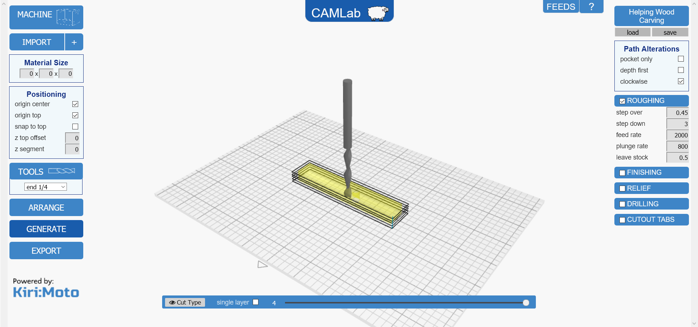
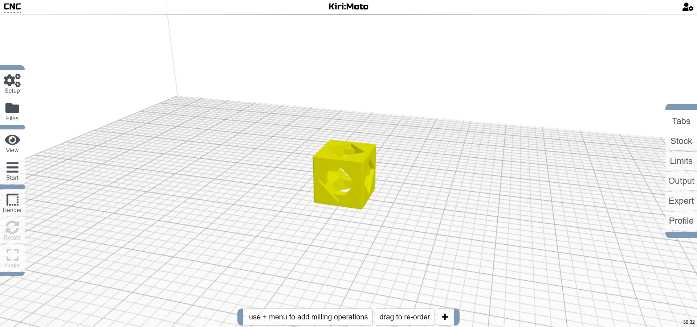
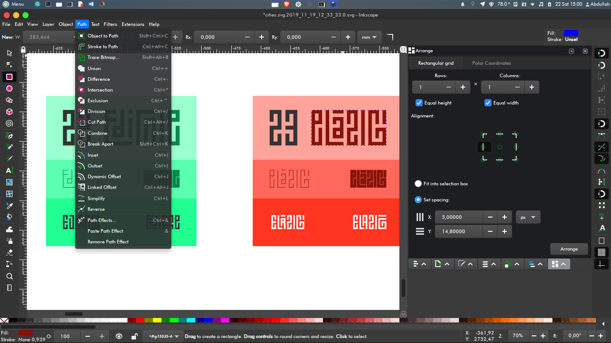
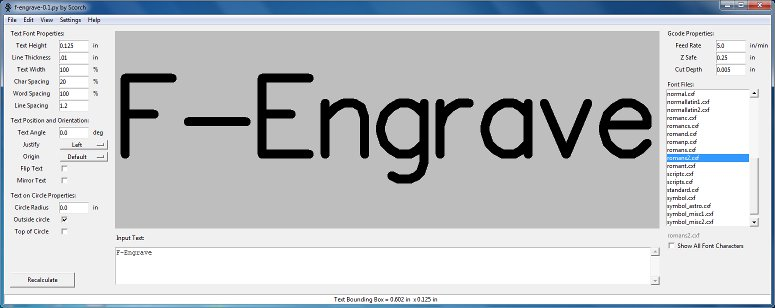

{.aligncenter .size-medium}
This page is meant to show you the softwares that we recommend and give you a sense of what they do and where you can access them. Move on to the next page if you'd like to continue with the tutorial.

Once you've created your parts, you will then need a CAM program to generate the commands (g-code) which your Mill One will use to make the right movements to carve your item. There are CAM programs that can create g-code files from 2D drawings, and there are others that can make the files from 3D objects.
<h2>The Basics</h2>
When it comes to using a CNC machine, it's essential to find a CAM software that you're most comfortable with. This will enable you to quickly transition from drawing/modelling to creating your g-code so that you can start cutting right away. For beginners, we have two great suggestions for software that is simple, free, and cloud-based. You can find links to the software below, along with introductory videos.

<strong>Note:</strong> it's important to know that CAM software will always do what you tell it to do. This means that if you tell the software that your material is 10mm thick and it's only 5mm thick, the machine WILL mill into your platform. Double-checking your numbers and visualizing your code is always important before starting a cutting operation.
<h3><strong><a href="http://camlab.sienci.com/camlab" target="_blank" rel="noopener">CAMLab</a> (3D Models)
</strong></h3>
CAMLab is our very own 2.5D and 3D CAM software which allows you to create g-code toolpaths using 3D, STL files through your browser. We've been working hard on it so that it can be easy to use while having a variety of very powerful features. Cut 2.5D profiles, and 3D reliefs with ease by generating the gcode through your browser, exporting it to your computer, and using a gcode sender like UGS to run it on your machine! CAMLab is based off of Kiri:Moto so Stewart Allen (the creator of Kiri:Moto) deserves a lot of credit for all his great work.

While CAMLab is still in beginning iterations, we will continue to be working on implementing new features for it, so stay tuned!
Access CAMLab here: <a href="http://camlab.sienci.com/" target="_blank" rel="noopener">http://camlab.sienci.com/</a>

{.aligncenter .size-medium}

<h3><strong><a href="https://github.com/GridSpace/apps/wiki/Kiri:Moto" target="_blank" rel="noopener">Kiri:Moto</a> (3D Models)
</strong></h3>
Kiri:Moto is a 2.5D and 3D CAM software which allows you to create g-code toolpaths using STL files through your browser. To add to it's convenience, Onshape has support for Kiri:Moto as a plugin. This means that you can create your 3D files in Onshape and bring them into Kiri in the same browser window! Stewart Allen (the creator) is a great guy who works hard to keep the software updated and working well.

The following is our video on how to use Kiri:Moto. This same video will be shown later to teach you how to generate a CAM toolpath for your first project.

Access Kiri:Moto here: <a href="https://grid.space/kiri/?sm:CAM" target="_blank" rel="noopener">https://grid.space/kiri/?sm:CAM</a>

{.aligncenter .size-medium}

<h3><strong><a href="http://www.makercam.com/about.html" target="_blank" rel="noopener">MakerCAM</a> (2D Drawings) **no longer functional
</strong></h3>
This program is designed for 2D cutting and etching. It's very simple and also browser-based. The makers of MakerCAM put together their own <a href="http://www.makercam.com/tutorial.html" target="_blank" rel="noopener">instruction set </a>that you can follow if you'd like to become more familiar with the program, as well as a <a href="http://www.makercam.com/help.html" target="_blank" rel="noopener">help page</a> if you require any further assistance.

Access it here: <a href="http://www.makercam.com/" target="_blank" rel="noopener">http://www.makercam.com/</a>

Check out the Caleb Peters' <a href="https://www.youtube.com/watch?v=-CHJJRMeAGU&amp;list=PLxm-7P1GnMICaQdDBz4kpNNXRcxo-IcqQ" target="_blank" rel="noopener">three part tutorial</a> outlining a gear coaster he designed and built. In the second video, he shows how to import the gear drawing into MakerCAM and generate the g-code for it:
<h3><strong>Conclusion</strong></h3>
With your ability to generate toolpaths, the Mill One is awaiting your command. The last step is the g-code sending software that will livestream the g-code to your machine.
<h2>Advanced Reading (Optional)</h2>
Here are some additional software recommendations if the first two weren't your cup of tea. Every software listed on this page is free to use and has been tested by us and other Mill One users. As far as other software is concerned, Wikipedia has an entire list of other more <a href="https://en.wikipedia.org/wiki/Category:Computer-aided_manufacturing_software" target="_blank" rel="noopener">commercially available CAM software</a>.
<h3><strong><a href="https://inkscape.org/" target="_blank" rel="noopener">Inkscape</a> (2D Drawings)
</strong></h3>
A great free tool that not only allows you to create vector drawings but also has a built-in plugin that can generate toolpaths! See a quick tutorial on how to get started below.

Download it here: <a href="https://inkscape.org/en/download/" target="_blank" rel="noopener">https://inkscape.org/en/download/</a>

{.aligncenter .size-medium}

<h3><strong><a href="http://www.scorchworks.com/Fengrave/fengrave.html#vcarve" target="_blank" rel="noopener">F-Engrave</a> (2D Drawings)</strong></h3>
F-Engrave is a free and open source software which provides several useful features if you are looking to do engraving work. This includes v-carving, b-carving, importing DXF and bitmap files, and more. To learn about how it works, check out the <a href="http://www.scorchworks.com/Fengrave/fengrave.html#documentation" target="_blank" rel="noopener">documentation</a> online or watch the <a href="https://www.youtube.com/playlist?list=PLEqJxTyAwzThLLbS33drahi0B-LQhdZME" target="_blank" rel="noopener">YouTube tutorial videos</a>.

Download it here: <a href="http://www.scorchworks.com/Fengrave/fengrave.html#download" target="_blank" rel="noopener">http://www.scorchworks.com/Fengrave/fengrave.html#download</a>

{.aligncenter .size-medium}

&nbsp;
<h3><strong><a href="https://www.autodesk.com/products/fusion-360/overview" target="_blank" rel="noopener">Fusion 360</a> (3D Models)</strong></h3>
Fusion 360 is a powerful, industry-used software that has both CAD and CAM software built-in. It's free for makers and hobbyists and they offer great <a href="https://academy.autodesk.com/software/fusion-360" target="_blank" rel="noopener">training resources</a> as well as a <a href="https://www.youtube.com/watch?v=Qmx5DUvvmxI&amp;list=PLmA_xUT-8UlK9rndthGGHsjjnZtPO8XRV" target="_blank" rel="noopener">full playlist</a> which teaches every step in learning how to use the CAM part of Fusion.

Download it here: <a href="https://www.autodesk.com/products/fusion-360/overview" target="_blank" rel="noopener">https://www.autodesk.com/products/fusion-360/overview</a>
