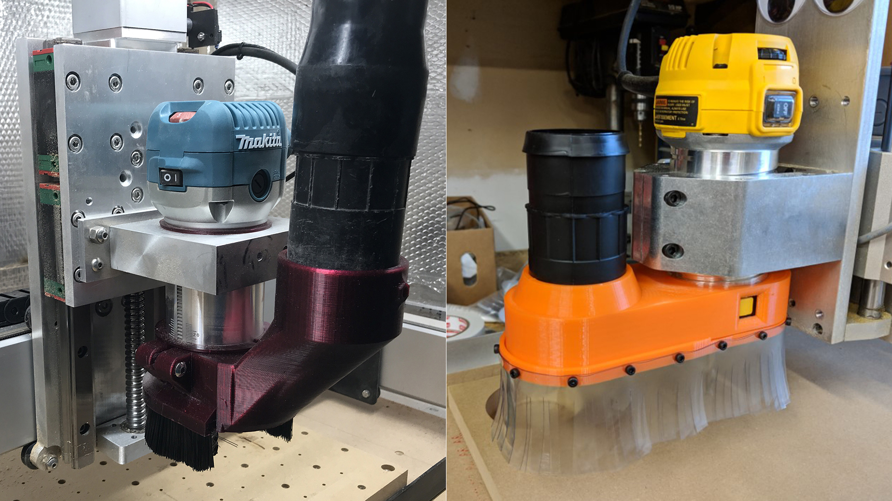
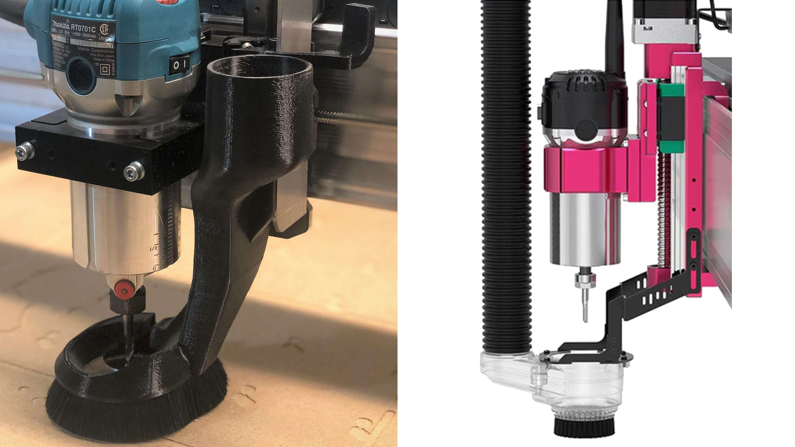
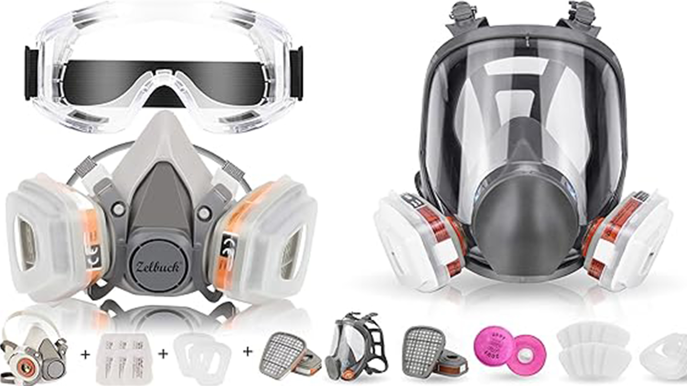
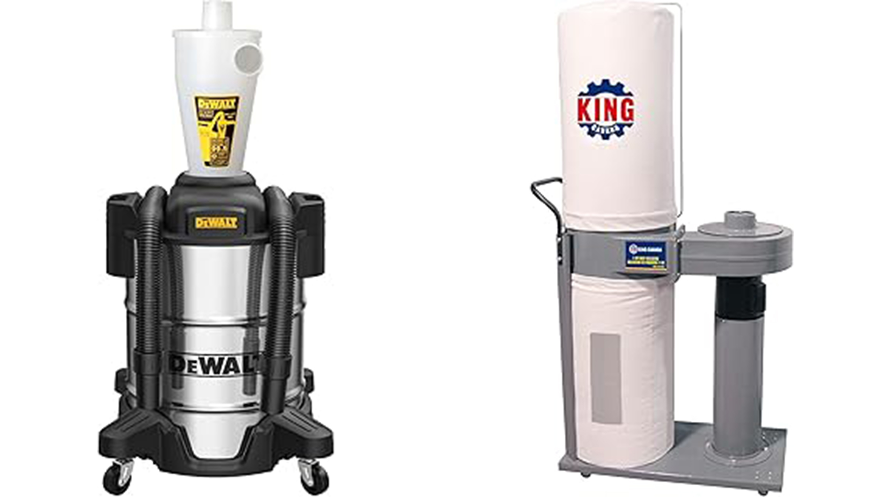
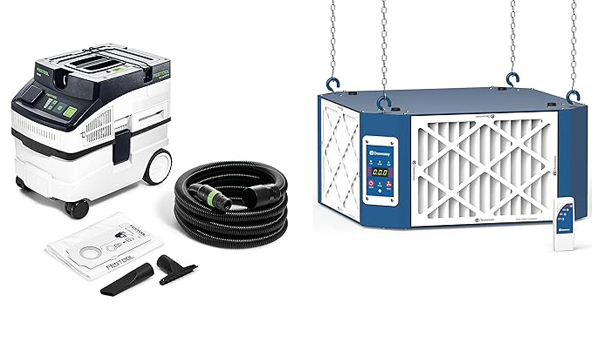

Improves on https://resources.sienci.com/view/lmk2-dust-collection/

- Refined discussion on dust shoes, pros/cons, what to choose
- Discuss more about setup and options for vacuums and dust collectors, talk about their pros/cons, and make purchase suggestions
- Tends to be needed for lung protection and keep the workspace clean while cutting but it can be accomplished with smaller shop vacs, larger dust collectors, or sometimes even just an enclosure that you vacuum up later
- How to use all the sawdust you collect?
- Oneida has a new low-profile cyclone to fit to a bucket

https://forum.sienci.com/t/dust-questions-for-newbie/14028/5

Clean/Maintain your shop vac  https://www.familyhandyman.com/list/cleaning-and-maintaining-your-shop-vac/

---

CNCs can create a lot of mess just like many other cutting tools. Think about the chips and fine dust you get drilling a single hole or cutting a piece of wood in half and then stretch that out over hours of constant cutting on a cnc machine. This is where dust collection helps out. Most woodworkers will setup a dust collection system that can quickly connect to whatever tool or machine they are using at the time.

A **dust shoe** is basically a fancy vacuum attachment for your CNC machine, it stays near the cutter to stop chips and fine dust from flying away while the **vacuum system** pulls it all away. This is good for you because it:

- can give you cleaner cuts with the debris out of the way
- reduces maintenance since dirt build-up can cause premature wear on many CNCs
- saves you time cleaning up that you'd have to do anyway
- keeps your shop air cleaner which is safer for your lungs

https://www.youtube.com/watch?v=94r4hgr2SgA

That said, dust management can still come in other forms like building an [enclosure for your CNC](https://resources.sienci.com/view/lmk2-table-enclosure/#machine-enclosure) or cutting outside. You might choose to do these if you:

- are worried about the noise from running a vacuum or dust collector (though the noise of cutting can get similarly loud)
- don't want to deal with the dust shoe colliding with clamps, material, or getting in the way during tool changes

### Fixed vs. Adjustable Dust Shoes

The design of your dust shoe can greatly affect how well it collects dust for you particular application. There are hundreds of different designs for dust shoes, however, one of the largest differentiators is whether it is fixed or adjustable. These two styles are also sometimes referred to as Z-axis dependent / bound / tethered vs. Z-axis independent / unbound / free.

Whether a dust shoe is fixed or adjustable depends on how it’s mounted:

- A fixed-style dust shoe is mounted to the Z-axis or the router body on the CNC. This means that when the Z-axis moves up or down during cutting the dust shoe moves up and down with it.

{.aligncenter .size-medium}

- An adjustable-style dust shoe is typically mounted to the X-axis of the CNC. This means that it never moves unless you change it's height, allowing the Z-axis to raise and plunge during cutting while the dust shoe stays in the spot you set it.

{.aligncenter .size-medium}

[su_table responsive="yes"]
<table>
<tbody>
<tr>
<td></td>
<td><b>Fixed</b></td>
<td><b>Adjustable</b></td>
</tr>
<tr>
<td style="background: #44bc72 !important;">Pros</td>
<td>
<ul>
  <li>Typically a much simpler design</li>
  <li>Little adjustment required, usually set it and forget it</li>
</ul>
</td>
<td>
<ul>
  <li>Much more efficient at collecting dust, keeping good contact between flat material and the shoe</li>
  <li>Consistent performance regardless of how deep your cut is</li>
</ul>
</td>
</tr>
<tr>
<td style="background: #ff4554 !important;">Cons</td>
<td>
<ul>
  <li>Not efficient at collecting dust, typically relies on the vacuum’s suction power to overcome escape gaps</li>
  <li>Dust shoe can collide with the material on deeper cuts</li>
</ul>
</td>
<td>
<ul>
  <li>Typically a more complicated design</li>
  <li>Requires adjustment based on your material’s thickness</li>
  <li>Router can collide with the dust shoe on deeper cuts</li>
</ul>
</td>
</tr>
</tbody>
</table>
[/su_table]

For general purpose cutting, we recommend using an adjustable dust shoe as it is significantly better at collecting dust and debris, and relies less on how powerful your vacuum system is. It's also much better suited toward flat or sheet material which is the type of material that's most commonly used by hobby CNCers for sign-making and v-carving.

https://forum.sienci.com/t/a-new-kind-of-articulating-dust-shoe/1681

https://forum.sienci.com/t/making-a-mostly-3d-printable-automatic-dust-shoe-that-is-driven-by-a-stepper-motor/13349

### Choosing a Vacuum  / Dust collector / Dust Extractor

Your dust shoe will need a source of suction. Most times an existing dust collector or Shop-Vac with a cyclone separator will be able to fit the bill since these systems are set up to run for many hours and provide reasonable suction. Depending on the dust shoe used and the hosing size you use for your shop, you may want to look at your system’s CFM and suction lift specifications depending on your needs.

CFM (cubic feet per minute) denotes the amount of air your vacuum can pass through. The higher the CFM, the more volume of material you can move. You will want a higher CFM rating if you are cutting a large amount of material.

Suction power (sometimes called Water Lift, Static Lift, Static Pressure…) indicates how fast the air is moving through the system. The higher your suction is, the harder the dust is pulled through your dust shoe and hose. You will typically want a higher suction vacuum if you are cutting heavier materials like metals, need to draw chips out of narrow cuts, or are using a fixed-style dust shoe.

### 1. Shop Vac

A **shop vac** is a versatile, high-suction device primarily designed to pick up larger particles, such as wood chips, sawdust, and even liquid spills. 

- **Power and Filtration**: Shop vacs provide high suction power but often lack fine filtration. Many have basic or HEPA filters, which helps capture some finer dust, but they are generally more effective at picking up heavier, larger debris.
- **Airflow (CFM)**: Shop vacs typically operate at lower cubic feet per minute (CFM) airflow, often ranging between 100-200 CFM. This is sufficient for spot-cleaning work areas and individual tools.
- **Portability**: Shop vacs are small, lightweight, and portable, making them easy to move around for cleaning various areas of the workshop.
- **Best Use**: Ideal for smaller, occasional cleanups, especially when dealing with larger wood particles, chips, or heavier dust around tools like miter saws, table saws, and hand tools.

WEN VC9209 | 10-Amp 9.25-Gallon 6.5 Peak HP Wet/Dry Shop Vacuum | https://wenproducts.com/collections/dust-management/products/wen-vc9209-10-amp-9-25-gallon-6-5-peak-hp-wet-dry-shop-vacuum-and-blower-with-0-3-micron-hepa-filter-hose-and-accessories

### 2. Dust Collector

A **dust collector** is designed to capture large volumes of dust and wood chips from woodworking tools, particularly those that generate large amounts of debris. It is a more powerful and specialized system compared to a shop vac.

- **Power and Filtration**: Dust collectors focus on high airflow (CFM), typically ranging from 400-1,000 CFM or higher. They use large collection bags or drums and are often equipped with filters that capture dust down to 1-5 microns, though some higher-end units have finer filtration or HEPA options.
- **Airflow (CFM)**: With significantly higher CFM, dust collectors are capable of handling the dust output from larger machines, like table saws, planers, and jointers, where a high volume of air is needed to capture dust at the source.
- **Stationary Setup**: Dust collectors are usually larger and stationary or semi-stationary units. They often involve ductwork to connect multiple tools, providing centralized dust management in the shop.
- **Best Use**: Ideal for woodworking shops with larger power tools, capturing high volumes of sawdust and debris from continuous operation.

Check out these examples!

Powertech | 1 HP Dust Collector with 1 Micron Dust Collector Bags | https://www.amazon.com/dp/B0CV3HJXRR/ref=cm_sw_r_cp_apan_glt_fabc_57VH7EJ6PTNK7ZXSE27F?th=1

WEN | 5.7 AMP 660 CFM Rolling Dust Collector | https://wenproducts.com/collections/dust-management/products/wen-dc3401-57-amp-660-cfm-rolling-dust-collector-with-12-gallon-bag-and-optional-wall-mount

Grizzly G0944 | 1-1/2 HP Wall-Mount Dust Collector with Canister Filter | https://www.grizzly.com/products/grizzly-1-1-2-hp-wall-mount-dust-collector-with-canister-filter/g0944

Grizzly G0548ZP | 2 HP Canister Dust Collector w/Aluminum Impeller | https://www.grizzly.com/products/grizzly-2-hp-canister-dust-collector-w-aluminum-impeller/g0548zp

### 3. Dust Extractor

A **dust extractor** is a specialized type of vacuum designed to capture fine, hazardous dust, often with more precise filtration systems than typical shop vacs. Dust extractors are especially useful for capturing finer particles, such as those from sanding or cutting engineered woods, concrete, or other materials that release smaller, respirable dust.

- **Power and Filtration**: Dust extractors typically come with HEPA filtration or very fine filters capable of capturing particles as small as 0.3 microns, which is essential for protecting respiratory health.
- **Airflow (CFM)**: Dust extractors usually have moderate CFM, around 100-200, similar to shop vacs, but the focus is on high-quality filtration rather than raw suction power. Many models also have automatic filter-cleaning features.
- **Portability**: They are generally portable and compact, making them easy to connect directly to handheld tools (like sanders or circular saws) for on-tool dust collection.
- **Best Use**: Dust extractors are best suited for capturing fine dust particles from sanding, concrete grinding, or other tasks that create hazardous, respirable dust.

WEN AF1270 | 4.2-Amp 3-Speed Remote-Controlled Industrial-Strength Air Filtration System | https://wenproducts.com/collections/dust-management/products/wen-af1270-4-2-amp-3-speed-remote-controlled-industrial-strength-air-filtration-system-750-950-1270-cfm

### Features Comparison

| Feature              | Shop Vac                    | Dust Collector           | Dust Extractor                  |
|----------------------|-----------------------------|---------------------------|---------------------------------|
| **Suction Power**    | High suction, lower airflow | High airflow, moderate suction | Moderate suction and airflow    |
| **Filtration**       | Basic or HEPA; limited fine dust capture | Typically 1-5 microns; some HEPA options | HEPA filtration for very fine dust |
| **Airflow (CFM)**    | 100-200 CFM                 | 400-1000+ CFM             | 100-200 CFM                    |
| **Portability**      | Portable                    | Stationary or semi-stationary | Portable and tool-compatible    |
| **Best For**         | Spot cleaning, larger debris | Continuous large dust collection | Fine, hazardous dust from sanding and concrete |

### Choosing the Right Tool

- **Use a Shop Vac** if you need portability and versatility for general cleanup or larger wood particles and debris.
- **Choose a Dust Collector** if you have a dedicated woodworking shop with stationary tools and need continuous dust collection.
- **Opt for a Dust Extractor** if you frequently work with hazardous fine dust from sanding, concrete grinding, or materials that produce respirable particles and need HEPA-level filtration for safety. 

Each of these tools has its strengths, costs, size and power requirements. Often woodworkers start small and build up to a combination of a dust collector and dust extractor, which can create an optimal setup for a safer, cleaner workshop.

### Choosing Hose Size

Your vacuum or dust collector will probably come with a hose of a certain diameter. Your system will probably work most optimally if you use hoses that are similar in diameter.

Dust collectors for example typically have higher CFMs but lower suction, thus better suited with larger diameter hoses. Using a smaller diameter hose can constrict airflow and reduce its efficiency.

Shop-Vacs, on the other hand, have smaller CFMs but higher suction power. These types of vacuums are happy with using smaller diameter hoses.

Depending on the design of your dust shoe, you may need to adapt your hose to match. You can find adapters that can help switch between hose diameters. You may also want to opt for a hose that will keep static buildup along it's length to a minimum in which case more specialized options exist such as the 36mm antistatic hose from Festool.

Adaptors

### Hanging Your Hose

Easy CNC Swing Arm: 3 min: https://youtu.be/RwYulYI8uRw
Custom Dust Collection Swing Arm: 18 min:  https://youtu.be/KufOYrTFBPA

### Adding a Cyclone

Adding a second stage to your dust collection strategy can drastically reduce the amount of filters your shop vac or dust collection system uses.

| Video Title                               | Duration | Link                                           |
|-------------------------------------------|----------|------------------------------------------------|
| How do Cyclone Dust Separators Work?      | 5 min    | [Watch Here](https://youtu.be/3fB_uH5k6RQ)     |
| Adding a Dust Separator to a Shop Vac     | 12 min   | [Watch Here](https://youtu.be/jRuLmnQymXg)     |
| Dust Cyclone Separator Cart               | 15 min   | [Watch Here](https://youtu.be/lGnGNYrxqjs)     |

### User Setups

You can customize your shop to have a simple shop vac with hose hanging above your cnc, upgrade to a 2 stage system and add a cyclone, or build a cart for portability. Upgrade further to a wall mounted dust collection system, and run it to each tool in your shop. You can even add blast gates to your system, activated manually or automatically!

| Video Title                                   | Duration | Link                                           |
|-----------------------------------------------|----------|------------------------------------------------|
| Dust Collection for Beginners                 | 10 min   | [Watch Here](https://youtu.be/-g3GqsNJ60U)     |
| Attic Based & Voice Activated System          | 15 min   | [Watch Here](https://youtu.be/6swtBtcTGwY)     |
| Wall Mounted Dust Collector Setup             | 6 min    | [Watch Here](https://youtu.be/jRuLmnQymXg)     |
| Cart for Shop Vac and Cyclone                 | 2 min    | [Watch Here](https://youtu.be/nnVQyKaR9Cg)     |
| Upgrade from Shop Vac to Dust Collection      | 4 min    | [Watch Here](https://youtu.be/WHnnJmsoz_Q)     |
| Advanced Setup with Blast Gates for Each Tool | 11 min   | [Watch Here](https://youtu.be/SkIFPjJOQNU)     |
| Pairing the best Dust Collector with a CNC    | 13 min   | [Watch Here](https://www.youtube.com/watch)    |
| 5 tips to improve CNC dust collection DIY     | 6 min    | [Watch Here](https://youtu.be/-hKEXZNbGsg) |

### Safety

Being in an environment where you are exposed to high amounts of aerosolized sawdust isn't good for you, and can cause a chronic cough, chest pain, runny nose, headaches, bronchitis and more. The worst for your health is the fine particle that can't be seen by the naked eye. In the woodworking hobby, dust is classified into categories—L (low-risk), M (medium-risk), and H (high-risk)—based on the type of material and associated health risks.

### L-Class Dust (Low-Risk Dust)
L-class dust poses the least risk and includes materials that, while potentially irritating, generally have minimal health effects with short-term exposure. However, L-class dust still requires basic dust collection and protection measures, especially for prolonged exposure.

- **Softwoods** (e.g., pine, cedar): These woods produce dust that can be irritating to the respiratory system but are generally considered less toxic than hardwoods.
- **Plastics**: Dust from sanding certain plastics can be irritating but is generally categorized as low risk, although it should still be managed to avoid respiratory discomfort.

### M-Class Dust (Medium-Risk Dust)
M-class dust poses a higher health risk and includes materials that can cause respiratory issues with regular exposure. This category requires enhanced dust extraction measures and PPE, such as respirators rated for medium dust filtration.

- **Hardwoods** (e.g., oak, beech): These woods produce finer dust particles that can be inhaled deeply into the lungs, potentially causing respiratory issues and allergic reactions. Some hardwood dusts are also linked to nasal cancer with prolonged exposure.
- **Plywood and MDF (Medium Density Fiberboard)**: These engineered woods can release formaldehyde and other chemicals as fine dust, which are more hazardous to health, especially in confined spaces.
- **Painted or coated surfaces**: Sanding painted wood or surfaces coated with certain chemicals can release toxic particles, particularly if the coatings contain lead or other harmful compounds.

### H-Class Dust (High-Risk Dust)
H-class dust is the most hazardous, typically containing carcinogenic or highly toxic materials. Special dust control equipment with high-filtration capabilities and sealed PPE are required to handle these materials safely.

- **Asbestos**: While not common in hobby woodworking, asbestos dust can be encountered in renovations or demolition work involving older materials. It’s extremely hazardous and known to cause lung cancer and mesothelioma.
- **Silica dust** (e.g., from concrete, tile, or stone): Silica dust, common in masonry and tile work, is highly dangerous and can lead to silicosis, a serious lung disease, if inhaled over time.
- **Lead-based paints**: Sanding or cutting wood with lead-based paint can release lead dust, which is highly toxic and can cause serious health issues, including neurological damage.

 You can protect yourself on 3 basic levels.

 1. Your nose and mouth should be covered with a high quality dust mask or respirator with a minimum rating of N95. This prevents dust from entering your body at all.

 {.aligncenter .size-medium}

 1. Your project should have a good dust collector, to remove as much dust at the source as possible, before the particles have the chance to become airborne. This type of protection 'collects' the dust at the source.

{.aligncenter .size-medium}

 1. Your workshop can add more protection against those fine particles by using a dust extraction system to catch any particles your dust collector misses. This type of protection 'extracts' fine dust particles from the air in your shop.

 {.aligncenter .size-medium}

 Regularly cleaning work surfaces, machines, and the floor will help minimize any dust that could be kicked up by new projects.
  Working with a door open or an exhaust fan in a well ventilated area is also a great way to reduce your exposure to hazardous fine sawdust materials.

### Sawdust Recycling

Sawdust from a woodworking shop has a surprising number of useful applications. Mix with wax for a camping fire starter or mix with wood glue to make art. Mulch your flower beds or make a bed for your livestock. What ever you do, don't throw it all away!

**Workshop Uses**

- **Wood Filler**: Combine sawdust with wood glue to fill in gaps or cracks in woodworking projects. You can often match the colour of the project if you use sawdust from that project.
- **Absorbent Material**: Sawdust soaks up spills well, making it useful for cleaning up oil or paint spills.

**Gardening and Landscaping**

- **Mulch**: Sawdust can be spread around plants to retain moisture and suppress weeds. Just be cautious with hardwood sawdust, as it can deplete nitrogen from the soil.
- **Compost**: Mix sawdust with other organic matter to create a rich compost. Be mindful of the wood type; avoid sawdust from treated wood.
- **Pathways**: It creates a soft, natural-looking walkway and prevents muddy paths in gardens.

**Pet and Livestock Care**

- **Animal Bedding**: Use sawdust as bedding for small animals, chickens, or livestock. Be careful with aromatic woods like cedar, which might irritate some animals.

**Crafts and DIY Projects**

- **Wood Stain**: Darker sawdust can be boiled in water to create a natural stain.
- **Molded Wood Projects**: Mixing sawdust with resin or glue can create a wood-based composite for small molded items.

**Environmental Uses**

- **Fire Starters**: Mix sawdust with wax to create fire starters, or simply use small piles of sawdust on kindling. Great to take camping!
- **Pathways for Erosion Control**: Spread on slopes or muddy areas to reduce erosion.
- **Ice Melt Substitute**: In winter, use sawdust on sidewalks or driveways for traction instead of salt. Good idea Eh!?

#### Video Tips

Collect different types of wood sawdust to match your projects, or make a new project with your freshly made sawdust. If you do want to throw it all out, the last short video is a great way to make smaller bags.

[su_table responsive="yes"]

| **Title**                             | **Description**                                                                                             | **Length** | **Video Link**                                   |
|---------------------------------------|-------------------------------------------------------------------------------------------------------------|------------|--------------------------------------------------|
| **Save Sawdust in Tins for Glue**     | Collect and store different types of sawdust in separate tins. Mix with glue to use for repairs in woodworking projects. | Short      | [Watch Video](https://youtube.com/shorts/B3DerwmNEaI) |
| **Reuse Sawdust for Art**             | Repurpose sawdust in art projects, adding unique textures or effects to artwork.                             | Short      | [Watch Video](https://youtube.com/shorts/KCMPF9GwKro) |
| **41 Creative Uses of Sawdust**       | Amazing ideas for using sawdust around the homestead and garden, from composting to fire starters.          | 5 min      | [Watch Video](https://youtu.be/V8CRrCH_eZw)      |
| **Sawdust Flowerpot Project**         | Turn scrap sawdust into a project to sell by creating a flowerpot.                                          | 12 min     | [Watch Video](https://youtu.be/u52tGEYJL08)      |
| **Clear Your Lungs After Inhaling Dust** | Understanding effective methods to clear your lungs after inhaling dust is crucial for maintaining respiratory health | 9 min      | [Watch Video](https://youtu.be/fmLqbzLz4-A) |
| **Compact Sawdust Bags**              | Compress sawdust bags to make them more compact, saving space and making them easier to store or dispose of. | Short      | [Watch Video](https://youtube.com/shorts/QOYwWEAp1P0) |

[/su_table]