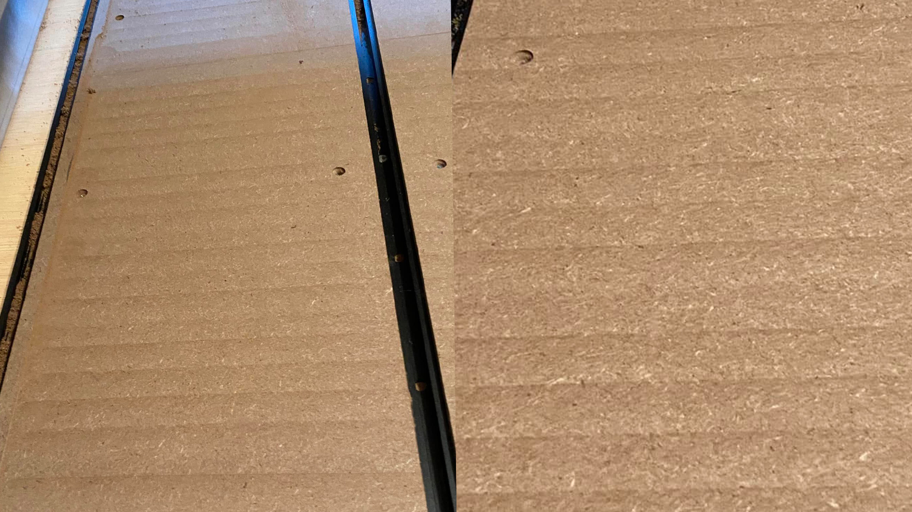
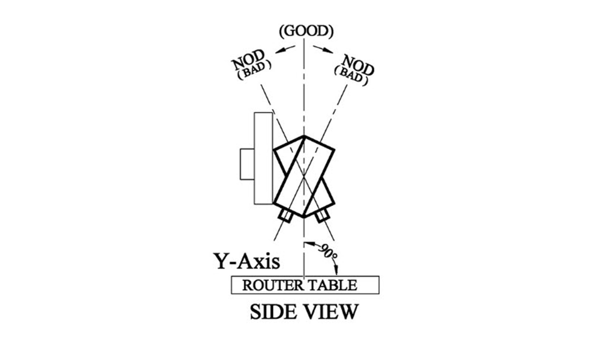
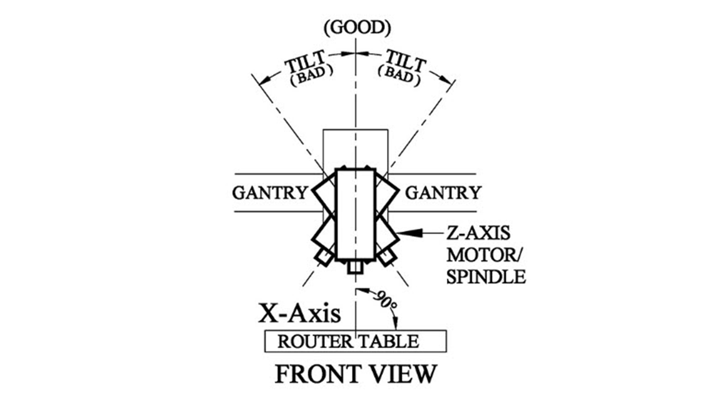

Can go in “Advanced” section
Cover all aspects of tramming but try to keep it general to apply to any CNC

- https://www.servomagazine.com/magazine/article/how-to-tram-your-cnc-router
- Order of steps to get everything nice with minimal effort
- Find if any other community videos have been made for our machines in particular
- My spoil board has slight stripes as opposed to being perfectly flat… is this normal or do I have a tilt on my router that needs to be fixed? If so, how’s that done?
- https://forum.sienci.com/t/tramming-suggestions/13812/7
- https://www.reddit.com/r/hobbycnc/s/XAy2e2vF1a
- Intertwine tramming page with surfacing page like Garrett did https://youtu.be/Afw1VdArLuo
- Either here or in surfacing, mention how budget machines don't need levelling as opposed to industrial machines, the only case where levelling makes sense is if you want to use it as a method for seeing how square your machine is
  - https://youtu.be/DdyMjsz4BVs
  - https://youtu.be/3uiacvLCIHk

- https://forum.sienci.com/t/how-to-ensure-spindle-is-perpendicular-to-table/14118/4

Tramming tool - https://www.amazon.ca/SST-Mill-Lathe-Adjustable-Tramming/dp/B07D84Y1ZD/ref=sr_1_1

---
Tramming is the process of adjusting the position of the router or spindle, typically by tiling it forwards and backwards, and/or left to right. This ensures that the cutting tool stays aligned with the Z-axis. Having a machine out-of-tram can result in things such as ridges or artifacts, especially on surfacing operations with wider bits. It's caused by the flat bottom of bits not being parallel to the rails. The router is slightly angled causing one side of the bit to be higher than the other.

{.aligncenter .size-medium}

If the lines appear in the left to right direction, the bit is angled front to back. Depending on how out of tram your router is you may be able to shim the inside surface of where the router mounts. Shim either above or below the mounting bolts to tilt the router towards the front or the back. Another option is to loosen the mounting bolts on the y-gantry plates and rotate the x-rail forward or backward for adjustment. Note: there is very little adjustment to be made.

If the lines appear in the front-to-back direction, the bit is angled left to right. Loosen the four router mount screws and gently tap the router clockwise or counterclockwise until it is trammed.

**We have found that our machines don't typically require significant tramming for their use-case. If you're interested in tramming your router, continue reading to see the steps we recommend taking, or explore our LongMill Facebook group and forum and see what process others have used.**

### Terminology

Tramming is the process of aligning the CNC machine’s spindle perpendicular to the machine's work surface (spoilboard or table). Proper tramming ensures that tools cut evenly across the entire work area, improving surface finish and accuracy. Below is an outline for tramming, including definitions for **nod** and **tilt**.

#### Nod

If you say yes to someone and nod your head, you will notice your chin rise and fall. This is called nod, the forward or backward tilt of the spindle relative to the work surface (along the X-axis). It's unusual to have to adjust this on most hobby cnc machines. The following diagram is looking at the router mount from the left side of the machine, and we will work to eliminate nod. (Any Command & Conquer fans out there?)

| Nod GIF                   | Nod diagram - Side View              |
|---------------------------|---------------------------|
| {.aligncenter .size-medium} | {.aligncenter .size-medium} |

#### Tilt

When man's best friend is confused or listening very closely, you will often see their head tilt from side to side. This is called tilt, the side-to-side tilt of the spindle relative to the work surface (along the Y-axis). Tramming tilt is a bit easier to tackle than adjusting nod. (Any pinball enthusiasts out there?)

| Tilt GIF                  | Tilt diagram - Front View                |
|---------------------------|---------------------------|
| {.aligncenter .size-medium} | {.aligncenter .size-medium} |

#### Expectations

An accuracy of 0.1mm is a good goal to try and achieve. About the thickness of a piece of regular paper. You will be hard pressed to see 0.01 mm of accuracy, and even this level can still show ridges in your spoilboard.

### Some Community Links:

- [Mill One - Facebook Group Post 1](https://www.facebook.com/groups/mill.one/permalink/1253819475089381/)
- [Mill One - Facebook Group Post 2](https://www.facebook.com/groups/mill.one/posts/1184610055343657/)
- [Mill One - Facebook Group Post 3](https://www.facebook.com/groups/mill.one/permalink/1151461815325148/)
- [Has anyone trammed their LongMill? - Sienci Forum](https://forum.sienci.com/t/has-anyone-trammed-their-longmill/521)
- [Tramming Suggestions - Sienci Forum](https://forum.sienci.com/t/tramming-suggestions/13812)
- [Tramming Question - Sienci Forum](https://forum.sienci.com/t/tramming-question/12362)
- [Tramming My 30x30 LongMill - Sienci Forum](https://forum.sienci.com/t/tramming-my-30-x30-longmill/3763)
- [Tramming: An Exercise in Futility - Sienci Forum](https://forum.sienci.com/t/tramming-an-excercise-in-futility/8553)
- [Has anyone trammed their LongMill? (Duplicate) - Sienci Forum](https://forum.sienci.com/t/has-anyone-trammed-their-longmill/521)
- [Tramming Suggestions (Duplicate) - Sienci Forum](https://forum.sienci.com/t/tramming-suggestions/13812)

### Video Tutorials:

- [Setting Up Your Spoilboard (20 min)](https://youtu.be/q6S73Iu-z5o)
- [CNC Router Tramming Tutorial (24 min)](https://youtu.be/8T_ZasfpDsM)
- [2 Ways to Tram Your CNC (14 min)](https://youtu.be/A0w6Ddb0ViY)
- [DIY Quick and Easy Tramming (2 min)](https://youtu.be/5EwQxSNQLAg)

---

**Tools**:

- [Dial indicator (or tramming gauge)](https://www.amazon.ca/SST-Mill-Lathe-Adjustable-Tramming/dp/B07D84Y1ZD)  
- [Straight edge or precision square](https://www.amazon.ca/Machinist-Hardened-Precision-Engineer-Square-Seat100x70mm/dp/B07QNHTZ4G)  
- [Ultra precision blocks](https://www.amazon.ca/TEXALAN-Blocks-Precision-Hardened-Without/dp/B08KZF733S/ref=sr_1_11)  
- [Precision Level](https://www.amazon.ca/Iglobalbuy-Precision-Machinist-Straightness-Parallelism/dp/B0CFLNNVBR)  

---

## General Step-by-Step Tramming Process

### A. Check for Spoilboard Flatness

- Use a straight edge to ensure the spoilboard is flat.
- Resurface the spoilboard if necessary to create a level reference plane.

### B. Measure Spindle Alignment

- Mount a tramming gauge in the spindle collet. You can also use a DIY arm.
- Rotate the spindle by hand to check the height of the spoilboard at multiple points.
- Record measurements to identify high or low areas.

### D. Adjust Tilt First (Side-to-Side)

- Loosen the router/spindle mounting bolts.
- Adjust the spindle left or right to achieve perpendicularity along the Y-axis.
- Re-tighten the bolts securely.

### C. Adjust Nod Second (Forward/Backward)

- Loosen the linear rail mounting bolts.
- Use shims or adjustment screws to tilt the spindle forward or backward until it aligns perpendicular to the spoilboard in the X-axis.
- Re-tighten the bolts.

### E. Verification

- Repeat the measurement process to confirm adjustments.
- Ensure the spindle remains stable and doesn’t shift during operation.

---

## Tips for Best Results
- Resurface the spoilboard regularly to maintain a consistent reference plane.
- Use precision tramming tools for accurate adjustments.
- Periodically re-tram the spindle as part of routine maintenance.
- Don't lean on your table when you are measuring, to ensure you don't move the wasteboard at all
