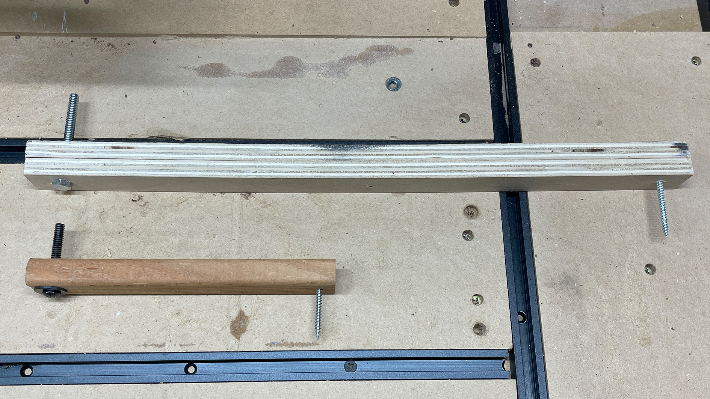
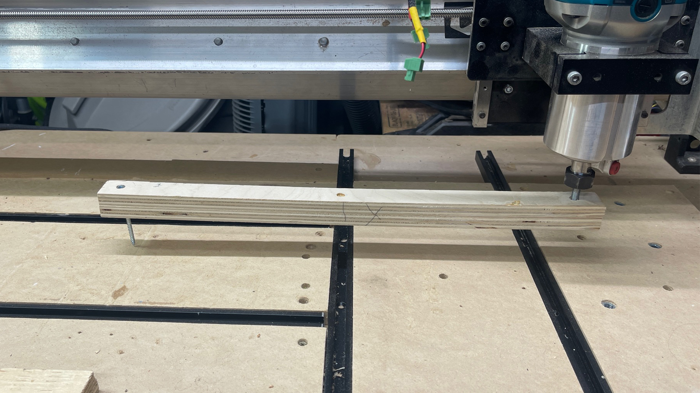
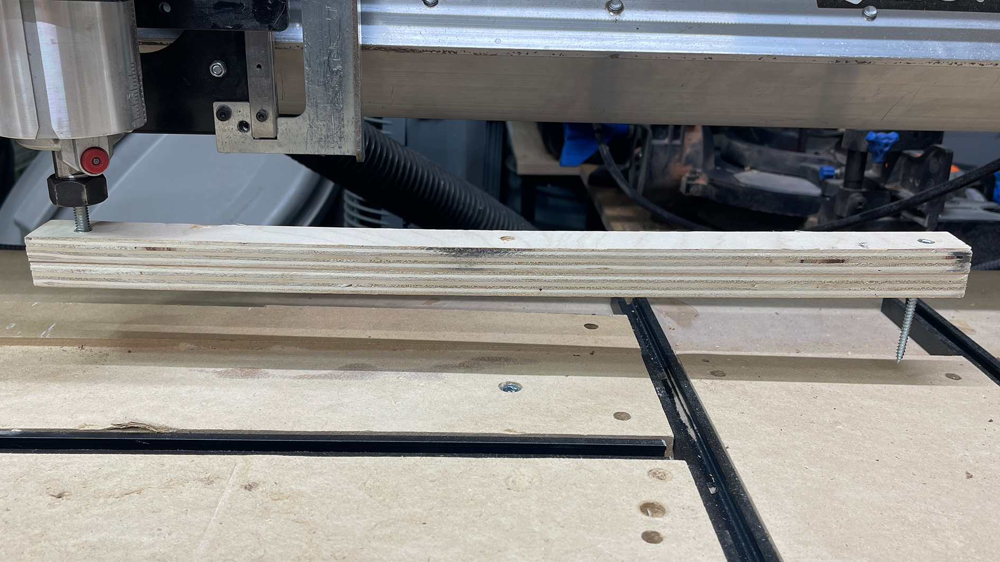
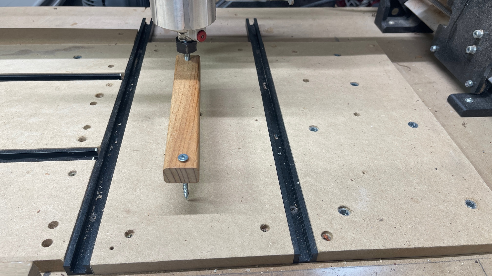
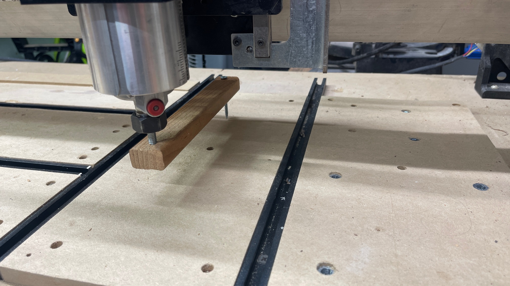
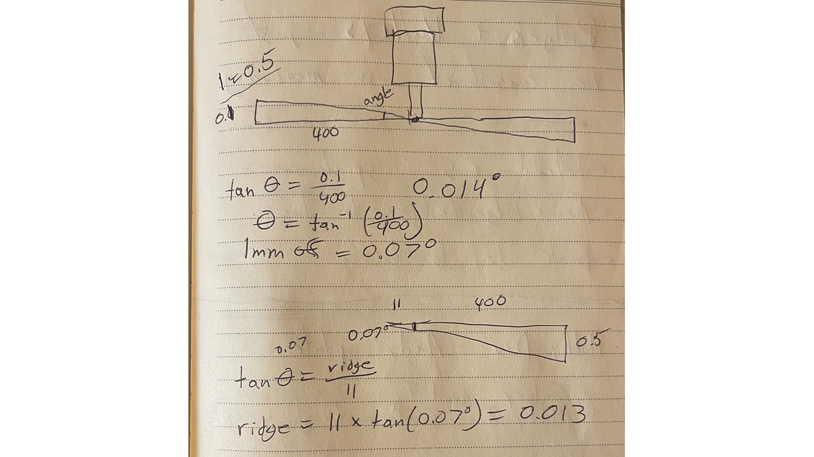

https://www.youtube.com/watch?v=Afw1VdArLuo

https://www.youtube.com/watch?v=8T_ZasfpDsM

https://www.youtube.com/watch?v=1PMy90aPyhk

https://www.corbinstreehouse.com/blog/2023/04/how-to-tram-a-cnc-spindle-router/
---

1. Don't do it
    - Designed to not need any tramming
    - Accuracy of 0.5 mm is good
    - Wood type/days humidity/bit used can all effect tramming
2. Loosen screws and tighten again
    - Use a level or carpenter square to check if you are level
    - Loosen screws on the router mount, adjust and tighten screws again
    - Double check with your level or carpenters square that improvements have been made
3. Shim your router mount or adjust your eccentric nuts on Y axis
    - Use mini tram tool with a piece of glass

Tramming keeps your router perpendicular to the spoilboard so surfacing passes stay clean. Here’s a simplified process any hobby CNC user can follow.  

---

## Step 1: Don’t Do It (Yet)  

**Check your results first.**  
- Most machines are square enough out of the box.  
- Expect around **0.1 mm tolerance** (about the thickness of paper).  
- You’ll always see faint lines after surfacing, even if you’re “perfect.”  

  

---

## Step 2: Loosen Screws & Re-Tighten  

If ridges are visible:  
1. Loosen the **four router mount screws.**  
2. Reseat the router.  
3. Tighten screws evenly while keeping the router square.  

Tools: carpenter’s square or small precision level.  

  

---

## Step 3: Check Tilt (Side-to-Side)  

If ridges run **front to back**, your router is tilted left/right.  
- Loosen the router mount slightly.  
- Shim between the mount and router (thin paper, tape, or shim stock).  
- Retighten until even.  

  

---

## Step 4: Check Nod (Front-to-Back)  

If ridges run **left to right**, your router is tilted forward/backward.  
- Adjust **eccentric nuts** on Y-axis bearings.  
- Or, slightly loosen the X-rail and rotate it forward/back.  
- Very small adjustments are needed.  

  

---

## Step 5: Verify with a Mini Tram Tool  

DIY method:  
- Insert a bolt in the collet, with another bolt sticking out opposite.  
- Rotate over a flat reference (piece of glass works well).  
- Compare front vs. back, left vs. right.  

  

---

## Step 6: Resurface Spoilboard  

Once you’re close:  
- Run a surfacing pass.  
- Inspect the cut lines.  
- Repeat adjustments only if ridges are obvious.  

  

---

## Summary  

1. **Don’t stress** small ridges — they’re normal.  
2. **Reseat and tighten** screws first.  
3. **Shim or adjust** only if needed.  
4. **Verify with a simple tram tool** on glass.  
5. **Resurface spoilboard** regularly for best results.  

👉 Keep it simple: hobby CNCs don’t need machinist-level tramming.  

---
Tramming is the process of adjusting the position of the router or spindle, typically by tiling it forwards and backwards, and/or left to right. This ensures that the cutting tool stays aligned with the Z-axis. Having a machine out-of-tram can result in things such as ridges or artifacts, especially on surfacing operations with wider bits. It's caused by the flat bottom of bits not being parallel to the rails. The router is slightly angled causing one side of the bit to be higher than the other.

{.aligncenter .size-medium}

If the lines appear in the left to right direction, the bit is angled front to back. Depending on how out of tram your router is you may be able to shim the inside surface of where the router mounts. Shim either above or below the mounting bolts to tilt the router towards the front or the back. Another option is to loosen the mounting bolts on the y-gantry plates and rotate the x-rail forward or backward for adjustment. Note: there is very little adjustment to be made.

If the lines appear in the front-to-back direction, the bit is angled left to right. Loosen the four router mount screws and gently tap the router clockwise or counterclockwise until it is trammed.

**We have found that our machines don't typically require significant tramming for their use-case. If you're interested in tramming your router, continue reading to see the steps we recommend taking, or explore our LongMill Facebook group and forum and see what process others have used.**

### Terminology

Tramming is the process of aligning the CNC machine’s spindle perpendicular to the machine's work surface (spoilboard or table). Proper tramming ensures that tools cut evenly across the entire work area, improving surface finish and accuracy.

#### Nod

{.aligncenter .size-full}

If you say yes to someone and nod your head, you will notice your chin rise and fall. This is called nod, the forward or backward tilt of the spindle relative to the work surface (along the X-axis). It's unusual to have to adjust this on most hobby cnc machines. The following diagram is looking at the router mount from the left side of the machine, and we will work to eliminate nod. (Any Command & Conquer fans out there?)

{.aligncenter .size-medium}

#### Tilt

{.aligncenter .size-full}

When man's best friend is confused or listening very closely, you will often see their head tilt from side to side. This is called tilt, the side-to-side tilt of the spindle relative to the work surface (along the Y-axis). Tramming tilt is a bit easier to tackle than adjusting nod. (Any pinball enthusiasts out there?)

{.aligncenter .size-medium}

#### Expectations

An accuracy of 0.1mm is a good goal to try and achieve. About the thickness of a piece of regular paper. You will be hard pressed to see 0.01 mm of accuracy, and even this level can still show ridges in your spoilboard.

## General Step-by-Step Tramming Process

### Check for Spoilboard Flatness

Use a straight edge to ensure the spoilboard is flat. Resurfacing the spoilboard if necessary to create a level reference plane.

### Create or purchase an arm

{.aligncenter .size-medium}

For 12x30 area, use a 6 inch arm as pictured. For larger sizes you can double the length of your arm. You will need a bolt to fit into your router collect and another bolt/screw to measure with. Ensure they are installed facing the opposite direction.

### Measure Spindle Alignment

Mount the arm in the spindle collet. You can also use a tramming gauge. Rotate the spindle by hand to check the height of the spoilboard at multiple points.

Checking Tilt first...

{.aligncenter .size-medium}

{.aligncenter .size-medium}

Checking Nod next...

{.aligncenter .size-medium}

{.aligncenter .size-medium}

### Adjust Tilt First (Side-to-Side)

Adjustments to Tilt are performed at the router mount.

- Loosen the router/spindle mounting bolts.
- Adjust the spindle left or right to achieve perpendicularity along the Y-axis.
- Re-tighten the bolts securely.

### Adjust Nod Second (Forward/Backward)

Adjustments to Nod are performed at the linear rails

- Loosen the linear rail mounting bolts.
- Use shims or adjustment screws to tilt the spindle forward or backward until it aligns perpendicular to the spoilboard in the X-axis.
- Re-tighten the bolts.

### Verification

- Repeat the measurement process to confirm adjustments.
- Ensure the spindle remains stable and doesn’t shift during operation.

---

## Tips for Best Results

- Resurface the spoilboard regularly to maintain a consistent reference plane.
- Use precision tramming tools for accurate adjustments.
- Periodically re-tram the spindle as part of routine maintenance.
- Don't lean on your table when you are measuring, to ensure you don't move the wasteboard at all

### Some Community Links

- [Mill One - Facebook Group Post 1](https://www.facebook.com/groups/mill.one/permalink/1253819475089381/)
- [Mill One - Facebook Group Post 2](https://www.facebook.com/groups/mill.one/posts/1184610055343657/)
- [Mill One - Facebook Group Post 3](https://www.facebook.com/groups/mill.one/permalink/1151461815325148/)
- [Has anyone trammed their LongMill? - Sienci Forum](https://forum.sienci.com/t/has-anyone-trammed-their-longmill/521)
- [Tramming Suggestions - Sienci Forum](https://forum.sienci.com/t/tramming-suggestions/13812)
- [Tramming Question - Sienci Forum](https://forum.sienci.com/t/tramming-question/12362)
- [Tramming My 30x30 LongMill - Sienci Forum](https://forum.sienci.com/t/tramming-my-30-x30-longmill/3763)
- [Tramming: An Exercise in Futility - Sienci Forum](https://forum.sienci.com/t/tramming-an-excercise-in-futility/8553)
- [Has anyone trammed their LongMill? (Duplicate) - Sienci Forum](https://forum.sienci.com/t/has-anyone-trammed-their-longmill/521)
- [Tramming Suggestions (Duplicate) - Sienci Forum](https://forum.sienci.com/t/tramming-suggestions/13812)

### Video Tutorials

- [Setting Up Your Spoilboard (20 min)](https://youtu.be/q6S73Iu-z5o)
- [Easy way to Tram your CNC router (30 min)](https://youtu.be/Afw1VdArLuo)
- [2 Ways to Tram Your CNC (14 min)](https://youtu.be/A0w6Ddb0ViY)
- [DIY Quick and Easy Tramming (2 min)](https://youtu.be/5EwQxSNQLAg)

---

**Tools**:

- [Dial indicator (or tramming gauge)](https://www.amazon.ca/SST-Mill-Lathe-Adjustable-Tramming/dp/B07D84Y1ZD)  
- [Straight edge or precision square](https://www.amazon.ca/Machinist-Hardened-Precision-Engineer-Square-Seat100x70mm/dp/B07QNHTZ4G)  
- [Ultra precision blocks](https://www.amazon.ca/TEXALAN-Blocks-Precision-Hardened-Without/dp/B08KZF733S/ref=sr_1_11)  
- [Precision Level](https://www.amazon.ca/Iglobalbuy-Precision-Machinist-Straightness-Parallelism/dp/B0CFLNNVBR)  

---

### Advanced 

For a detailed walkthrough of tramming your machine using a mirror for the surface, check out this article [HERE](https://www.servomagazine.com/magazine/article/how-to-tram-your-cnc-router)

In the math shown below, we calculated that being 1mm off results in an angle of 0.07 degrees!

{.aligncenter .size-medium}