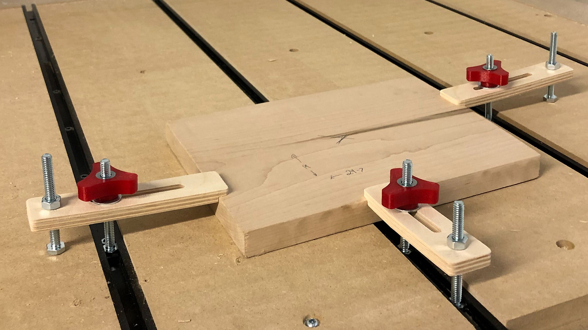
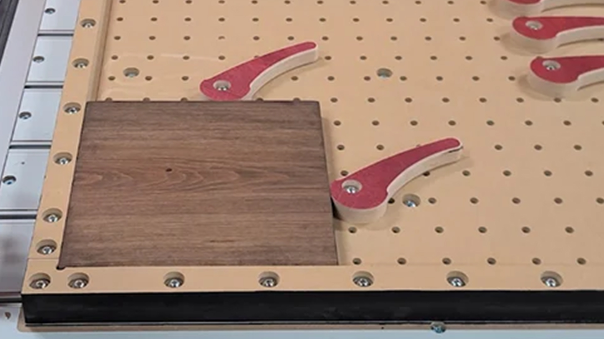
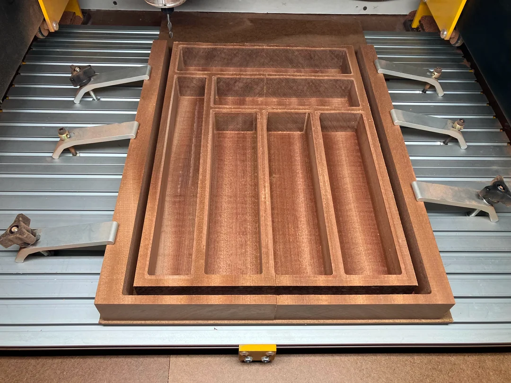
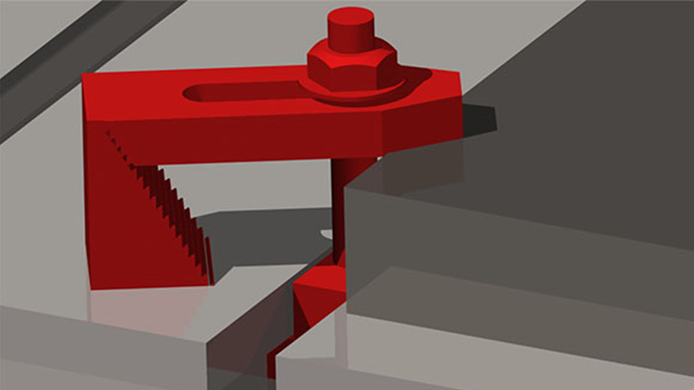

Re-frame page https://resources.sienci.com/view/lmk2-workholding/ to be in the context of the general types of project the person is wanting to do, then recommending workholding based on those project styles e.g. sign-cutting, metal, 3D carves, cookie surfacing.

- Revise page to include all up-to-date Workholding options and the ones we recommend for different project styles / materials
- Explain where each method excels and what situations or materials they simply can’t handle
- Give examples of where to buy each type (both specific and generic)
- Also include other considerations when making a wasteboard like tiling needing space to pass material through, flip milling needing reference surfaces when flipping, end grain cutting needing space at the end of the table to clamp wood with
- New research on more information we can include https://docs.google.com/document/d/1PDLbZyhQaEzvSSDIwUEN9I4QXlXSRr85oOOaqGCHA1o/edit#heading=h.jjkoazaklfhv
- Make sure if you use screws in mdf you flatten the screw bumps afterwards
- Mostly painless process using hot glue, surfacing with gSender tool, running file, then using rubbing alcohol to solidify the hot glue to remove it though it still wasn't easy by any stretch and couldn't remove all the adhesive
- https://forum.sienci.com/t/diy-longmill-cnc-vertical-clamping-setup-part-2/13925
- Tiling: https://www.youtube.com/watch?v=3jhnKr4fc_c
- Flip-milling: https://forum.sienci.com/t/christmas-themed-slot-projects/1960/2
- Flip-jig: https://www.youtube.com/watch?v=u45tZtebIDM
- Might want to move it back up into a more general section since this would be info that people would want before setting their CNC up?
- Good typical spacing of t-track of 6 inches to reach different sized material
- Some people recommend XFasten tape (https://www.amazon.ca/gp/product/B07BBL4JXJ, https://www.amazon.ca/dp/B01DX1VDG2) but other people find it too thick and gummy and prefer LLPT (https://www.amazon.ca/dp/B07L6BS2KX)

top 5 methods to keep projects secure - IDCWoodcraft - https://www.youtube.com/watch?v=rRkjuLSV6Bc

Community post - https://forum.sienci.com/t/hold-down-tip-contact-cement-instead-of-super-glue/2681/23

Vertical workholding - https://forum.sienci.com/t/altmill-vertical-milling-thoughts/14989/16
Tiling
Flip milling
vacuum table

---

Another aspect of learning how to use your CNC router involves knowing how to properly secure material down to the bed of the machine. Rigidly securing material to the machine bed is crucial when setting up to cut. Some clamping methods are rigid but are more intrusive, while others keep a low profile but aren't quite as strong. Play around with these methods to see which ones you can use individually or in combination for your ideal setup. The ultimate goals are to hold you piece in place, and help you make more parts, in less time.

- If you’re just starting out with building your machine and are unsure of the types of workholding/clamping setups you might need, it can be daunting making the first decision for how you’d like to set up your table/wasteboard. Jump to [Setup](#choosing-a-table-setup-for-workholding) and we’ll go through each of the common types of table/wasteboard setups to start

- If you're wondering what workholding to use as 'the best practice' for your specific project, check out [our recommendations](#choosing-workholding-based-on-my-project)

- To explore specific workholding options in more detail, head straight to [Workholding Types](#workholding-types)

---

## Choosing a table setup for workholding

If you’re just starting out with building your machine and are unsure of the types of workholding/clamping setups you might need, it can be daunting making the first decision for how you’d like to set up your table/wasteboard. We’ll go through each of the common types of table/wasteboard setups below.

### T-tracks/T-slot mounted to the table

This is one of the most popular setups used widely across CNC from hobby to industrial level machines for its ease of use and flexibility. Having T-tracks setup along the wasteboard allows for clamps to be placed at virtually any spot/edge of your material, great for clamping irregular shapes, and quickly rearranging clamps for different sized projects.

T-tracks are most suitable for use with top clamps, but can also be used with side clamps. It should be noted that not all side clamps will work well with T-tracks, due to the limited range of most side clamps, as well as their tendency to slip when used inline with T-track direction.

   

One downside of using T-tracks is the initial cost and setup time, but if you find yourself needing to hold down many different sizes and types of materials for your project, you’ll likely come out ahead. A reusable solution such as T-tracks will save you time and money over more daunting options like double sided tape (which can get expensive over time). 

T-tracks are available for purchase on our store page here, or can be found in other sizes/variations from other sources depending on your needs. Full instructions for installing T-tracks can be found here.

### Threaded inserts in the table

Threaded inserts can be considered as a cost-effective alternative to T-tracks. Depending on your needs, these inserts can be spaced further apart or set closer together to allow for greater clamp position flexibility. Threaded inserts are quite flexible, but can potentially be a bit slower to setup clamps since clamps must be fully unthreaded from one insert and threaded into the when rearranging clamp positions.

Threaded inserts are suitable for both top clamps and side clamps. When top clamping with these, be careful not to over tighten your clamps to avoid pulling any inserts out. 

 

Threaded inserts are available for purchase in packs of 25 or 100 pcs on our store page here. These use a ¼-20 internal thread to interface with any clamp you might be using. 

To install these, you’ll first need to pre-drill a pattern of 5/16” (8mm) holes in your wasteboard. Include a small ½” diameter, ¼” deep counterbore so that these inserts sit below the top of the wasteboard out of the way for surfacing - see the photo below for suitable hole dimensions but keep in mind that these will likely change for different threaded insert sizes/types.

### Screwing into the wasteboard

If you don’t mind creating random holes in your wasteboard along with the mess that comes with this you can simply use screws to either affix your clamps, or material directly onto the wasteboard. If affixing clamps, you can use either top or side clamps.

Although this is generally very straightforward and easy to do, there are some issues to be aware of:
When screwing directly into the wasteboard, screws will likely tear out the wasteboard material. This will result in raised areas which may prevent future projects from sitting completely flat on your wasteboard.
If screwing through your project material into the wasteboard, you’ll need to pre-drill holes in your material so as to not split this material at the edges.

### Vac Table

## Choosing workholding based on my project

    sign-cutting
    metal
    3D carves
    cookie surfacing
    sheet work metal/wood - glue and tape. 
---

## Workholding Methods: Overview and Recommendations

| **Workholding Type** | **When to Use This**                                                                                      | **When Not to Use This**                                                     | **Table Setup Requirements/Options**                |
|-----------------------|----------------------------------------------------------------------------------------------------------|------------------------------------------------------------------------------|----------------------------------------------------|
| **Top Clamping**      | - Cutting out parts/contours. - Securing thin sheets of material. - Cutting pockets and engravings where the edges do not need to be machined. - Surfacing your material/stock. | - Projects where clamps interfere with cutter paths. - Delicate materials without padding. | - T-slot/T-tracks - Threaded inserts installed in MDF - Wood screws directly into wasteboard |
| **Side Clamping**     | - Cutting the entire top surface of the material without running into clamps. - Surfacing large slabs. - Clamping very odd/irregular shapes. | - Clamping thin sheets of material. - Projects requiring consistent pressure on flat surfaces. | - Threaded inserts - Dog holes                  |
| **Screws**            | - Cutting out parts/contours where screws can be avoided. - Holding down parts with holes for screws. | - Holding down brittle materials prone to splitting. - Projects that cannot tolerate screw holes. | - None needed                                       |
| **Tape/Glue**         | - Any type of cutting operation. - Cutting out parts without the need for tabs. - Cutting tall, narrow parts. | - Projects requiring heavy-duty clamping. - Materials with uneven surfaces that tape cannot adhere to. | - None needed                                       |
| **Vise**              | - Cutting very hard materials such as aluminum. - Cutting out many identical parts with quick clamping. | - Cutting thin sheets of material. - Clamping delicate or irregularly shaped materials. | - Vise mounted to wasteboard                       |

---
## Workholding Types

### Clamps

Clamps are versatile and come in various types, including cam clamps, low profile clamps, and hold-down clamps. They are suitable for general woodworking, sign-making, and soft metal projects, providing a secure hold for materials of different sizes. Their adjustable nature makes them reusable and adaptable for various setups.

However, clamps may interfere with cutter paths if not positioned correctly and can damage softer materials unless padded. Attention to clearance and material protection is crucial when using clamps.

#### Top Hold Down Clamps

#### Toe Clamps

{.aligncenter .size-medium}

https://sienci.com/2020/07/10/kelly-designed-some-hold-down-clamps/

#### Cam Clamps

{.aligncenter .size-medium}

#### Low Profile Clamps 

{.aligncenter .size-medium}

#### Step Clamps

{.aligncenter .size-medium}

**Where to Buy:**  
- 

---

### T-Tracks

T-tracks allow you to insert a variety of clamps along their length, such as toe clamps, making it a very quick and versatile way to secure items to your bed. You can find aluminum t-track and compatible clamps online, <a href="https://sienci.com/product/t-track/">on our store</a>, and at your local woodworking store.

https://www.youtube.com/watch?v=T4QVgtnZMDw

https://www.youtube.com/watch?v=cwDvnuouFlw

{.aligncenter .size-medium}

{.aligncenter .size-medium}

**Tips:**

- Putting t-track in then putting thicker MDF slats in between like in the photo allows you to mill off the surface of the MDF to get a perfectly flat surface relative to your machine. It also enables you to make smaller wasteboard replacements, instead of needing to replace the whole board.
- If you have a thick enough waste bed, you can use your machine to cut the grooves for your t-track. Just cut grooves to fit the width of your t-track.
- We designed a custom t-track system that works with hex-headed 1/4"-20 hardware that you can see in our store here: <a href="https://sienci.com/product/t-track/" target="_blank" rel="noopener">https://sienci.com/product/t-track/</a> and has a setup guide here: <a href="https://resources.sienci.com/view/assembling-add-ons/" target="_blank" rel="noopener">Installing the LongMill T-Track set</a>

---

### Vacuum Tables

Vacuum tables offer a high-tech solution for securing flat, lightweight materials such as thin sheets of wood, acrylic, and aluminum. They work by creating a suction that holds the material firmly in place, eliminating the need for physical clamps or adhesives. This method is ideal for projects where the material surface needs to remain untouched or where clamps would interfere with cutting paths.

While vacuum tables are highly efficient, they require an investment in additional equipment like a vacuum pump, and their effectiveness diminishes with irregular or porous materials.

**Where to Buy:**  
- CNC-specific equipment suppliers  
- Amazon  

---

### Screws and Fasteners

Using screws or fasteners to secure materials directly to the spoilboard is a straightforward and highly secure method. It’s particularly effective for heavy or thick materials, such as hardwoods and metals, that require maximum stability during cutting. Screws are simple to use and provide a firm hold against strong cutting forces.

However, this method is invasive, as it requires drilling holes into your material or spoilboard. Careful planning is necessary to avoid damaging your final project or misplacing screws in the cutting path.

**Where to Buy:**  
- Hardware stores  
- Online retailers like Home Depot or Amazon  

---

### Tabs and Bridges

Tabs and bridges are software-based solutions that work in tandem with physical workholding methods. During toolpath design, small tabs of uncut material are left in place to prevent pieces from shifting once they’re cut free from the main stock. These tabs are easily removed after machining and require minimal cleanup.

This method is highly reliable for projects with intricate designs but requires additional post-processing to remove and sand the tabs.

**Software Tools for Tabs:**  
- VCarve  
- Fusion 360  

---

### Wedges

Wedges are a simple yet effective method for securing materials with uneven surfaces or unusual shapes. They work by pressing the material into a tight fit against fixed stops or clamps. This technique is commonly used for irregularly shaped pieces and can be made using scrap wood, making it a cost-effective solution.

However, wedges are best suited for projects that don’t require extreme precision, as the method relies heavily on manual adjustments.

**Where to Buy:**  
- Made from scrap materials or purchased as part of a workholding kit.

---

### Vice

https://www.amazon.com/Profile-Workholding-Machine-Milling-Worktable/dp/B08C26KVD3/ref=pd_lutyp_ci_mcx_mr_typ_d_d_sccl_1_5/146-5834229-6751336

---

### Double-Sided Tape, Carpet tape or Adhesive Strips

Double-sided tape and adhesive strips are excellent for lightweight materials such as wood, acrylic, MDF, and small or thin pieces. These methods are non-invasive, meaning they won’t leave marks or require holes in your material. They allow for tight, flat placement, which is ideal for smooth surfaces and detailed work.

However, double-sided tape is not recommended for heavier materials or projects requiring strong cutting forces, as the adhesive may fail under significant pressure. Additionally, adhesive residue may require cleanup before finishing your project.

**Where to Buy:**  

- Nitto Tape on Amazon  
- 3M VHB Tape  

### Tape-and-CA Glue Method

This hybrid approach combines double-sided tape with cyanoacrylate (CA) glue for a strong, temporary hold. You place a layer of painter’s tape on both the material and the spoilboard, then apply CA glue between the tape layers to secure them together. This method offers the strength of adhesive without leaving residue on your material.

#### Project Examples

The tape-and-CA glue method is ideal for lightweight to medium-weight materials and precise operations but may require extra setup time. Additionally, it’s less effective for heavy or porous materials.

**Tips**    
- Set your zero to the wasteboard and not the top of the material to ensure a consistent cut all the way through
- Medium viscosity CA glue takes a while to dry. Spread it around with a scraper on the tape. Apply sparingly to avoid leaks through the tape

**Where to Buy:**  
- CA glue and tape are widely available at hardware stores and online.

https://youtu.be/e-coDYZCmEw  |  9 min  |  Superglue Workholding, Cheap & Reliable

---

## Choosing the Right Workholding Method

Selecting the appropriate workholding technique depends on your project’s material, weight, and design. Here’s a quick guide to help you decide:  

- **Lightweight and Thin Materials:** Double-sided tape, tape-and-CA glue, vacuum tables.  
- **General Woodworking:** Clamps, T-track systems, screws.  
- **Irregular Shapes:** Wedges, clamps.  
- **Delicate or Detailed Work:** Tape-and-CA glue, tabs.  
- **Heavy Materials:** Screws, clamps.  

---