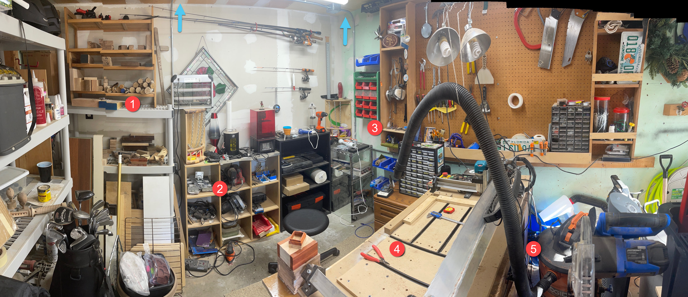
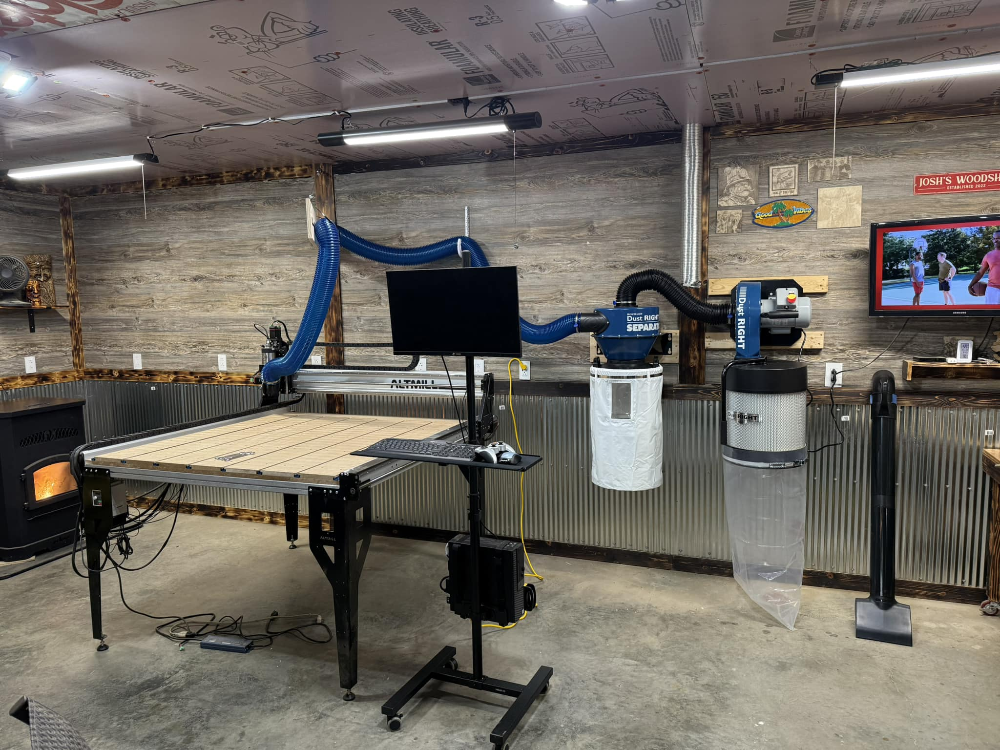

## Setting Expectations

You’ve done the research, plotted your course, and now you’re ready to set sail on your CNC journey — oars steady, full speed ahead. You’re imagining the incredible creations you’ll craft, masterpieces that will catch the world’s eye, and maybe one day find their place in a museum!

**But wait...**

- Need a bigger boat? Head over to explore [costs](#initial-costs), [space](#space-requirements) and [power requirements](#power-requirements)
- Is that a storm on the horizon? We can help you prepare for a flood of [resources & information](#learning-curve) 
- Why does it feel like your ship is veering off course? Ah, that’s the reality of [machine maintenance](#machine-maintenance) 
- Did you pack a bucket to bail out the water? Don’t worry, [the community](https://forum.sienci.com/) is your lifeboat 

We understand the excitement—you're eager to hoist the sails and catch the wind! But before you set off, let’s chart your course, explore the learning waters ahead, and point out a few icebergs to watch for on the journey.

Sit back and enjoy a couple of videos about starting your woodworking journey, the dark side of CNC, what you need to get started, and a beginner guide .

[su_table responsive="yes"]

| Title                                      | Description                                                | Length   | Watch Video                                             |
|--------------------------------------------|------------------------------------------------------------|----------|---------------------------------------------------------|
| Hobby Woodworkers need to hear this         | Hear from a couple of professional woodworkers about Hobby vs Pro woodworkers. | 20 min   | [Watch Video](https://youtu.be/YLs0_jACteA)              |
| The Dark Side of learning to use a CNC for Woodworking | The hardest parts of beginning a cnc journey.                       | 16 min   | [Watch Video](https://youtu.be/dbxhhiA0i2E)              |
| The CNC Process for the Absolute Beginner  | Introduction to CNC, components, software, and toolpaths.  | 22 min   | [Watch Video](https://youtu.be/fhFC1r_PtL0)              |
| CNC Basics          |             What you need to get started                                      |    9 min     | [Watch Video](https://youtu.be/lQ-MYnyxh7M)     |

[/su_table]

### **Initial Costs**

- **Machine Cost**  CNC machines come in a range of prices depending on size, precision, and brand. Hobby-level machines can start around $500–$2,000, while more advanced or larger machines can go well beyond $5,000.
- **Additional Costs**  You’ll also need software for designing your projects, which could involve one-time purchases or subscription fees. Accessories like end mills, clamps, dust collection systems, and materials (wood, MDF, etc.) will add to your initial investment.
- **Upgrades**  Over time, you may want to upgrade parts, like getting better tooling, a quieter dust collection system or adding additional features (such as an upgraded spindle or a laser engraver).

#### Those sneaky extra costs

Every shop is a bit different, and customizing yours to fit your needs is always a fun challenge. In the chart below we explore many of the things you will want to consider adding to your shop, before your end mill starts spinning.

[su_table responsive="yes"]

| **Category**                                | **Estimated Cost (USD)**                                  |
|---------------------------------------------|-----------------------------------------------------------|
| **Router** or **Spindle** ([Makita](https://sienci.com/product/makita-rt0701c-1-25-hp-110v-compact-router/))                     | *$100 - $300*                                             |
| **Accessories** ([dust shoe](https://sienci.com/product/touch-plate/), [touch plate](https://sienci.com/product/longmill-magnetic-dust-shoe-mk2/), [inductive sensors](https://sienci.com/product/inductive-sensor-kit-for-the-longmill-mk2/), [etc.](https://sienci.com/product-category/addons/mk2-addons/)) | *$100 - $300*                                             |
| **End Mills** ([cutting tools](https://sienci.com/product-category/cutting-tools/) & [starter kits](https://sienci.com/product/sems/))                            | *$50 - $200*                                              |
| **Dust Collection Strategy** ([shop vac](https://www.homedepot.ca/product/ridgid-nxt-60l-16-gal-50-peak-hp-wetdry-shop-vacuum-with-filter-hose-and-accessories/1001657626), [wall mount](https://www.amazon.ca/WEN-DC3401-Collector-12-Gallon-Optional/dp/B09Q7F9NC8/ref=sr_1_5?), [cyclone](https://www.amazon.ca/Cyclone-Collector-Collection-Separator-Accessories/dp/B07XL8X3DG/ref=sr_1_18))           | *$300 - $1,000*                                           |
| **Safety Equipment** ([glasses](https://sienci.com/product/laser-safety-glasses/), [mask](https://www.amazon.ca/Rugged-Comfort-Facepiece-Reusable-Respirator/dp/B00IF7RBS4/ref=sr_1_16), [etc.](https://www.amazon.ca/3M-Peltor-Optime-Earmuffs-H10A/dp/B00009LI4K/ref=sr_1_4))  | *$50 - $150*                                              |
| **Computer, Monitor, Mouse** ([gControl Panel Computer](https://sienci.com/product/gcontrol/))               | *$250 - $800*                                             |
| **Software** ([VCarve Pro](https://sienci.com/product/vectric-vcarve-pro/), [Carveco](https://sienci.com/product/carveco-maker-subscription/), [LightBurn](https://sienci.com/product/lightburn/), [CAMLab](http://camlab.sienci.com/welcome/))           | *$0 - $699*                                               |
| **Supplies** ([workholding](https://sienci.com/product/t-track/), sandpaper, oils, etc.) | *$100 - $500*                                             |
| **Table/Enclosure** ([community builds](https://resources.sienci.com/view/lmk2-table-enclosure/), [wasteboard](https://resources.sienci.com/view/lmk2-table-mounting/#suitable-wasteboard-amp-table) ) | *$200 - $600*                                             |
| **Total Estimated Cost:**                     | **$1,150 - $4,550** |

[/su_table]

Here are some videos to help you save some money when setting up your shop, buying wood, bits or extras.

[su_table responsive="yes"]

| Title                                      | Description                                                | Length   | Watch Video                                             |
|--------------------------------------------|------------------------------------------------------------|----------|---------------------------------------------------------|
| The Hidden costs of CNC's!                 | Exploring the hidden costs of power, software, tooling, workholding, and more! | 12 min   | [Watch Video](https://youtu.be/GB3zaGtKMO4)   |
| A thousand dollars worth of wood - Buying Wood Online | Testing online wood ordering.                                        | 34 min   | [Watch Video](https://youtu.be/zCXgP0Hu1Nk)              |
| DON'T LET THIS $40 MISTAKE HAPPEN TO YOU!  | Great tips to help you protect your investments in bits.   | 4 min    | [Watch Video](https://youtu.be/X7tR45tX4rs)              |
| Getting Started with CNC Machines - Choosing Bits | Explore different types of bits and cutting tools. | 6 min    | [Watch Video](https://youtu.be/hccjn5_Wnwc)              |
| CNC Router Bits for Beginners              | Intro to bits and when to use one bit over the other.      | 14 min   | [Watch Video](https://youtu.be/fweR7JaieKc)              |
| I Solved @Iliketomakestuff 's Dust Collection Debacle | Dust collection invention, with cool cart. | 6 min   | [Watch Video](https://youtu.be/pkdn7oLq4Zs)              |
| Introducing the New AutoZero Touch Plate!  | One of the many accessories you may want to add to your shop. | 7 min    | [Watch Video](https://youtu.be/H_fYFjtFc3Q)              |

[/su_table]

### **Space Requirements**

Setting up your CNC woodworking area requires careful planning, as you'll need more space than just for the machine itself. Let's check out a single car garage shop and explore some things to consider:

{.aligncenter .size-medium}

1. **Wood Storage** 
  You’ll need a space to store wood materials, whether it’s sheets of plywood, hardwoods, or other materials. It’s a good idea to designate a dry, organized area to prevent wood warping or damage and to ensure easy access during projects. *Keep out spiders!*

2. **Tools** 
  Over time, you’ll accumulate a variety of hand tools, sandpaper, clamps, and accessories. Make sure you have proper storage for these tools near your CNC machine to ensure quick access. Having access to a power bar is also very handy.

3. **Bits** 
  Having the original containers for bit or a small shelf or storage bin will help avoid misplacing or damaging small, delicate items like your cutting tools. The shop pictured above has carpet down to prevent any dropped bits from breaking too.

4. **Table** 
  Your CNC machine will need a sturdy, flat table or workbench to rest on. You may want to plan for extra space on the left side of your table to allow you to mount the controller or E-stop button.
  
5. **Dust Collection** 
  CNC projects generate a lot of dust, so a proper dust collection system is essential. This could be a small vacuum setup like pictured above, or a dedicated wall mounted dust collector to keep your workspace clean and prevent damage to your machine and electronics, like pictured below.

These videos explore setting up a garage shop, using the ceiling, installing classic workholding and handy tools to add to your shop.

[su_table responsive="yes"]

| Title                                      | Description                                                | Length   | Watch Video                                             |
|--------------------------------------------|------------------------------------------------------------|----------|---------------------------------------------------------|
| How To Set Up A Woodworking Shop In A Garage | Fitting both a CNC and a CO2 laser into one garage.       | 39 min   | [Watch Video](https://youtu.be/QrnOjFqNU4g)              |
| How-to Use your shop ceiling fully!        | Maximize your workshop by using the ceiling for power and dust collection. | 7 min    | [Watch Video](https://youtu.be/9T5khippBBE)              |
| How to Build a Bench and Install T-Tracks  | A traditional workholding method, added to your workbench. | 7 min    | [Watch Video](https://youtu.be/T4QVgtnZMDw)              |
| CNC accessories and tools to make life easier | Handy tools and tips for your shop.                      | 18 min   | [Watch Video](https://youtu.be/usCUSXLuIhE)              |

[/su_table]

### Power Requirements

When setting up your shop, it’s important to consider the power requirements of both the **controller**, the **router** or **spindle** used, and any other tools added. Here’s a quick rundown:

1. **Controller** ([SuperLongBoard](https://sienci.com/product/slb/))
   - The **SLB** requires a **24V** external power supply with a **10-12A capacity** to run. This adds up to about **2 amps** on a 120V circuit which is relatively low, but combined with a spindle or router and other equipment, it’s still essential to keep an eye on your overall power usage.
1. **Router Power** ([Makita 1.25HP](https://sienci.com/product/makita-rt0701c-1-25-hp-110v-compact-router/))
   - Many hobbyists start with a **router** instead of a spindle. Routers, like the **Makita RT0701C**, draw around **6-7 amps** on 120V circuits. This is much less than a spindle, making routers a good option if you’re working with limited power supply.
1. **Spindle Power**
   - Spindles come in different power levels, which affects how much electricity they use. Common spindles range from **0.8KW** to **2.2KW**.
     - A **1.5KW spindle** running on **120V** usually draws about **12.5 amps**.
     - A **2.2KW spindle** on **120V** can draw up to **18 amps**.
   - For typical 120V circuits (like the ones with **15A breakers** found in many workshops), a **1.5KW spindle** is about the highest you can use without risking a tripped breaker. Larger spindles, like a **2.2KW**, might need a dedicated circuit with a higher amperage or use of a **220V** outlet.

So, if you’re using a **1.5KW spindle** with the SLB on a standard 120V, 15A circuit, you’ll be close to capacity. Adding a dust collection system or other devices might push you over, requiring a separate circuit. Alternatively, if you’re using a **router**, you’ll have more breathing room for other equipment.

Always double-check your circuit’s breaker ratings to avoid overloading your workshop’s electrical setup.

## Learning Curve

There are many moving parts when it comes to producing something from your new CNC machine. A interesting intersection of technology and woodworking. You can produce something on your first try, but it may take several months to become comfortable with all of the steps available to you. Know that you will make some mistakes along the way, but embrace them if you can as learning moments. Store that memory away, and prevent it from happening again. Let's explore some of the new skills you will be learning about, acquiring, and eventually mastering. **You got this!**

- **Software Skills**  A significant part of CNC woodworking involves learning CAD (Computer-Aided Design) and CAM (Computer-Aided Manufacturing) software. Programs like Fusion 360, Easel, or VCarve have varying degrees of complexity, and mastering them takes time.
- **Toolpaths and Settings**  Beyond software, understanding toolpaths (how the machine moves), feed rates, spindle speeds, and materials will come into play. These settings directly affect the success of your projects.
- **Patience Required**  Expect to spend a good amount of time experimenting and learning through trial and error. Your first few projects may not be perfect, and that’s completely normal.
- **Learn about Wood**  There are a couple things to focus on learning including how to measure wood, where to buy it, and how to store it.

Here are a couple videos that may prove to be interesting at this point. The first is a good overview of the entire CNC process, followed by some simple projects you can begin with. Begin your journey learning about wood, then explore how AI can assist you on the design side of things.

[su_table responsive="yes"]

| Title                                      | Description                                                | Length   | Watch Video                                             |
|--------------------------------------------|------------------------------------------------------------|----------|---------------------------------------------------------|
| Anyone can learn CNC quickly - Let's make a drink coaster | Easily make your 1st drink coaster using VCarve Pro. | 20 min   | [Watch Video](https://youtu.be/gQ5sFgMiNJg)              |
| 5 Easy CNC Projects You Can Start Right Now | Easy to make and program items to help start your journey. | 17 min   | [Watch Video](https://youtu.be/gJkwYUuBgqk)              |
| Unlocking the Secrets of the Lumber Yards  | Calculate board footage, wood species, and different grades and sizes | 11 min   | [Watch Video](https://youtu.be/2ZwgkGHdhiA)                         |
| Top 5 Free AI Tools for Elevating CNC Design | Use these AI tools if you don't want to design your own.   | 7 min    | [Watch Video](https://youtu.be/3pGmLPGe17g)              |
| AI CNC ZoeDepth, shallow relief from AI images. | A deep cleaning and walkthrough of machine maintenance.   | 25 min   | [Watch Video](https://youtu.be/H6GvUdONkFI)              |

[/su_table]

### Failure is Part of the Process

- **Trial and Error**  Don’t be discouraged if your first attempts don’t go as planned. It’s common to break bits, misalign materials, or get unexpected results. Mistakes are part of the learning process.
- **Material Wastage**  You will likely waste some material during the learning phase, whether from incorrect settings or accidents. Plan for some losses as you refine your skills.

We all need to laugh at ourselves every now and again, so here are a video about beginner mistakes and some shorts to giggle with. These are those icebergs we were talking about earlier.

[su_table responsive="yes"]

| Title                                      | Description                                                | Length   | Watch Video                                             |
|--------------------------------------------|------------------------------------------------------------|----------|---------------------------------------------------------|
| 7 Mistakes CNC Beginners Make              | Stop breaking bits for good!                                | 13 min   | [Watch Video](https://youtu.be/Vh6OzYyd840)              |
| Hitting workholding  | —                                                          | Short | [Watch Video](https://youtube.com/shorts/1lbizGG0dco)    |
| Walnut is expensive  | —                                                          | Short       | [Watch Video](https://youtube.com/shorts/uu2aUNBWfcI)    |
| Hit Pause or Hit X?   | —                                                          | Short       | [Watch Video](https://youtube.com/shorts/MnAMTn4U_qg)    |
| Collet burn   | —                                                          | Short       | [Watch Video](https://youtube.com/shorts/01bqc3Gw3eQ)    |

[/su_table]

### Time Commitment

- **Setup and Testing**  Expect a significant amount of time to be spent on project setup—finalizing the design, securing the workpiece, setting up toolpaths, and making sure everything is aligned. Testing new designs or tool setups on scrap materials is often necessary.
- **Project Completion**  Projects can take longer than expected, especially if you are refining a design, troubleshooting issues, or making multiple passes on a complicated cut. Patience is key. Often a roughing pass is used first to remove the bulk of material, then a finishing pass comes along and really smooths thing up.

### Community Support

- **Learning from Others**  The CNC woodworking community is large and active. Online forums, YouTube tutorials, and CNC groups are invaluable resources for troubleshooting, tips, and inspiration. You’re not alone in the learning process.
- **Asking for Help**  Don’t hesitate to ask questions when you get stuck. Most CNC enthusiasts are willing to share their knowledge and help you through challenges.

## Machine Maintenance

- **[Regular Upkeep](https://resources.sienci.com/view/lmk2-maintenance/)**  CNC machines require regular maintenance to perform optimally. This includes cleaning your rails & wheels, lubricating parts, checking for loose bolts, and inspecting wiring and belts. Some software like gSender will help you track the number of hours you have been running your machine, and recommend specific maintenance be performed.
- **[Replacing Parts](https://sienci.com/product-category/parts/)**  Over time, you’ll need to replace things like the cutting tools, which dull with use, or v-wheels, linear bearings, and delrin nuts that wear out. Knowing how to maintain your machine will help avoid costly breakdowns. Just like replacing tires or windshield wipers on your car.
- **[Calibration](https://resources.sienci.com/view/lmk2-checks-and-first-moves/#tuning-movement)**  Keeping your machine properly calibrated is key for accuracy. Routine checks on squareness, zeroing, and other factors will save you time and material in the long run.

[su_table responsive="yes"]

| Title                                      | Description                                                | Length   | Watch Video                                             |
|--------------------------------------------|------------------------------------------------------------|----------|---------------------------------------------------------|
| How To Do CNC Router Maintenance           | A deep cleaning and walkthrough of machine maintenance.    | 77 min   | [Watch Video](https://youtu.be/hEbUk9rpWas)              |
| How to adjust and tune the LongMill MK2 48x30          |   Get peek performance and prevent movement issues          |    15 min        |      [Watch Video](https://youtu.be/p5SpgoUza7o)       |

[/su_table]

### Final Thought: **Start Small**

It’s tempting to jump straight into large or complex projects, but starting with simpler tasks will help you build confidence and understand your machine. Set realistic expectations for your first few months, focus on mastering the basics, and steadily work your way up to more advanced projects. Embarking on your CNC journey can be incredibly rewarding, but it requires patience, learning, and ongoing investment.

**Stay curious, embrace the mistakes as learning opportunities and you may just find your very own gold treasure! May the winds always be at your back.**

---
